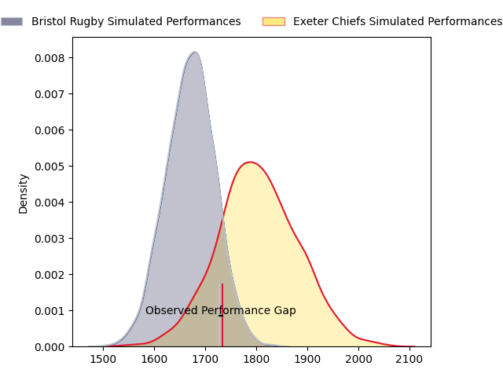
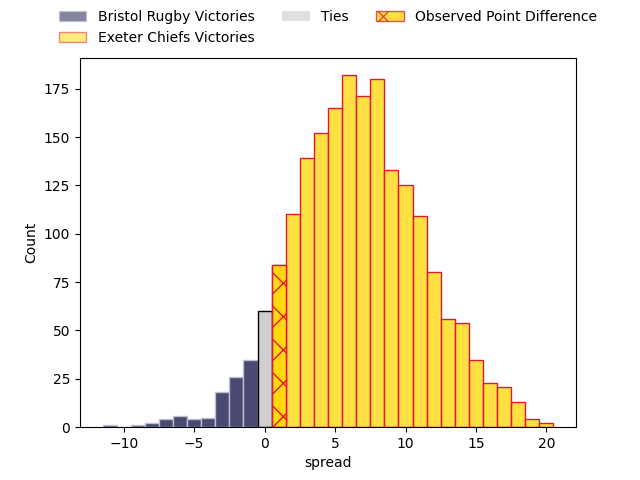

---  
layout: page  
title: Bristol Rugby at Exeter Chiefs; 21.0-22.0  
date: 2023-04-22 10:00:00 18:00:00 -0500  
categories: match review  
---
# Bristol Rugby at Exeter Chiefs; 21.0-22.0

# Club Level Predictions

The first set of predictions treats a club as the smallest object, as the club develops its members, organizes a gameplan, and deploys its players as needed for each match. This club model has a prediction of 0.683, which translates to predicting Exeter Chiefs to win by 6.7.

Each club has a rating and a rating deviation (simiar to a Glicko system), and expected performances can be generated. This allows for simulated matches and spreads like the ones below.
## Projected Performances

## Projected Spreads

## Projected Results

# Player Level Predictions

Treating teams instead as an entity made up of the currently active players, I have ratings for each player in an altogether different system. These can be combined to form team ratings once teamsheets are announced, weighting starters a bit higher than the reserves. After the match is played, players can be weighted by their minutes on the field, allowing for an accurate measure of the team's composition. With these compiled team ratings, we can make predictions, measure inaccuracy, and update the individual player ratings.
## Prediction with Player Minutes: Exeter Chiefs by 16.3

Exeter Chiefs by 12.3 on a neutral field

There were 14 large changes in win probability in this match
## Prediction without Player Minutes: Exeter Chiefs by 13.6

Exeter Chiefs by 9.6 on a neutral pitch

|   Away Minutes | Away Player     |   Away elo |   Away Percentile |   Number |   Home Percentile |   Home elo | Home Player       |   Home Minutes |
|---------------:|:----------------|-----------:|------------------:|---------:|------------------:|-----------:|:------------------|---------------:|
|             57 | Yann Thomas     |      76.85 |                62 |        1 |                66 |      83.81 | Nika Abuladze     |             48 |
|             80 | Will Capon      |      69.47 |                36 |        2 |                89 |      99.67 | Dan Frost         |             48 |
|              6 | Max Lahiff      |      91.15 |                80 |        3 |                65 |      80.79 | Marcus Street     |             48 |
|             76 | Joe Batley      |     103.72 |                90 |        4 |                66 |      84.78 | Jack Dunne        |             80 |
|             80 | Chris Vui       |      88.51 |                73 |        5 |                94 |     110.78 | Dafydd Jenkins    |             80 |
|             64 | Steven Luatua   |     121.64 |                97 |        6 |                97 |     125.03 | Dave Ewers        |             55 |
|             80 | Sam Jeffries    |      97.87 |                87 |        7 |                92 |     105.92 | Jannes Kirsten    |             80 |
|             80 | Fitz Harding    |      75.99 |                48 |        8 |                95 |     112.44 | Sam Simmonds      |             80 |
|             59 | Harry Randall   |     105.48 |                91 |        9 |                69 |      88.25 | Will Becconsall   |             53 |
|             68 | Callum Sheedy   |      87.23 |               nan |       10 |                90 |     107.46 | Joe Simmonds      |             80 |
|             80 | Gabriel Ibitoye |      91.61 |                76 |       11 |                94 |     114.23 | Olly Woodburn     |             80 |
|             80 | James Williams  |      64.33 |                24 |       12 |                70 |      89.17 | Ian Whitten       |             69 |
|             80 | Joe Jenkins     |      79.35 |                52 |       13 |                87 |     103.23 | Henry Slade       |             80 |
|             62 | Ratu Naulago    |      88.14 |                71 |       14 |                50 |      77.2  | Tom Wyatt         |             55 |
|             80 | Charles Piutau  |      97.5  |                81 |       15 |                48 |      77.78 | Stuart Hogg       |             80 |
|              0 | Fred Davies     |      86.64 |               nan |       16 |                94 |     106.41 | Jack Yeandle      |             32 |
|             23 | Jake Woolmore   |      88.9  |                68 |       17 |                63 |      82.99 | Alec Hepburn      |             32 |
|             74 | George Kloska   |      90.92 |               nan |       18 |                71 |      86.73 | Josh Iosefa-Scott |             32 |
|              4 | Charlie Rice    |      84.11 |               nan |       19 |                25 |      65.41 | Aidon Davis       |             25 |
|             16 | Daniel Thomas   |      75.56 |                66 |       20 |                69 |      85.81 | Christ Tshiunza   |             25 |
|             21 | Andy Uren       |      75.16 |                45 |       21 |                90 |     102.71 | Stu Townsend      |             27 |
|             12 | Sam Bedlow      |     102.68 |                84 |       22 |                21 |      62.19 | Harvey Skinner    |              0 |
|             18 | Ioan Lloyd      |      89.09 |                82 |       23 |                15 |      57.38 | Sean O'Brien      |             11 |

