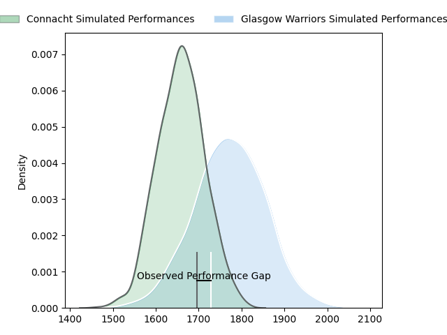
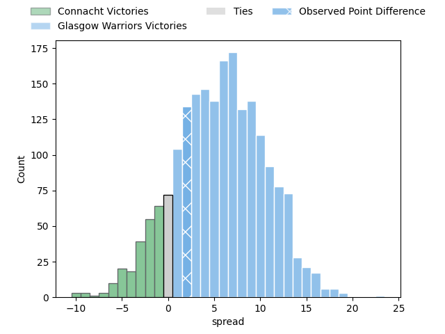

---  
layout: page  
title: Connacht at Glasgow Warriors; 27-29  
date: 2023-04-22 20:35:00 18:00:00 -0500  
categories: match review  
---
# Connacht at Glasgow Warriors; 27-29

# Club Level Predictions

The first set of predictions treats a club as the smallest object, as the club develops its members, organizes a gameplan, and deploys its players as needed for each match. This club model has a prediction of 0.658, which translates to predicting Glasgow Warriors to win by 5.8.

Each club has a rating and a rating deviation (simiar to a Glicko system), and expected performances can be generated. This allows for simulated matches and spreads like the ones below.
## Projected Performances

## Projected Spreads

## Projected Results

# Player Level Predictions

Treating teams instead as an entity made up of the currently active players, I have ratings for each player in an altogether different system. These can be combined to form team ratings once teamsheets are announced, weighting starters a bit higher than the reserves. After the match is played, players can be weighted by their minutes on the field, allowing for an accurate measure of the team's composition. With these compiled team ratings, we can make predictions, measure inaccuracy, and update the individual player ratings.
## Prediction with Player Minutes: Glasgow Warriors by 9.8

Glasgow Warriors by 5.8 on a neutral field

There were 11 large changes in win probability in this match
## Prediction without Player Minutes: Glasgow Warriors by 6.2

Glasgow Warriors by 2.2 on a neutral pitch

|   Away Minutes | Away Player           |   Away elo |   Away Percentile |   Number |   Home Percentile |   Home elo | Home Player              |   Home Minutes |
|---------------:|:----------------------|-----------:|------------------:|---------:|------------------:|-----------:|:-------------------------|---------------:|
|             40 | Dennis Buckley        |      77.25 |                49 |        1 |                66 |      83.95 | Allan Michael Elgin Dell |             45 |
|             49 | Dylan Tierney-Martin  |      79.66 |                57 |        2 |                80 |      88.67 | Fraser Brown             |             45 |
|             40 | Finlay Bealham        |      90.07 |                79 |        3 |                64 |      82.93 | Lucio Sordoni            |             30 |
|             54 | Oisin Dowling         |      83.18 |                63 |        4 |                75 |      86.61 | Scott Cummings           |             80 |
|             80 | Niall Murray          |      89.7  |                75 |        5 |                92 |     106.29 | Richie Gray              |             52 |
|             80 | Joshua Daniel Murphy  |      81.26 |                58 |        6 |                81 |      93.46 | Rory Darge               |             80 |
|             80 | Conor Oliver          |      82.84 |                63 |        7 |                58 |      82.23 | Sione Vailanu            |             80 |
|             40 | Cian Prendergast      |      79.59 |                57 |        8 |                26 |      67.77 | Jack Dempsey             |             80 |
|             54 | Caolin Blade          |      80.98 |                56 |        9 |                60 |      82.9  | Ali Price                |             80 |
|             80 | Jack Carty            |      92.52 |                75 |       10 |                58 |      82.47 | Tom Jordan               |             80 |
|             80 | Byron Ralston         |      76.98 |               nan |       11 |                66 |      84.77 | Cole Forbes              |             54 |
|             80 | Cathal Forde          |      79.85 |                53 |       12 |                60 |      82.71 | Sam Johnson              |             80 |
|             59 | Thomas Farrell        |      81.97 |                58 |       13 |                55 |      80.73 | Stafford McDowall        |             80 |
|             80 | John Porch            |      77.52 |                51 |       14 |                67 |      83.26 | Jamie Dobie              |             11 |
|             68 | Tiernan O'Halloran    |      73.8  |                40 |       15 |                22 |      63.21 | Huw Jones                |             37 |
|             40 | Shamus Hurley-Langton |      75.95 |               nan |       16 |                72 |      89.55 | George Horne             |             69 |
|             40 | Sam Illo              |      82.63 |                77 |       17 |                91 |     100.29 | Zander Fagerson          |             50 |
|             40 | Peter Dooley          |      81.18 |                55 |       18 |                77 |      93.71 | Domingo Miotti           |             43 |
|             31 | Eoin  de Buitlear     |      74.21 |               nan |       19 |                55 |      78.4  | Johnny Matthews          |             35 |
|             26 | Darragh Murray        |      91.13 |                69 |       20 |                64 |      83.19 | Jamie Bhatti             |             35 |
|             26 | Kieran Marmion        |      74.89 |               nan |       21 |                69 |      86.23 | Jean-Pierre du Preez     |             28 |
|             21 | Tom Daly              |      72.68 |               nan |       22 |                88 |     101.46 | Matt Fagerson            |             26 |
|             12 | Shane Jennings        |      79.76 |               nan |       23 |               nan |     nan    | nan                      |            nan |

