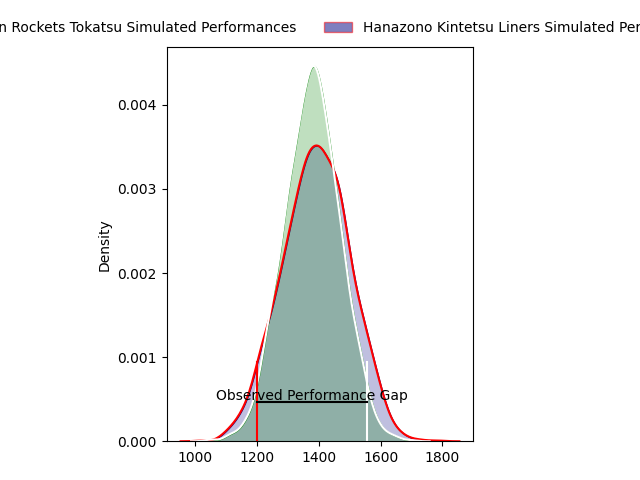
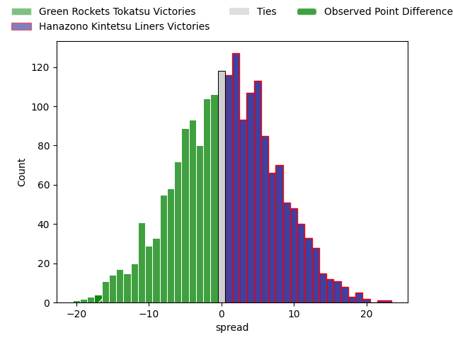

---  
layout: page  
title: Green Rockets Tokatsu at Hanazono Kintetsu Liners; 43-26  
date: 2023-04-22 07:00:00 18:00:00 -0500  
categories: match review  
---
# Green Rockets Tokatsu at Hanazono Kintetsu Liners; 43-26

# Club Level Predictions

The first set of predictions treats a club as the smallest object, as the club develops its members, organizes a gameplan, and deploys its players as needed for each match. This club model has a prediction of 0.512, which translates to predicting Hanazono Kintetsu Liners to win by 0.4.

Each club has a rating and a rating deviation (simiar to a Glicko system), and expected performances can be generated. This allows for simulated matches and spreads like the ones below.
## Projected Performances

## Projected Spreads

## Projected Results

# Player Level Predictions

Treating teams instead as an entity made up of the currently active players, I have ratings for each player in an altogether different system. These can be combined to form team ratings once teamsheets are announced, weighting starters a bit higher than the reserves. After the match is played, players can be weighted by their minutes on the field, allowing for an accurate measure of the team's composition. With these compiled team ratings, we can make predictions, measure inaccuracy, and update the individual player ratings.
## Prediction with Player Minutes: Hanazono Kintetsu Liners by 12.3

Hanazono Kintetsu Liners by 8.3 on a neutral field

There were 11 large changes in win probability in this match
## Prediction without Player Minutes: Hanazono Kintetsu Liners by 11.0

Hanazono Kintetsu Liners by 7.0 on a neutral pitch

|   Away Minutes | Away Player       |   Away elo |   Away Percentile |   Number |   Home Percentile |   Home elo | Home Player           |   Home Minutes |
|---------------:|:------------------|-----------:|------------------:|---------:|------------------:|-----------:|:----------------------|---------------:|
|             36 | Kosei Yamamoto    |      65.07 |                23 |        1 |                65 |      83.69 | Kenta Tanaka          |             65 |
|             50 | Myuu Arai         |      78.06 |                61 |        2 |                75 |      88.54 | Atsushi Kashimoto     |             65 |
|             50 | Keisuke Kikuta    |      75.76 |                46 |        3 |                63 |      82.79 | Kota Mitake           |             61 |
|             80 | Daiki Yamagiwa    |      71.43 |                37 |        4 |                48 |      77.92 | Ben Toolis            |             61 |
|             80 | Jake Ball         |      73.83 |                42 |        5 |                53 |      78.8  | Sanaila Junior Waqa   |             80 |
|             80 | Kavaia Tagivetaua |      70.15 |                34 |        6 |                37 |      71.36 | Takahito Sugahara     |             64 |
|             70 | Ryoi Kamei        |      52.21 |                12 |        7 |                56 |      79.37 | Shohei Nonaka         |             80 |
|             50 | Wheetu Douglas    |      63.95 |                20 |        8 |                50 |      78.89 | Waimana Kapa          |             80 |
|             78 | Nicholas Phipps   |      68.86 |                33 |        9 |                39 |      72.16 | William Genia         |             80 |
|             80 | Taisetsu Kanai    |      84.62 |                61 |       10 |               nan |      70.12 | Quade Cooper          |              1 |
|             65 | Kenta Omata       |      63.94 |                25 |       11 |                18 |      59.89 | Sioasia Fifita        |             80 |
|             80 | Christian Laui    |      79.06 |                52 |       12 |                66 |      86.39 | Haruki Kanazawa       |             80 |
|             65 | Maritino Nemani   |      71.71 |                36 |       13 |                 8 |      50.38 | Koji Okamura          |             25 |
|             80 | Teruya Goto       |      67.95 |                31 |       14 |               nan |      74.21 | Takahiro Hayashi      |             75 |
|             80 | Lomano Lemeki     |      59.85 |                19 |       15 |                62 |      85.6  | Yoshizumi Takeda      |             80 |
|             44 | Sunao Takizawa    |      66.41 |                25 |       16 |                33 |      69.18 | Jackson Garden-Bachop |             79 |
|             30 | Ash Dixon         |      69.81 |                33 |       17 |                64 |      86.23 | Ren Takano            |             55 |
|             30 | Satoshi Ueda      |     117.64 |                98 |       18 |                 7 |      54.66 | Lata Tangimana        |             19 |
|             30 | Ren Osawa         |      79.75 |                57 |       19 |                21 |      64.73 | Jed Brown             |             19 |
|             15 | Tom Marshall      |      48.41 |                11 |       20 |                78 |      91.99 | Tsuyoshi Murata       |             16 |
|             15 | Tim Bennetts      |      68.96 |                37 |       21 |                16 |      61.37 | Yushi Inoue           |             15 |
|             10 | Yoshida Hosoda    |      75.3  |                48 |       22 |                20 |      59.82 | Sho Fukui             |             15 |
|              2 | Tatsuya Fujii     |      79.27 |                52 |       23 |               nan |      65.96 | Kensyo Kawamura       |              5 |

