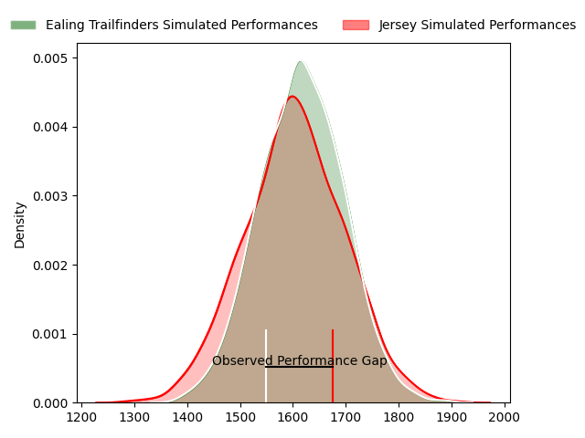
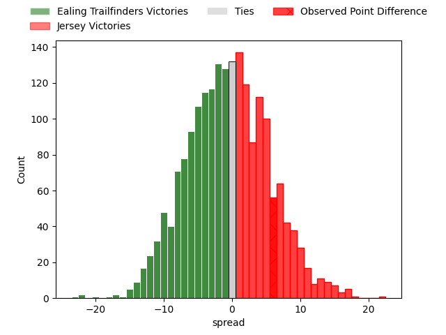

---  
layout: page  
title: Ealing Trailfinders at Jersey; 13-19  
date: 2023-04-22 15:00:00 18:00:00 -0500  
categories: match review  
---
# Ealing Trailfinders at Jersey; 13-19

# Club Level Predictions

The first set of predictions treats a club as the smallest object, as the club develops its members, organizes a gameplan, and deploys its players as needed for each match. This club model has a prediction of 0.482, which translates to predicting Ealing Trailfinders to win by 0.7.

Each club has a rating and a rating deviation (simiar to a Glicko system), and expected performances can be generated. This allows for simulated matches and spreads like the ones below.
## Projected Performances

## Projected Spreads

## Projected Results

# Player Level Predictions

Treating teams instead as an entity made up of the currently active players, I have ratings for each player in an altogether different system. These can be combined to form team ratings once teamsheets are announced, weighting starters a bit higher than the reserves. After the match is played, players can be weighted by their minutes on the field, allowing for an accurate measure of the team's composition. With these compiled team ratings, we can make predictions, measure inaccuracy, and update the individual player ratings.
## Prediction with Player Minutes: Jersey by 3.1

Ealing Trailfinders by 0.9 on a neutral field

There were 10 large changes in win probability in this match
## Prediction without Player Minutes: Jersey by 2.7

Ealing Trailfinders by 1.3 on a neutral pitch

|   Away Minutes | Away Player             |   Away elo |   Away Percentile |   Number |   Home Percentile |   Home elo | Home Player                 |   Home Minutes |
|---------------:|:------------------------|-----------:|------------------:|---------:|------------------:|-----------:|:----------------------------|---------------:|
|             53 | James Gibbons           |      75.89 |                28 |        1 |                94 |     102.87 | Samuel Alexander Grahamslaw |             80 |
|             71 | Alun Walker             |      88.87 |                76 |        2 |                60 |      79.03 | James Hadfield              |             57 |
|             53 | George Davis            |      82.75 |                63 |        3 |                69 |      82.23 | Steven Longwell             |             57 |
|             80 | David O'Connor          |      80.6  |               nan |        4 |                85 |      98.73 | Sean O'Connor               |             57 |
|             51 | Barney Maddison         |      84.69 |                66 |        5 |                51 |      78.17 | Macauley Cook               |             80 |
|             74 | Rob Farrar              |      86.24 |                71 |        6 |                78 |      90.72 | James Andrew Dun            |             80 |
|             80 | Adam Korczyk            |      81.56 |                57 |        7 |                86 |      98.51 | Lewis Wynne                 |             80 |
|             51 | Jack Digby              |      81.36 |                57 |        8 |                65 |      84.95 | Alun Lawrence               |             80 |
|             80 | Craig Hampson           |      90    |                72 |        9 |                78 |      90    | James Mitchell              |             80 |
|             80 | Steve Shingler          |      75.79 |                46 |       10 |                21 |      62.97 | Russell Bennett             |             80 |
|             80 | Nathan Earle            |      80.14 |                57 |       11 |                87 |     101.84 | Tomi Lewis                  |             60 |
|             80 | Patrick Benjamin Howard |      95.65 |                78 |       12 |                21 |      62.48 | Jordan Holgate              |             67 |
|             80 | Max Bodilly             |      95.57 |                78 |       13 |                46 |      76.09 | Alex McHenry                |             80 |
|             80 | Luke Daniels            |      88.96 |                73 |       14 |                55 |      78.76 | Ben Woollett                |             80 |
|             80 | Jonah Holmes            |      91.72 |                73 |       15 |                77 |      93.91 | Brendan Owen                |             80 |
|             29 | Andrew Davidson         |      91.26 |                77 |       16 |                85 |      96.68 | Eoghan Clarke               |             23 |
|             29 | Simon Uzokwe            |     101.38 |                88 |       17 |               nan |      83.88 | Hamish Bain                 |             23 |
|             27 | Will Davis              |     114.63 |                97 |       18 |                50 |      77.53 | Adam Nicol                  |             23 |
|             27 | Ross Kane               |      83.43 |               nan |       19 |                96 |     115.51 | Will Brown                  |             20 |
|              9 | Shaun Malton            |      78.61 |                41 |       20 |                95 |     112.93 | Dan Barnes                  |             13 |
|              6 | Will Montgomery         |      79.1  |                53 |       21 |               nan |     nan    | nan                         |            nan |

