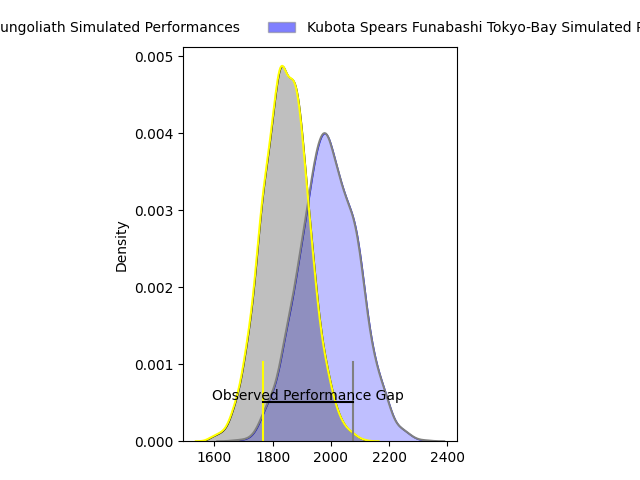
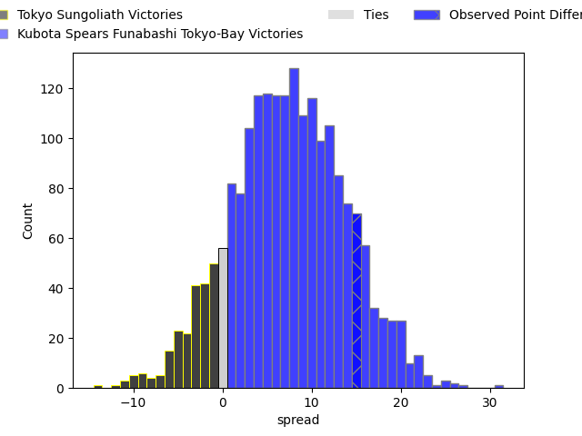
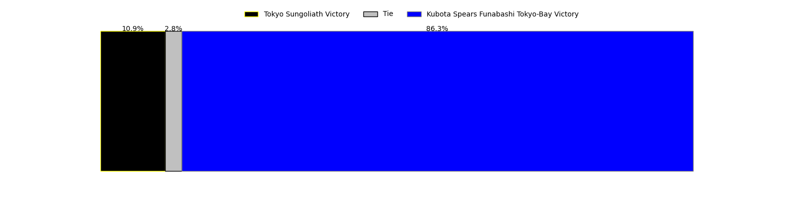

---  
layout: page  
title: Tokyo Sungoliath at Kubota Spears Funabashi Tokyo-Bay; 24-39  
date: 2023-04-22 07:00:00 18:00:00 -0500  
categories: match review  
---
# Tokyo Sungoliath at Kubota Spears Funabashi Tokyo-Bay; 24-39

# Club Level Predictions

The first set of predictions treats a club as the smallest object, as the club develops its members, organizes a gameplan, and deploys its players as needed for each match. This club model has a prediction of 0.691, which translates to predicting Kubota Spears Funabashi Tokyo-Bay to win by 7.2.

Each club has a rating and a rating deviation (simiar to a Glicko system), and expected performances can be generated. This allows for simulated matches and spreads like the ones below.
## Projected Performances

## Projected Spreads

## Projected Results

# Player Level Predictions

Treating teams instead as an entity made up of the currently active players, I have ratings for each player in an altogether different system. These can be combined to form team ratings once teamsheets are announced, weighting starters a bit higher than the reserves. After the match is played, players can be weighted by their minutes on the field, allowing for an accurate measure of the team's composition. With these compiled team ratings, we can make predictions, measure inaccuracy, and update the individual player ratings.
## Prediction with Player Minutes: Kubota Spears Funabashi Tokyo-Bay by 4.7

Kubota Spears Funabashi Tokyo-Bay by 0.7 on a neutral field

There were 13 large changes in win probability in this match
## Prediction without Player Minutes: Kubota Spears Funabashi Tokyo-Bay by 5.0

Kubota Spears Funabashi Tokyo-Bay by 1.0 on a neutral pitch

|   Away Minutes | Away Player         |   Away elo |   Away Percentile |   Number |   Home Percentile |   Home elo | Home Player                    |   Home Minutes |
|---------------:|:--------------------|-----------:|------------------:|---------:|------------------:|-----------:|:-------------------------------|---------------:|
|             51 | Yukio Morikawa      |     116.63 |                97 |        1 |                95 |     108.75 | Kota Kaishi                    |             50 |
|             51 | Kosuke Horikoshi    |      89.47 |                77 |        2 |                84 |      96.59 | Malcolm Justin Marx            |             50 |
|             51 | Shinnosuke Kakinaga |      87.16 |                72 |        3 |                85 |      94.05 | Kengo Kitagawa                 |             50 |
|             67 | Hendrik Tui         |      93.58 |                80 |        4 |                55 |      81.35 | Uwe Helu                       |             80 |
|             80 | Harrison Hockings   |      92.18 |                78 |        5 |                68 |      86.21 | David James Bulbring           |             24 |
|             80 | Ryuga Hashimoto     |      91.46 |                76 |        6 |                99 |     132.89 | Finau Tupa                     |             80 |
|             80 | Kai Yamamoto        |      92.74 |                80 |        7 |                76 |      89.73 | Takeo Suenaga                  |             80 |
|             53 | Tevita Tatafu       |      93.75 |                79 |        8 |                87 |     100.08 | Faulua Makisi                  |             80 |
|             80 | Naoto Saito         |      84.98 |                63 |        9 |                45 |      75.28 | Shinobu Fujiwara               |             57 |
|             80 | Hikaru Tamura       |     102.29 |                87 |       10 |                73 |      91.17 | Bernard Foley                  |             80 |
|             69 | Seiya Ozaki         |     102.37 |                87 |       11 |                95 |     115.45 | Haruto Kida                    |             80 |
|             80 | Ryoto Nakamura      |     106.06 |                90 |       12 |                70 |      88.79 | Harumichi Tatekawa             |             80 |
|             80 | Shogo Nakano        |      88.84 |                70 |       13 |                52 |      79.32 | Ryan Crotty                    |             50 |
|             80 | Taiga Ozaki         |      89.94 |                74 |       14 |                55 |      79.01 | Koga Nezuka                    |             28 |
|             80 | Kotaro Matsushima   |      89.74 |                70 |       15 |                84 |      99.64 | Gerhard Jacobus van den Heever |             80 |
|             29 | Shintaro Ishihara   |      99.1  |                88 |       16 |                72 |      88    | Ruan Botha                     |             56 |
|             29 | Shunta Nakamura     |     117.48 |                98 |       17 |                83 |      97.24 | Halatoa Vailea                 |             52 |
|             29 | Ryosuke Iwaihara    |     104.96 |                94 |       18 |                78 |      89.33 | Yota Kaminori                  |             30 |
|             27 | Koji Iino           |     100.69 |                88 |       19 |                94 |     108    | Hiraoki Sugimoto               |             30 |
|             13 | Tom Savage          |      92.54 |                84 |       20 |                80 |      93.06 | Opeti Helu                     |             30 |
|             11 | Ryosuke Kawase      |     104.44 |                89 |       21 |                76 |      90.85 | Sione Teaupa                   |             30 |
|            nan | nan                 |     nan    |               nan |       22 |                89 |     105.68 | Kazuhiro Taniguchi             |             23 |

