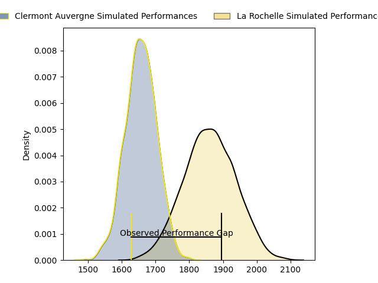
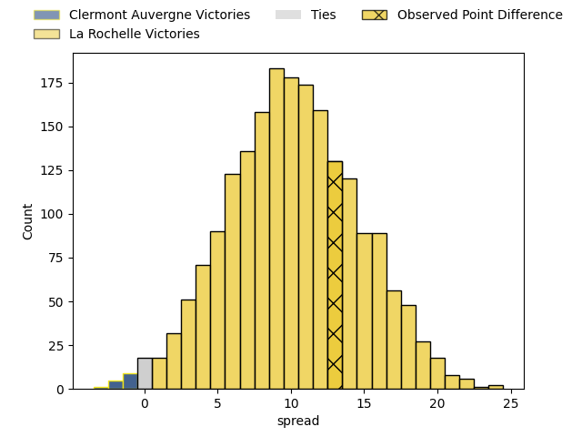
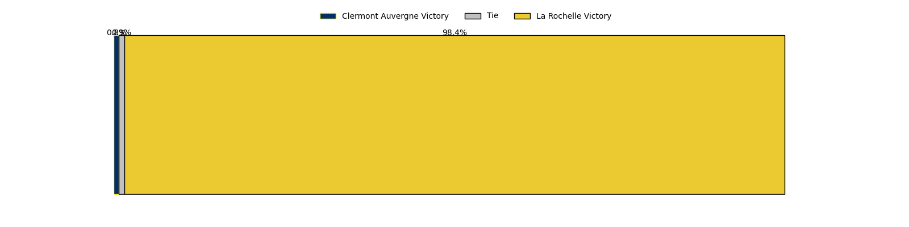

---  
layout: page  
title: Clermont Auvergne at La Rochelle; 13-26  
date: 2023-04-22 15:00:00 18:00:00 -0500  
categories: match review  
---
# Clermont Auvergne at La Rochelle; 13-26

# Club Level Predictions

The first set of predictions treats a club as the smallest object, as the club develops its members, organizes a gameplan, and deploys its players as needed for each match. This club model has a prediction of 0.762, which translates to predicting La Rochelle to win by 10.2.

Each club has a rating and a rating deviation (simiar to a Glicko system), and expected performances can be generated. This allows for simulated matches and spreads like the ones below.
## Projected Performances

## Projected Spreads

## Projected Results

# Player Level Predictions

Treating teams instead as an entity made up of the currently active players, I have ratings for each player in an altogether different system. These can be combined to form team ratings once teamsheets are announced, weighting starters a bit higher than the reserves. After the match is played, players can be weighted by their minutes on the field, allowing for an accurate measure of the team's composition. With these compiled team ratings, we can make predictions, measure inaccuracy, and update the individual player ratings.
## Prediction with Player Minutes: La Rochelle by 18.8

La Rochelle by 14.8 on a neutral field

There were 6 large changes in win probability in this match
## Prediction without Player Minutes: La Rochelle by 17.0

La Rochelle by 13.0 on a neutral pitch

|   Away Minutes | Away Player                |   Away elo |   Away Percentile |   Number |   Home Percentile |   Home elo | Home Player               |   Home Minutes |
|---------------:|:---------------------------|-----------:|------------------:|---------:|------------------:|-----------:|:--------------------------|---------------:|
|             41 | Giorgi Beria               |      68.33 |                29 |        1 |                78 |      89.3  | Reda Wardi                |             61 |
|             79 | Étienne Fourcade           |      73.81 |                44 |        2 |                65 |      83.17 | Quentin Lespiaucq-Brettes |             75 |
|             41 | Cristian Ojovan            |      86.04 |                70 |        3 |                62 |      82.2  | Joel Sclavi               |             50 |
|             80 | Thibault Lanen             |      79.79 |                55 |        4 |                83 |      95.08 | Thomas Lavault            |             54 |
|             54 | Miles Amatosero            |      72.4  |               nan |        5 |                39 |      72.27 | Rémi Picquette            |             80 |
|             80 | Judicael Cancoriet         |      63.89 |                24 |        6 |                49 |      76.62 | Rémi Bourdeau             |             80 |
|             57 | Jacobus van Tonder         |      79.38 |               nan |        7 |                43 |      74.27 | Paul Boudehent            |             80 |
|             80 | Fritz Lee                  |      88.99 |                72 |        8 |               nan |      75.8  | Kyle Hatherell            |             54 |
|             61 | Baptiste Jauneau           |      83.15 |                63 |        9 |               nan |      76.62 | Jules Le Bail             |             38 |
|             54 | Anthony Belleau            |      81.8  |                56 |       10 |                67 |      87.35 | Antoine Hastoy            |             79 |
|             80 | Alivereti Raka             |      71.32 |                38 |       11 |                38 |      73.35 | Dillyn Leyds              |             80 |
|             80 | George Moala               |      83.82 |                62 |       12 |                86 |      98.46 | Jules Favre               |             80 |
|             57 | François Carlo Mey         |      80.05 |               nan |       13 |                79 |      95.78 | UJ Seuteni                |             41 |
|             80 | Alex Newsome               |      81.17 |                55 |       14 |                77 |      92.26 | Teddy Thomas              |             80 |
|             80 | Jean-Pascal Barraque       |      73.12 |               nan |       15 |                85 |     101.25 | Brice Dulin               |             80 |
|             39 | Daniel Bibi Biziwu         |      71.7  |               nan |       16 |                87 |     101.41 | Tawera Kerr-Barlow        |             42 |
|             39 | Rabah Slimani              |      74.21 |                38 |       17 |                85 |      97.89 | Levani Botia              |             39 |
|             26 | Lucas Dessaigne            |      76.59 |                49 |       18 |                85 |      93.94 | Uini Atonio               |             30 |
|             26 | Jules Plisson              |      73.76 |                47 |       19 |                86 |      98.94 | Ultan Dillane             |             26 |
|             23 | Julien Heriteau            |      75.86 |                45 |       20 |                95 |     112.1  | Gregory Alldritt          |             26 |
|             23 | Killian Tixeront           |      67.85 |                30 |       21 |                80 |      93.95 | Hayden Thompson-Stringer  |             19 |
|             19 | Sebastien Bézy             |      86.13 |                66 |       22 |                43 |      74.3  | Hugo Reus                 |              1 |
|              1 | Jean-Maxence Jules-Rosette |      73.27 |               nan |       23 |               nan |      84.04 | Sacha Idoumi              |              5 |

