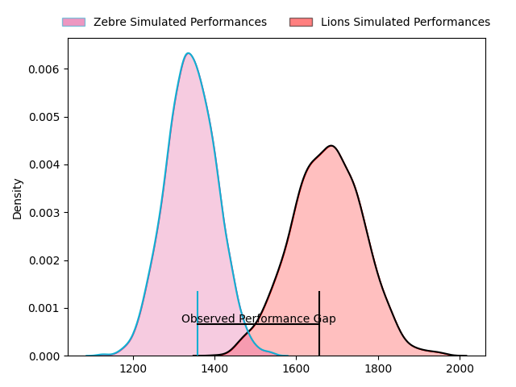
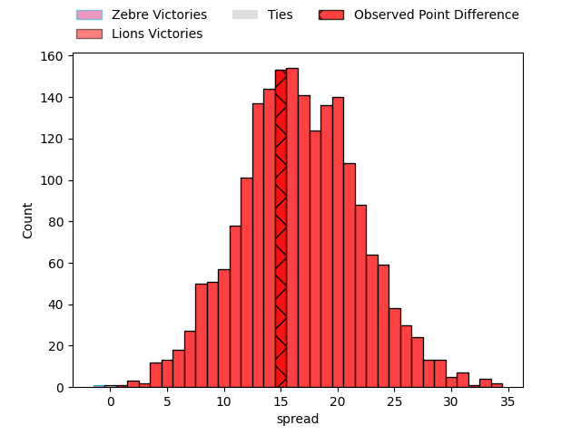
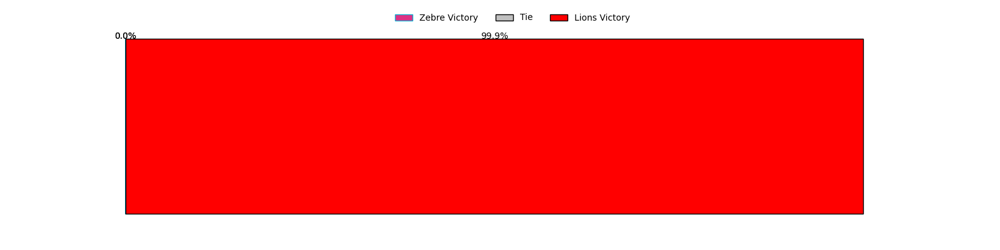

---  
layout: page  
title: Zebre at Lions; 35-50  
date: 2023-04-22 13:00:00 18:00:00 -0500  
categories: match review  
---
# Zebre at Lions; 35-50

# Club Level Predictions

The first set of predictions treats a club as the smallest object, as the club develops its members, organizes a gameplan, and deploys its players as needed for each match. This club model has a prediction of 0.867, which translates to predicting Lions to win by 16.6.

Each club has a rating and a rating deviation (simiar to a Glicko system), and expected performances can be generated. This allows for simulated matches and spreads like the ones below.
## Projected Performances

## Projected Spreads

## Projected Results

# Player Level Predictions

Treating teams instead as an entity made up of the currently active players, I have ratings for each player in an altogether different system. These can be combined to form team ratings once teamsheets are announced, weighting starters a bit higher than the reserves. After the match is played, players can be weighted by their minutes on the field, allowing for an accurate measure of the team's composition. With these compiled team ratings, we can make predictions, measure inaccuracy, and update the individual player ratings.
## Prediction with Player Minutes: Lions by 26.6

Lions by 22.6 on a neutral field

There were 4 large changes in win probability in this match
## Prediction without Player Minutes: Lions by 24.2

Lions by 20.2 on a neutral pitch

|   Away Minutes | Away Player            |   Away elo |   Away Percentile |   Number |   Home Percentile |   Home elo | Home Player                 |   Home Minutes |
|---------------:|:-----------------------|-----------:|------------------:|---------:|------------------:|-----------:|:----------------------------|---------------:|
|             47 | Paolo Buonfiglio       |      65.59 |                24 |        1 |                25 |      65.93 | Rhynardt Rinjsburger        |             69 |
|             46 | Luca Bigi              |      60.8  |               nan |        2 |                70 |      85.6  | PJ Botha                    |             69 |
|             40 | Matteo Nocera          |      55.59 |                11 |        3 |                46 |      75.42 | Asenathi Ntlabakanye        |             46 |
|             67 | Leonard Krumov         |      64.37 |                25 |        4 |                28 |      66.43 | Willem Alberts              |             46 |
|             80 | Andrea Zambonin        |      56.2  |                16 |        5 |                72 |      88.14 | Ruben (Hobo) Schoeman       |             80 |
|             80 | Guido Volpi            |      63.8  |                23 |        6 |                23 |      64.03 | Jacobus Albertus Kriel      |             80 |
|             80 | Luca Andreani          |      68.05 |                30 |        7 |                61 |      82.02 | Ruan Venter                 |             71 |
|             52 | Giacomo Ferrari        |      75.2  |                51 |        8 |                56 |      81.11 | Francke Horn                |             80 |
|             61 | Chris Cook             |      69.92 |                40 |        9 |                60 |      83.03 | Sanele Nohamba              |             69 |
|             80 | Tiff Eden              |      57.77 |                17 |       10 |                54 |      81.14 | Gianni Dean Lombard         |             44 |
|             80 | Simone Gesi            |      59.15 |                19 |       11 |                53 |      78.11 | Edwill Charl van der Merwe  |             80 |
|             80 | Enrico Lucchin         |      58.12 |                16 |       12 |                54 |      80.58 | Marius Louw                 |             80 |
|             73 | Erich Cronje           |      55.94 |                13 |       13 |                55 |      81.07 | Manuel Johern (Mannie) Rass |             80 |
|             51 | Jacobus van Wyk        |      71.02 |                37 |       14 |                68 |      86.36 | Sibahle Ndiphiwe Maxwane    |             80 |
|             80 | Jacopo Trulla          |      68.53 |                33 |       15 |                56 |      81.71 | Quan Horn                   |             80 |
|             40 | Muhamed Hasa           |      70.42 |                34 |       16 |                56 |      80.04 | Andries Coetzee             |             36 |
|             34 | Marco Manfredi         |      62.27 |                26 |       17 |               nan |      70.03 | Ruan Martin Dreyer          |             34 |
|             33 | Juan Manuel Pitinari   |      73.06 |                40 |       18 |                68 |      85.01 | Emmanuel Tshituka           |             34 |
|             29 | Geronimo Prisciantelli |      75.06 |                45 |       19 |                43 |      74.69 | Morne Van den Berg          |             11 |
|             28 | Davide Ruggeri         |      54.91 |                11 |       20 |                57 |      80.09 | Morgan Naude                |             11 |
|             19 | Alessandro Fusco       |      74.75 |                44 |       21 |                22 |      62.72 | Morné Brandon               |             11 |
|             13 | Jan-Frederik Uys       |      71.94 |                38 |       22 |                76 |      89.7  | Ruan Delport                |              9 |
|              7 | Richard Kriel          |      60.93 |                20 |       23 |               nan |     nan    | nan                         |            nan |

