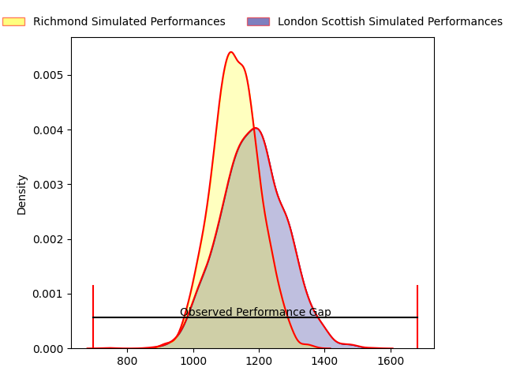
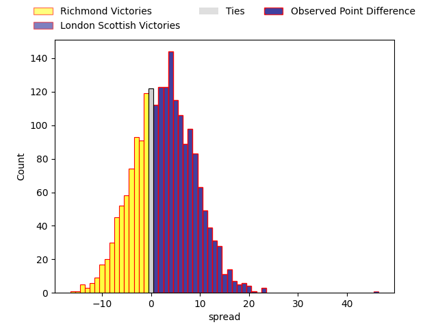

---  
layout: page  
title: Richmond at London Scottish; 3-49  
date: 2023-04-22 16:00:00 18:00:00 -0500  
categories: match review  
---
# Richmond at London Scottish; 3-49

# Club Level Predictions

The first set of predictions treats a club as the smallest object, as the club develops its members, organizes a gameplan, and deploys its players as needed for each match. This club model has a prediction of 0.573, which translates to predicting London Scottish to win by 2.6.

Each club has a rating and a rating deviation (simiar to a Glicko system), and expected performances can be generated. This allows for simulated matches and spreads like the ones below.
## Projected Performances

## Projected Spreads

## Projected Results

# Player Level Predictions

Treating teams instead as an entity made up of the currently active players, I have ratings for each player in an altogether different system. These can be combined to form team ratings once teamsheets are announced, weighting starters a bit higher than the reserves. After the match is played, players can be weighted by their minutes on the field, allowing for an accurate measure of the team's composition. With these compiled team ratings, we can make predictions, measure inaccuracy, and update the individual player ratings.
## Prediction with Player Minutes: London Scottish by 3.5

Richmond by 0.5 on a neutral field

There were 6 large changes in win probability in this match
## Prediction without Player Minutes: London Scottish by 0.4

Richmond by 3.6 on a neutral pitch

|   Away Minutes | Away Player       |   Away elo |   Away Percentile |   Number |   Home Percentile |   Home elo | Home Player        |   Home Minutes |
|---------------:|:------------------|-----------:|------------------:|---------:|------------------:|-----------:|:-------------------|---------------:|
|             55 | George Cave       |      78.5  |                53 |        1 |                26 |      66.67 | Will Prior         |             65 |
|             47 | Alexander Post    |      72.25 |                39 |        2 |                19 |      59.81 | Austin Wallis      |             25 |
|             47 | Jimmy Litchfield  |      69.31 |                32 |        3 |                25 |      65.98 | Joe Rees           |             65 |
|             80 | Jake Monson       |      61.2  |                15 |        4 |                19 |      60.63 | Matas Jurevicius   |             77 |
|             52 | Tevita Cavubati   |      76.61 |                48 |        5 |                93 |     109.31 | Bailey Ransom      |             80 |
|             80 | David Massey      |      67.77 |                29 |        6 |                21 |      62.21 | Will Trenholm      |             80 |
|             80 | Ethan Benson      |      76.52 |                49 |        7 |                16 |      58.54 | Jack Ingall        |             80 |
|             25 | Mark Bright       |      74.2  |                41 |        8 |                 6 |      47.22 | Cameron King       |             55 |
|             59 | Jack Stafford     |      80.33 |                55 |        9 |                21 |      62.81 | Daniel Nutton      |             65 |
|             80 | Alex Burrage      |      72.29 |               nan |       10 |                37 |      70.87 | Nathan Chamberlain |             77 |
|             67 | Jack Caddy        |      46.37 |                 5 |       11 |                81 |      95.29 | Cassius Cleaves    |             80 |
|             80 | Craig Duncan      |      79.72 |                50 |       12 |                21 |      62.33 | Will Simonds       |             66 |
|             80 | Paddy Case        |      64.15 |                23 |       13 |                71 |      90.78 | Cameron Anderson   |             80 |
|             80 | Alexander O'Meara |      80.09 |                57 |       14 |                44 |      74.41 | Luke Mehson        |             80 |
|             59 | Darren Atkins     |      84.54 |                61 |       15 |                27 |      66.38 | Charlie Ingall     |             80 |
|             55 | Lucas Brooke      |      58.22 |                16 |       16 |               nan |      59.65 | Nathan Jibulu      |             55 |
|             33 | Joseph Vajner     |      57.53 |                21 |       17 |                20 |      65.79 | Viliami Taulani    |             25 |
|             33 | Ntinga Mpiko      |      66.91 |                27 |       18 |               nan |      62.92 | Rhys Litterick     |             15 |
|             28 | George Nugent     |      59.01 |               nan |       19 |               nan |      63.26 | Luca Petrozzi      |             15 |
|             25 | Conor Maguire     |      75.83 |                40 |       20 |               nan |      60.3  | Rhys Charalambous  |             15 |
|             21 | James Lennon      |      93.25 |                78 |       21 |                25 |      65.39 | Vilikesa Wara      |             14 |
|             21 | Zuriel Makele     |      78.71 |                55 |       22 |                35 |      71.08 | Connor Slevin      |              3 |
|             13 | Raz Patel         |      58.7  |                18 |       23 |                18 |      61.36 | Maurice Nwakor     |              3 |

