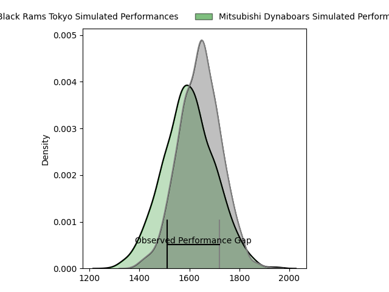
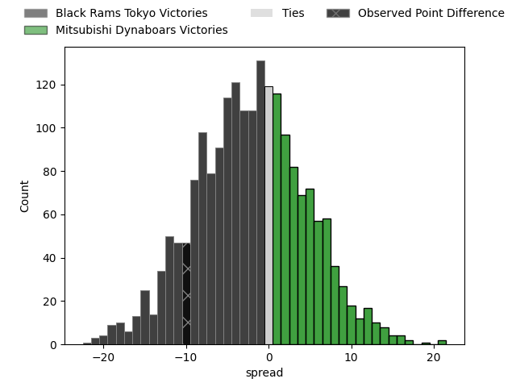

---  
layout: page  
title: Black Rams Tokyo at Mitsubishi Dynaboars; 31-21  
date: 2023-04-22 07:00:00 18:00:00 -0500  
categories: match review  
---
# Black Rams Tokyo at Mitsubishi Dynaboars; 31-21

# Club Level Predictions

The first set of predictions treats a club as the smallest object, as the club develops its members, organizes a gameplan, and deploys its players as needed for each match. This club model has a prediction of 0.445, which translates to predicting Black Rams Tokyo to win by 2.0.

Each club has a rating and a rating deviation (simiar to a Glicko system), and expected performances can be generated. This allows for simulated matches and spreads like the ones below.
## Projected Performances

## Projected Spreads

## Projected Results

# Player Level Predictions

Treating teams instead as an entity made up of the currently active players, I have ratings for each player in an altogether different system. These can be combined to form team ratings once teamsheets are announced, weighting starters a bit higher than the reserves. After the match is played, players can be weighted by their minutes on the field, allowing for an accurate measure of the team's composition. With these compiled team ratings, we can make predictions, measure inaccuracy, and update the individual player ratings.
## Prediction with Player Minutes: Black Rams Tokyo by 14.0

Black Rams Tokyo by 18.0 on a neutral field

There were 6 large changes in win probability in this match
## Prediction without Player Minutes: Black Rams Tokyo by 12.8

Black Rams Tokyo by 16.8 on a neutral pitch

|   Away Minutes | Away Player        |   Away elo |   Away Percentile |   Number |   Home Percentile |   Home elo | Home Player            |   Home Minutes |
|---------------:|:-------------------|-----------:|------------------:|---------:|------------------:|-----------:|:-----------------------|---------------:|
|             40 | Kazuma Nishi       |      86.31 |                70 |        1 |                40 |      75.24 | Shunsuke Sakamoto      |             58 |
|             72 | Ko Sato            |      85.66 |                70 |        2 |                53 |      75.27 | Yoshimitsu Yasue       |             62 |
|             72 | Taichi Chiba       |      84.6  |                65 |        3 |                48 |      77    | Jun Morimoto           |             62 |
|             62 | Michael Stolberg   |      87.78 |                72 |        4 |                42 |      74.59 | Epineri Uluviti        |             80 |
|             80 | Pohiva Lotoahea    |     122.35 |                97 |        5 |                54 |      80.99 | Sam Chongkit           |             80 |
|             80 | Talau Fakatava     |      73.65 |                38 |        6 |                39 |      72.09 | Timote Tavalea         |             80 |
|             80 | Brodi McCurran     |     105.55 |                91 |        7 |                40 |      74.37 | Yusuke Sakamoto        |             62 |
|             80 | Nathan Hughes      |      78.57 |                50 |        8 |                33 |      71.53 | Jackson Hemopo         |             48 |
|             72 | Syota Yamamoto     |      77.04 |                48 |        9 |               nan |      69.49 | Ryuta Nakamori         |             55 |
|             80 | Kohei Horigome     |      90.77 |                76 |       10 |                37 |      70.85 | Matt To'omua           |             80 |
|             80 | Netani Vakayalia   |     104.97 |                90 |       11 |                48 |      76.17 | Satoshi Koizumi        |             78 |
|             67 | Hadleigh Parkes    |      87.29 |                68 |       12 |                54 |      80.53 | Brackin Karauria-Henry |             40 |
|              7 | Amanaki Lotoahea   |      84.49 |                63 |       13 |                54 |      79.23 | Nozomi Nara            |             80 |
|             80 | Yuta Kurihara      |      55.65 |                12 |       14 |                40 |      72.73 | Matt Vaega             |             80 |
|             80 | Isaac Lucas        |      91.78 |                73 |       15 |                48 |      77.63 | Kazuki Ishida          |             80 |
|             40 | Yuichiro Taniguchi |     101.18 |                90 |       16 |               nan |      70.79 | Ryoto Fukuyama         |             40 |
|             18 | Josh Goodhue       |      86.01 |                74 |       17 |               nan |      71.36 | Heiden Bedwell-Curtis  |             32 |
|             13 | Matt McGahan       |      87.3  |                67 |       18 |                60 |      82.7  | Ryoto Shibata          |             25 |
|              8 | Toshiya Takahashi  |      80.37 |                53 |       19 |                 9 |      53.76 | Hayato Hosoda          |             22 |
|              8 | Masaaki Onishi     |      88.81 |                62 |       20 |               nan |      80.21 | Yuya Otsuka            |             18 |
|              8 | Daigo Sasagawa     |      92.42 |                79 |       21 |                41 |      73.52 | Mototsugu Hachiya      |             18 |
|             73 | Siope Lolo Tavo    |      58.19 |                17 |       22 |                42 |      73.84 | Maoya Nakagawa         |             18 |
|            nan | nan                |     nan    |               nan |       23 |                50 |      76.33 | Keita Sekimoto         |              2 |

