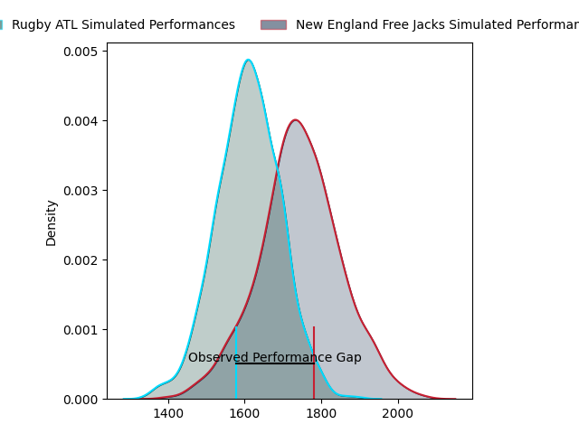
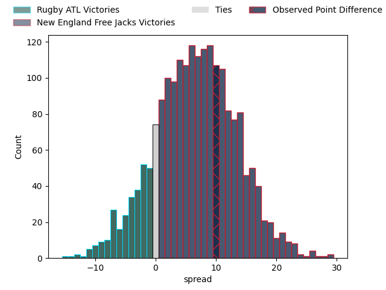

---  
layout: page  
title: Rugby ATL at New England Free Jacks; 13-23  
date: 2023-04-22 21:00:00 18:00:00 -0500  
categories: match review  
---
# Rugby ATL at New England Free Jacks; 13-23

# Club Level Predictions

The first set of predictions treats a club as the smallest object, as the club develops its members, organizes a gameplan, and deploys its players as needed for each match. This club model has a prediction of 0.677, which translates to predicting New England Free Jacks to win by 6.7.

Each club has a rating and a rating deviation (simiar to a Glicko system), and expected performances can be generated. This allows for simulated matches and spreads like the ones below.
## Projected Performances

## Projected Spreads

## Projected Results

# Player Level Predictions

Treating teams instead as an entity made up of the currently active players, I have ratings for each player in an altogether different system. These can be combined to form team ratings once teamsheets are announced, weighting starters a bit higher than the reserves. After the match is played, players can be weighted by their minutes on the field, allowing for an accurate measure of the team's composition. With these compiled team ratings, we can make predictions, measure inaccuracy, and update the individual player ratings.
## Prediction with Player Minutes: New England Free Jacks by 3.2

Rugby ATL by 0.8 on a neutral field

There were 4 large changes in win probability in this match
## Prediction without Player Minutes: New England Free Jacks by 7.6

New England Free Jacks by 3.6 on a neutral pitch

|   Away Minutes | Away Player                |   Away elo |   Away Percentile |   Number |   Home Percentile |   Home elo | Home Player        |   Home Minutes |
|---------------:|:---------------------------|-----------:|------------------:|---------:|------------------:|-----------:|:-------------------|---------------:|
|             78 | Will Burke                 |      62.03 |                19 |        1 |                38 |      72.16 | Kyle Ciquera       |             49 |
|             80 | Alex Maughan               |      -0.58 |                 0 |        2 |                22 |      61.76 | Andrew Quattrin    |             15 |
|             53 | John Roy Jenkinson         |      69.91 |                33 |        3 |                42 |      73.92 | Cole Keith         |             49 |
|             57 | Justin Johan Basson        |      62.69 |                23 |        4 |                16 |      58.78 | Jesse Parete       |             53 |
|             80 | Johannes Momsen            |      72.01 |                39 |        5 |                46 |      75.3  | Conor Keys         |             80 |
|             78 | Vili Helu                  |     114.32 |                95 |        6 |                13 |      56.02 | Mitchell Jacobson  |             80 |
|             80 | Matthew Heaton             |      57.91 |                16 |        7 |               nan |      59.01 | Slade McDowall     |             59 |
|             53 | Ross Deacon                |      34.56 |                 1 |        8 |                76 |      90.91 | Wian Conradie      |             80 |
|             80 | Ryan Rees                  |      72.12 |                32 |        9 |                63 |      84.66 | John Poland        |             45 |
|             21 | Duncan van Schalkwyk       |      37.83 |                 2 |       10 |                68 |      88.35 | Jayson Potroz      |             80 |
|             60 | Nolan Tuamoheloa           |      29.88 |                 1 |       11 |                72 |      88.5  | Paul Balekana      |             80 |
|             80 | Will Leonard               |     175.45 |               100 |       12 |                20 |      61.47 | Le Roux Malan      |             80 |
|             80 | Martini Talapusi           |      87.59 |                68 |       13 |                23 |      64.13 | Wayne van der Bank |             49 |
|             80 | Te Rangatira Waitokia      |      64.34 |                26 |       14 |                26 |      64.63 | Mitchell Wilson    |             80 |
|             80 | Rewita Biddle              |      64.73 |                24 |       15 |                27 |      67.33 | Spencer Jones      |             80 |
|              2 | Lincoln Sii                |      60.74 |               nan |       16 |                 5 |      46.73 | Kianu Kereru-Symes |             31 |
|             27 | Wikus Christian Groenewald |      68.1  |                24 |       17 |                12 |      60.95 | Millenium Sanerivi |             65 |
|             23 | Christian Nahuel Milan     |      50.66 |                 6 |       18 |                61 |      96.02 | Tevita Sole        |             31 |
|              2 | Frederick Henry-Ajudua     |      58.92 |               nan |       19 |               nan |      60.46 | Reegan O'Gorman    |             27 |
|             27 | Daemon Torres              |      81.36 |                57 |       20 |                 0 |       5.17 | Joe Johnston       |             21 |
|             59 | Kurt Kendall Coleman       |      46.44 |                 3 |       21 |                 0 |      14.85 | Holden Yungert     |             35 |
|             20 | Harley Davidson            |      69.97 |                34 |       22 |                36 |      71.68 | Ben Lesage         |             31 |

