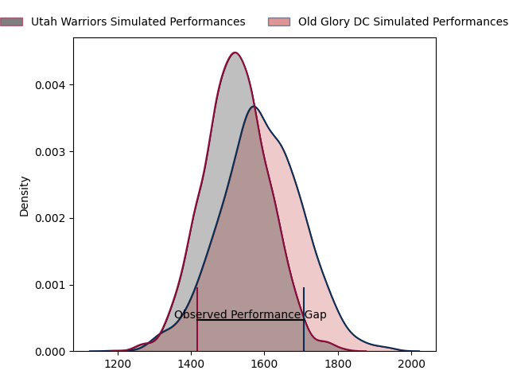
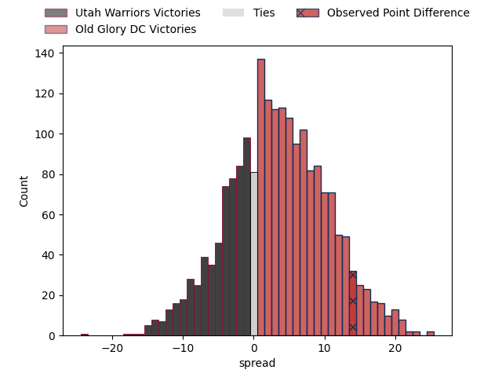

---  
layout: page  
title: Utah Warriors at Old Glory DC; 22-36  
date: 2023-04-22 21:00:00 18:00:00 -0500  
categories: match review  
---
# Utah Warriors at Old Glory DC; 22-36

# Club Level Predictions

The first set of predictions treats a club as the smallest object, as the club develops its members, organizes a gameplan, and deploys its players as needed for each match. This club model has a prediction of 0.6, which translates to predicting Old Glory DC to win by 3.6.

Each club has a rating and a rating deviation (simiar to a Glicko system), and expected performances can be generated. This allows for simulated matches and spreads like the ones below.
## Projected Performances

## Projected Spreads

## Projected Results

# Player Level Predictions

Treating teams instead as an entity made up of the currently active players, I have ratings for each player in an altogether different system. These can be combined to form team ratings once teamsheets are announced, weighting starters a bit higher than the reserves. After the match is played, players can be weighted by their minutes on the field, allowing for an accurate measure of the team's composition. With these compiled team ratings, we can make predictions, measure inaccuracy, and update the individual player ratings.
## Prediction with Player Minutes: Old Glory DC by 2.4

Utah Warriors by 1.6 on a neutral field

There were 5 large changes in win probability in this match
## Prediction without Player Minutes: Old Glory DC by 3.1

Utah Warriors by 0.9 on a neutral pitch

|   Away Minutes | Away Player                |   Away elo |   Away Percentile |   Number |   Home Percentile |   Home elo | Home Player              |   Home Minutes |
|---------------:|:---------------------------|-----------:|------------------:|---------:|------------------:|-----------:|:-------------------------|---------------:|
|             54 | Olive Kilifi               |      60.38 |                17 |        1 |                 0 |      21.78 | Jack Iscaro              |             77 |
|             74 | Ratu Vere Taukona Vugakoto |      59.25 |                18 |        2 |                20 |      61.08 | Nic Souchon              |             69 |
|             52 | Paul Mullen                |      57.23 |                13 |        3 |                18 |      61.24 | Kyle Stewart             |             57 |
|             80 | Jurie George van Vuuren    |      57.77 |                17 |        4 |                23 |      62.99 | Colin Grosse             |             80 |
|             77 | Jamie Lane                 |      54.64 |                12 |        5 |               nan |      58.7  | Kyle Baillie             |             80 |
|             66 | Bailey Wilson              |      61.38 |                20 |        6 |                81 |      94.02 | Jamason Fa'anana Schultz |             63 |
|             80 | Lance Williams             |      96.9  |                84 |        7 |                58 |      80.27 | Lautaro Ezequiel Bavaro  |             80 |
|             80 | Thomas Tu'avao             |      73.44 |                38 |        8 |                96 |     117.12 | Langilangi Haupeakui     |             50 |
|             70 | Connor McLeod              |      51.97 |                 8 |        9 |                10 |      53.04 | Danny Joseph Tusitala    |             77 |
|             80 | Joel Hodgson               |      57.47 |                14 |       10 |                20 |      62.37 | Gradyn Bowd              |             80 |
|             77 | Joseph Mano                |      39.95 |                 3 |       11 |                10 |      50.94 | Tafeaga Junior Sau       |             60 |
|             66 | Tyler Luke Fisher          |     109.7  |                93 |       12 |                 9 |      56.26 | Thretton Palamo          |             60 |
|             80 | Mika Kruse                 |      53.26 |                10 |       13 |                 0 |      27.51 | William Talataina-Mu     |             80 |
|             80 | Caleb Makene               |      51.13 |                10 |       14 |                19 |      59.14 | Peni Lasaqa              |             80 |
|             80 | Cliven Loubser             |      56.51 |                14 |       15 |                16 |      57.76 | Kurt Baker               |             80 |
|             26 | Franco van den Berg        |      27.19 |                 0 |       16 |               nan |      57.48 | Cali Martinez            |              3 |
|              6 | Joey Backe                 |      65.7  |                26 |       17 |               nan |      58.83 | Facundo Gattas           |             11 |
|             28 | Angus McLellan             |      48.59 |                 6 |       18 |                 2 |      39.63 | Quentin Newcomer         |             23 |
|              3 | Jonah Dietenberger         |      76.16 |               nan |       19 |                27 |      65.86 | Fintan Coleman           |             17 |
|             14 | Jeremiah Noaese            |      63.35 |                22 |       20 |                57 |      80.85 | Alejandro Daireaux       |             30 |
|             10 | Zion Going                 |      62.88 |                20 |       21 |               nan |      55.89 | John LeFevre             |              3 |
|              3 | Logan Tago                 |      67.26 |                31 |       22 |                52 |      77.9  | Marcos Young             |             20 |
|             14 | Calvin Whiting             |      59.86 |                20 |       23 |                13 |      57.35 | Joaquin Diaz Bonilla     |             20 |

