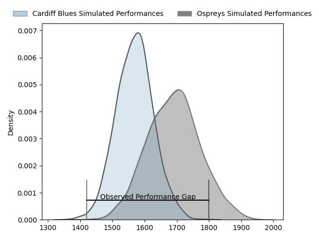
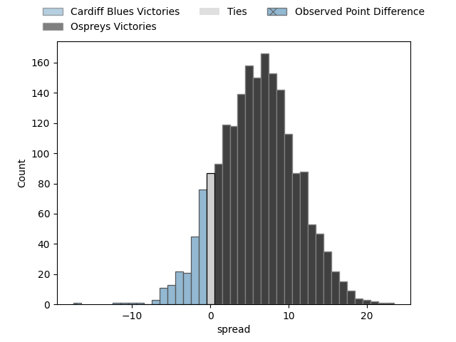
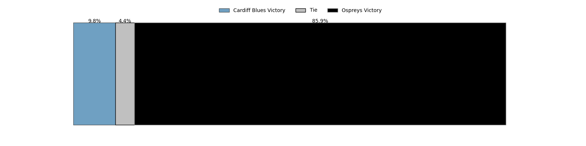

---  
layout: page  
title: Cardiff Blues at Ospreys; 38-21  
date: 2023-04-22 18:15:00 18:00:00 -0500  
categories: match review  
---
# Cardiff Blues at Ospreys; 38-21

# Club Level Predictions

The first set of predictions treats a club as the smallest object, as the club develops its members, organizes a gameplan, and deploys its players as needed for each match. This club model has a prediction of 0.666, which translates to predicting Ospreys to win by 6.1.

Each club has a rating and a rating deviation (simiar to a Glicko system), and expected performances can be generated. This allows for simulated matches and spreads like the ones below.
## Projected Performances

## Projected Spreads

## Projected Results

# Player Level Predictions

Treating teams instead as an entity made up of the currently active players, I have ratings for each player in an altogether different system. These can be combined to form team ratings once teamsheets are announced, weighting starters a bit higher than the reserves. After the match is played, players can be weighted by their minutes on the field, allowing for an accurate measure of the team's composition. With these compiled team ratings, we can make predictions, measure inaccuracy, and update the individual player ratings.
## Prediction with Player Minutes: Ospreys by 13.8

Ospreys by 9.8 on a neutral field

There were 9 large changes in win probability in this match
## Prediction without Player Minutes: Ospreys by 15.4

Ospreys by 11.4 on a neutral pitch

|   Away Minutes | Away Player       |   Away elo |   Away Percentile |   Number |   Home Percentile |   Home elo | Home Player            |   Home Minutes |
|---------------:|:------------------|-----------:|------------------:|---------:|------------------:|-----------:|:-----------------------|---------------:|
|             53 | Corey Domachowski |      79.37 |                56 |        1 |                46 |      72.82 | Nicky Smith            |             50 |
|             50 | Liam Belcher      |      75.91 |                48 |        2 |                48 |      73.05 | Sam Parry              |             50 |
|             53 | Kieran Assirati   |      74.52 |                43 |        3 |                99 |     125.65 | Tomas Francis          |             50 |
|             40 | James Ratti       |      67.43 |                24 |        4 |                79 |      92.31 | Adam Beard             |             80 |
|             80 | Seb Davies        |      69.83 |                33 |        5 |                89 |     101.69 | Alun Wyn Jones         |             59 |
|             80 | Joshua Turnbull   |      80.67 |                67 |        6 |                19 |      60.1  | Rhys Davies            |             80 |
|             64 | Thomas Young      |      78.72 |                55 |        7 |                35 |      70.62 | Daniel Lydiate         |             59 |
|             80 | Taulupe Faletau   |      97.56 |                84 |        8 |                46 |      76.48 | Morgan Morris          |             80 |
|             59 | Tomos Williams    |     114.44 |                95 |        9 |                97 |     118.47 | Rhys Webb              |             59 |
|             80 | Jarrod Evans      |      72.72 |                40 |       10 |               nan |      78.58 | Gareth Anscombe        |             80 |
|             68 | Jason Harries     |      57.15 |                16 |       11 |                43 |      74.28 | Luke Morgan            |             80 |
|             80 | Max Llewellyn     |      71.01 |                34 |       12 |                91 |     107.56 | Owen Williams          |             80 |
|             64 | Rey Lee-Lo        |      72.74 |                38 |       13 |                43 |      74.54 | Kieran Williams        |             64 |
|             80 | Mason Grady       |      82.06 |                58 |       14 |                94 |     112.04 | George North           |             70 |
|             80 | Rhys Priestland   |      78.93 |                51 |       15 |                44 |      75.35 | Michael Collins        |             80 |
|             40 | James Botham      |      74.2  |                44 |       16 |                37 |      71.2  | Dewi Lake              |             30 |
|             30 | Kristian Dacey    |      74.08 |                44 |       17 |                69 |      85.3  | Gareth Thomas          |             30 |
|             27 | Dillon Lewis      |      93.26 |                73 |       18 |                28 |      68.12 | Tom Botha              |             30 |
|             27 | Rhys Carre        |      72.5  |                35 |       19 |                57 |      77.09 | Ethan Roots            |             21 |
|             21 | Lloyd Williams    |      71.46 |                38 |       20 |                60 |      81.1  | Huw Sutton             |             21 |
|             16 | Ben Thomas        |      69.91 |                30 |       21 |                31 |      65.76 | Reuben Morgan-Williams |             21 |
|             16 | Teddy Williams    |     100.58 |                87 |       22 |                27 |      66.67 | Max Nagy               |             16 |
|             12 | Harri Millard     |      75.61 |               nan |       23 |               nan |      78.97 | Harri Doel             |             10 |

