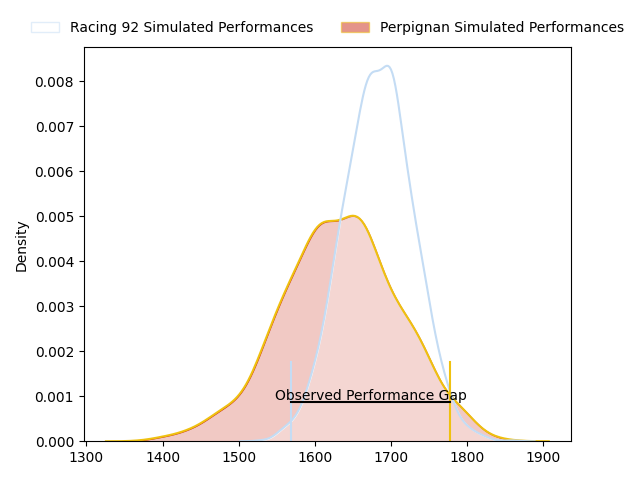
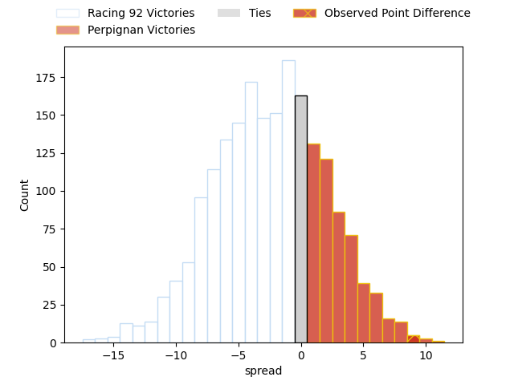
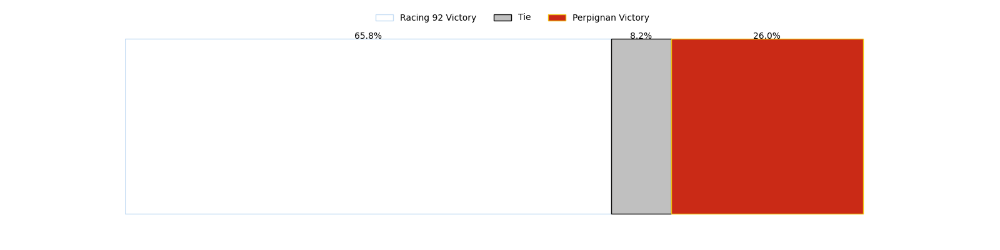

---  
layout: page  
title: Racing 92 at Perpignan; 21-30  
date: 2023-04-22 17:00:00 18:00:00 -0500  
categories: match review  
---
# Racing 92 at Perpignan; 21-30

# Club Level Predictions

The first set of predictions treats a club as the smallest object, as the club develops its members, organizes a gameplan, and deploys its players as needed for each match. This club model has a prediction of 0.427, which translates to predicting Racing 92 to win by 2.6.

Each club has a rating and a rating deviation (simiar to a Glicko system), and expected performances can be generated. This allows for simulated matches and spreads like the ones below.
## Projected Performances

## Projected Spreads

## Projected Results

# Player Level Predictions

Treating teams instead as an entity made up of the currently active players, I have ratings for each player in an altogether different system. These can be combined to form team ratings once teamsheets are announced, weighting starters a bit higher than the reserves. After the match is played, players can be weighted by their minutes on the field, allowing for an accurate measure of the team's composition. With these compiled team ratings, we can make predictions, measure inaccuracy, and update the individual player ratings.
## Prediction with Player Minutes: Perpignan by 7.2

Perpignan by 3.2 on a neutral field

There were 12 large changes in win probability in this match
## Prediction without Player Minutes: Perpignan by 8.8

Perpignan by 4.8 on a neutral pitch

|   Away Minutes | Away Player            |   Away elo |   Away Percentile |   Number |   Home Percentile |   Home elo | Home Player           |   Home Minutes |
|---------------:|:-----------------------|-----------:|------------------:|---------:|------------------:|-----------:|:----------------------|---------------:|
|             51 | Guram Gogichashvili    |      78.49 |                53 |        1 |                49 |      79.47 | Giorgi Tetrashvili    |             48 |
|             51 | Janick Tarrit          |      67.86 |                30 |        2 |                61 |      81.66 | Seilala Lam           |             63 |
|             57 | Trevor Ntando Nyakane  |      79.3  |                56 |        3 |                65 |      83.5  | Arthur Joly           |             63 |
|             80 | Fabien Sanconnie       |      86.35 |                69 |        4 |                70 |      89.57 | Tristan Labouteley    |             80 |
|             80 | Anton Bresler          |      69.47 |                30 |        5 |                57 |      83.47 | Posolo Tuilagi        |             67 |
|             80 | Ibrahim Diallo         |      72.58 |                40 |        6 |                60 |      81.68 | Brad Shields          |             80 |
|             80 | Baptiste Chouzenoux    |      77.02 |                50 |        7 |                33 |      71.57 | Joaquin Oviedo        |             69 |
|             24 | Maxime Baudonne        |      71.54 |                37 |        8 |                53 |      79.92 | Genesis Mamea Lemalu  |             80 |
|             76 | Nolann Le Garrec       |      81.38 |                57 |        9 |                67 |      86.89 | Sadek Deghmache       |             77 |
|             80 | Finn Russell           |     103.6  |                88 |       10 |                58 |      82.74 | Jake McIntyre         |             71 |
|             80 | Vinaya Habosi          |      80.75 |                58 |       11 |                59 |      81.34 | Alistair Crossdale    |             80 |
|             47 | Henry Chavancy         |      82.81 |                55 |       12 |                50 |      77.81 | Jeronimo de la Fuente |             80 |
|             80 | Gael Fickou            |      98.4  |                82 |       13 |                49 |      77.48 | Edward Sawailau       |             52 |
|             80 | Donovan Taofifenua     |      60.85 |                21 |       14 |                45 |      76.11 | Lucas Dubois          |             80 |
|             47 | Max Spring             |      86.53 |                65 |       15 |                75 |      92.02 | Tristan Tedder        |             80 |
|             56 | Cameron Woki           |      71.12 |                32 |       16 |                50 |      77.1  | Mathieu Acebes        |             28 |
|             33 | Francis Saili          |      89.07 |                70 |       17 |                43 |      74.19 | Sacha Lotrian         |             32 |
|             33 | Warrick Wayne Gelant   |      68.48 |                27 |       18 |                50 |      80.17 | Siua Halanukonuka     |             17 |
|             29 | Thomas Moukoro         |      69.73 |                32 |       19 |                67 |      84.04 | Mike Tadjer           |             17 |
|             29 | Peniami Nasali Narisia |      75.42 |                43 |       20 |                27 |      66.47 | Shahn Eru             |             13 |
|             23 | Ali Oz                 |      70.5  |                30 |       21 |                54 |      78.74 | Kélian Galletier      |             11 |
|              4 | Antoine Gibert         |      79.06 |                51 |       22 |               nan |      74.05 | Tom Ecochard          |              3 |
|            nan | nan                    |     nan    |               nan |       23 |                71 |      88.24 | Théo Forner           |              9 |

