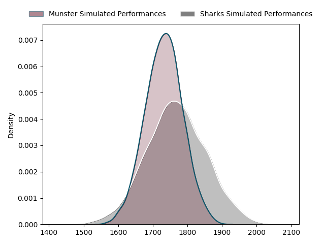
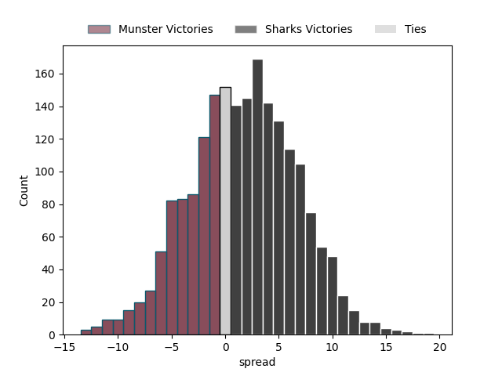

---  
layout: page  
title: Munster at Sharks; 22-22  
date: 2023-04-22 18:15:00 18:00:00 -0500  
categories: match review  
---
# Munster at Sharks; 22-22

# Club Level Predictions

The first set of predictions treats a club as the smallest object, as the club develops its members, organizes a gameplan, and deploys its players as needed for each match. This club model has a prediction of 0.549, which translates to predicting Sharks to win by 1.7.

Each club has a rating and a rating deviation (simiar to a Glicko system), and expected performances can be generated. This allows for simulated matches and spreads like the ones below.
## Projected Performances

## Projected Spreads

## Projected Results

# Player Level Predictions

Treating teams instead as an entity made up of the currently active players, I have ratings for each player in an altogether different system. These can be combined to form team ratings once teamsheets are announced, weighting starters a bit higher than the reserves. After the match is played, players can be weighted by their minutes on the field, allowing for an accurate measure of the team's composition. With these compiled team ratings, we can make predictions, measure inaccuracy, and update the individual player ratings.
## Prediction with Player Minutes: Sharks by 6.2

Sharks by 2.2 on a neutral field

There were 4 large changes in win probability in this match
## Prediction without Player Minutes: Sharks by 5.8

Sharks by 1.8 on a neutral pitch

|   Away Minutes | Away Player      |   Away elo |   Away Percentile |   Number |   Home Percentile |   Home elo | Home Player                 |   Home Minutes |
|---------------:|:-----------------|-----------:|------------------:|---------:|------------------:|-----------:|:----------------------------|---------------:|
|             61 | Jeremy Loughman  |      82.8  |                64 |        1 |                92 |     103.09 | Retshegofaditswe Nche       |             66 |
|             80 | Diarmuid Barron  |      86.62 |                72 |        2 |                64 |      83.06 | Mbongeni Mbonambi           |             65 |
|             80 | Stephen Archer   |      87.34 |                73 |        3 |                90 |      99.11 | Thomas Joubert du Toit      |             66 |
|             65 | Jean Kleyn       |      78.15 |                52 |        4 |                28 |      68.13 | Jeandre Labuschagne         |             65 |
|             80 | Fineen Wycherley |      82.94 |                64 |        5 |                53 |      78.78 | Douw Gerbrandt Grobler      |             80 |
|             80 | Peter O'Mahony   |      67.5  |                28 |        6 |                67 |      84.67 | Siya Kolisi                 |              7 |
|             61 | Alex Kendellen   |      89.44 |                75 |        7 |                66 |      84.22 | Vincent Tshikaya Tshituka   |             80 |
|             80 | Gavin Coombes    |      77.03 |                47 |        8 |                79 |      94.36 | Sikhumbuzo Notshe           |             80 |
|             73 | Conor Murray     |     125.83 |                99 |        9 |                72 |      89.5  | Grant Williams              |             80 |
|             53 | Jack Crowley     |      75.6  |                46 |       10 |                64 |      85.75 | Curwin Dominique Bosch      |             34 |
|             80 | Jack Daly        |      83.24 |                63 |       11 |                68 |      85.88 | Makazole Mapimpi            |             80 |
|             80 | Malakai Fekitoa  |      84.17 |                63 |       12 |                63 |      84.11 | Ben Tapuai                  |             65 |
|             80 | Antoine Frisch   |      89.9  |                72 |       13 |                65 |      85.91 | Lukhanyo Am                 |             80 |
|             80 | Calvin Nash      |      72.11 |                39 |       14 |                65 |      84.35 | Werner Kok                  |             80 |
|             61 | Michael Haley    |      76.81 |                46 |       15 |                45 |      76.44 | Boeta Chamberlain           |             80 |
|             27 | Ben Healy        |      91.48 |               nan |       16 |                70 |      89.28 | Phendulani Buthelezi        |             73 |
|             16 | Keith Earls      |      78    |               nan |       17 |                62 |      82.86 | Aphelele Onke Okuhle Fassi  |             46 |
|             19 | Josh Wycherley   |      81.18 |                71 |       18 |                41 |      72.77 | Daniel Pieter (Reniel) Hugo |             15 |
|             19 | Jack O'Donoghue  |      76.28 |                47 |       19 |                65 |      88.25 | Kerron van Vuuren           |             15 |
|             15 | Edwin Edogbo     |      85.76 |                69 |       20 |                47 |      76.8  | Rohan Janse van Rensburg    |             15 |
|              7 | Craig Casey      |      85.06 |                63 |       21 |                40 |      76.16 | Ntuthuko Mchunu             |             14 |
|              3 | Scott Buckley    |      95.33 |               nan |       22 |                47 |      78.37 | Carlu Johann Sadie          |             14 |

