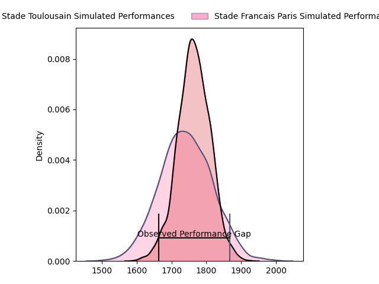
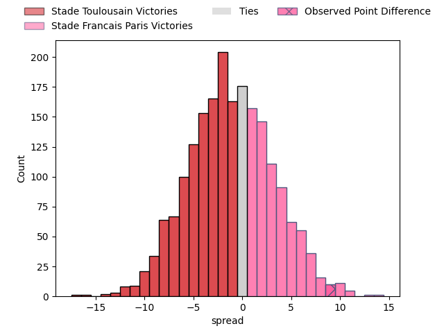

---  
layout: page  
title: Stade Toulousain at Stade Francais Paris; 10-19  
date: 2023-04-22 21:00:00 18:00:00 -0500  
categories: match review  
---
# Stade Toulousain at Stade Francais Paris; 10-19

# Club Level Predictions

The first set of predictions treats a club as the smallest object, as the club develops its members, organizes a gameplan, and deploys its players as needed for each match. This club model has a prediction of 0.468, which translates to predicting Stade Toulousain to win by 1.1.

Each club has a rating and a rating deviation (simiar to a Glicko system), and expected performances can be generated. This allows for simulated matches and spreads like the ones below.
## Projected Performances

## Projected Spreads

## Projected Results

# Player Level Predictions

Treating teams instead as an entity made up of the currently active players, I have ratings for each player in an altogether different system. These can be combined to form team ratings once teamsheets are announced, weighting starters a bit higher than the reserves. After the match is played, players can be weighted by their minutes on the field, allowing for an accurate measure of the team's composition. With these compiled team ratings, we can make predictions, measure inaccuracy, and update the individual player ratings.
## Prediction with Player Minutes: Stade Toulousain by 1.4

Stade Toulousain by 5.4 on a neutral field

There were 19 large changes in win probability in this match
## Prediction without Player Minutes: Stade Francais Paris by 0.8

Stade Toulousain by 3.2 on a neutral pitch

|   Away Minutes | Away Player         |   Away elo |   Away Percentile |   Number |   Home Percentile |   Home elo | Home Player                   |   Home Minutes |
|---------------:|:--------------------|-----------:|------------------:|---------:|------------------:|-----------:|:------------------------------|---------------:|
|             57 | Rodrigue Neti       |      69.03 |                31 |        1 |                59 |      81.05 | Moses Eneliko Alo-Emile       |             63 |
|             62 | Guillaume Cramont   |      68.62 |                44 |        2 |                72 |      86.04 | Mickaël Ivaldi                |             60 |
|             58 | David Ainu'u        |      78.37 |                54 |        3 |                88 |      96.88 | Paul Alo-Emile                |             56 |
|              9 | Joshua Brennan      |      82.79 |                62 |        4 |                27 |      66.38 | Paul Gabrillagues             |             80 |
|             80 | Clement Verge       |      83.46 |                64 |        5 |                39 |      72.11 | Baptiste Pesenti              |             63 |
|             80 | Rynhard Elstadt     |      64.65 |                25 |        6 |                58 |      80.25 | Romain Briatte                |             80 |
|             80 | Alban Placines      |      76.35 |                49 |        7 |                41 |      73.09 | Marcos Kremer                 |             80 |
|             57 | Alexandre Roumat    |      61.87 |                17 |        8 |                17 |      60.1  | Giovanni Habel Kuffner        |             58 |
|             69 | Paul Graou          |     107.3  |                92 |        9 |                45 |      75.35 | Arthur Coville                |             67 |
|             80 | Tim Nanai-Williams  |      71.17 |                37 |       10 |                13 |      60.12 | Joris Segonds                 |             80 |
|             62 | Dimitri Delibes     |      66.1  |                31 |       11 |                36 |      70.18 | Lester Etien                  |             80 |
|             80 | Santiago Chocobares |      71.46 |                35 |       12 |                51 |      78.57 | Julien Delbouis               |             58 |
|             80 | Pierre Fouyssac     |      73.53 |                42 |       13 |               nan |      69.95 | Sefanaia Naivalu              |             60 |
|             80 | Eto Bainivalu       |      89.37 |               nan |       14 |                35 |      69.84 | Peniasi Dakuwaqa              |             80 |
|             36 | Melvyn Jaminet      |      58.85 |                17 |       15 |                42 |      74.93 | Kylan Hamdaoui                |             80 |
|             71 | Theo Ntamack        |      91.81 |                74 |       16 |                24 |      65.29 | Vincent Philip Koch           |             24 |
|             44 | Martin Page-Relo    |      71.72 |                48 |       17 |                54 |      79.97 | Mathieu Hirigoyen             |             22 |
|             23 | Maxime Duprat       |      80.95 |                65 |       18 |                44 |      72.55 | Alex Arrate                   |             22 |
|             23 | Joel Merkler        |      82.46 |                63 |       19 |               nan |      79.18 | Lucas Peyresblanques          |             20 |
|             22 | Paul Mallez         |      90.64 |               nan |       20 |                39 |      72.23 | Léo Barré                     |             20 |
|             18 | Ian Boubila         |      94.53 |               nan |       21 |                24 |      67.61 | Vasil Kakovin                 |             17 |
|             18 | Paul Costes         |      86.05 |               nan |       22 |               nan |      71.31 | Juan John (JJ) van der Mescht |             17 |
|             11 | Arthur Retière      |      82.14 |                61 |       23 |                45 |      66.97 | James Hall                    |             13 |

