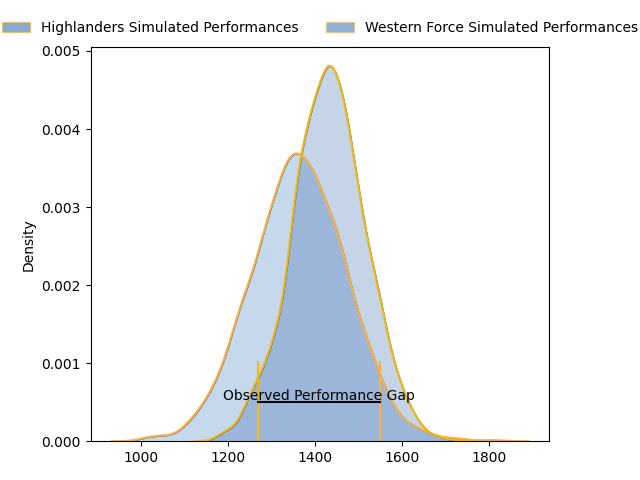
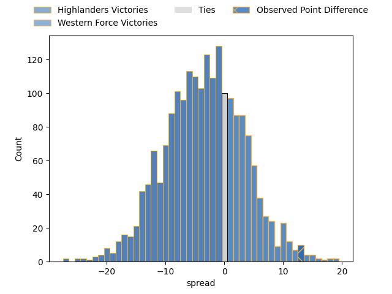

---  
layout: page  
title: Highlanders at Western Force; 17.0-30.0  
date: 2023-04-22 05:35:00 18:00:00 -0500  
categories: match review  
---
# Highlanders at Western Force; 17.0-30.0

# Club Level Predictions

The first set of predictions treats a club as the smallest object, as the club develops its members, organizes a gameplan, and deploys its players as needed for each match. This club model has a prediction of 0.401, which translates to predicting Highlanders to win by 3.6.

Each club has a rating and a rating deviation (simiar to a Glicko system), and expected performances can be generated. This allows for simulated matches and spreads like the ones below.
## Projected Performances

## Projected Spreads

## Projected Results

# Player Level Predictions

Treating teams instead as an entity made up of the currently active players, I have ratings for each player in an altogether different system. These can be combined to form team ratings once teamsheets are announced, weighting starters a bit higher than the reserves. After the match is played, players can be weighted by their minutes on the field, allowing for an accurate measure of the team's composition. With these compiled team ratings, we can make predictions, measure inaccuracy, and update the individual player ratings.
## Prediction with Player Minutes: Highlanders by 3.0

Highlanders by 7.0 on a neutral field

There were 11 large changes in win probability in this match
## Prediction without Player Minutes: Highlanders by 1.9

Highlanders by 5.9 on a neutral pitch

|   Away Minutes | Away Player          |   Away elo |   Away Percentile |   Number |   Home Percentile |   Home elo | Home Player           |   Home Minutes |
|---------------:|:---------------------|-----------:|------------------:|---------:|------------------:|-----------:|:----------------------|---------------:|
|             60 | Ethan de Groot       |      88.44 |                75 |        1 |                97 |     112.76 | Tom Robertson         |             62 |
|             72 | Andrew Makalio       |      91.7  |                80 |        2 |                87 |      98.22 | Tom Horton            |             80 |
|             62 | Jermaine Ainsley     |      88.4  |                75 |        3 |                79 |      90.26 | Santiago Medrano      |             68 |
|             56 | Pari Pari Parkinson  |     126.35 |                98 |        4 |                 1 |      33.24 | Felix Kalapu          |             68 |
|             80 | Will Tucker          |      85.11 |                67 |        5 |                40 |      72.67 | Jeremy Williams       |             80 |
|             69 | Shannon Frizell      |      99.84 |                87 |        6 |                23 |      64.15 | Tim Anstee            |             80 |
|             80 | Billy Harmon         |     111.87 |                94 |        7 |                36 |      71.05 | Ollie Callan          |              2 |
|             80 | Marino Mikaele-Tu'u  |      85.22 |                65 |        8 |                68 |      85.19 | Michael Wells         |             80 |
|             80 | James Arscott        |      94.62 |                80 |        9 |                72 |      90    | Issak Fines-Leleiwasa |             68 |
|             58 | Mitch Hunt           |      99.5  |                84 |       10 |                71 |      90.39 | Bryce Hegarty         |             80 |
|             80 | Jonah Lowe           |      75.46 |                46 |       11 |                90 |     104.72 | Manasa Mataele        |             80 |
|             61 | Thomas Umaga-Jensen  |      78.47 |                51 |       12 |                97 |     121.1  | Hamish Stewart        |             80 |
|             80 | Fetuli Paea          |      92.66 |                75 |       13 |                77 |      93.44 | Sam Spink             |             80 |
|             70 | Connor Garden-Bachop |     101.43 |                86 |       14 |                98 |     126.27 | Toni Pulu             |             14 |
|             80 | Sam Gilbert          |      88    |                69 |       15 |                66 |      87.16 | Chase Tiatia          |             80 |
|              8 | Leni Apisai          |      82.8  |                64 |       16 |                31 |      70.12 | Feleti Kaitu'u        |             20 |
|             30 | Dan Lienert-Brown    |      89.06 |                78 |       17 |               nan |      82.81 | Marley Pearce         |             18 |
|             18 | Saula Mau            |      84.97 |                73 |       18 |               nan |      86.22 | Siosifa Amone         |             12 |
|             24 | Fabian Holland       |      93.94 |                81 |       19 |                68 |      90.26 | Ryan McCauley         |             12 |
|             11 | Sean Withy           |      73.22 |                44 |       20 |                80 |      94.69 | Rahboni Vosayaco      |             58 |
|             12 | Nathan Hastie        |      78.14 |               nan |       21 |                77 |      92.12 | Ian Prior             |             12 |
|             22 | Freddie Burns        |     112.59 |                92 |       22 |                65 |      84.48 | Bayley Kuenzle        |              0 |
|              7 | Josh Timu            |      72.31 |                37 |       23 |               nan |      83.12 | George Poolman        |             66 |

