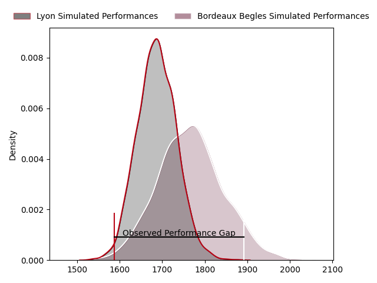
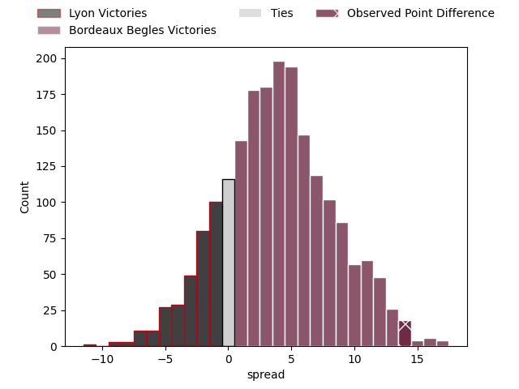

---  
layout: page  
title: Lyon at Bordeaux Begles; 9-23  
date: 2023-04-23 21:00:00 18:00:00 -0500  
categories: match review  
---
# Lyon at Bordeaux Begles; 9-23

# Club Level Predictions

The first set of predictions treats a club as the smallest object, as the club develops its members, organizes a gameplan, and deploys its players as needed for each match. This club model has a prediction of 0.601, which translates to predicting Bordeaux Begles to win by 3.6.

Each club has a rating and a rating deviation (simiar to a Glicko system), and expected performances can be generated. This allows for simulated matches and spreads like the ones below.
## Projected Performances

## Projected Spreads

## Projected Results

# Player Level Predictions

Treating teams instead as an entity made up of the currently active players, I have ratings for each player in an altogether different system. These can be combined to form team ratings once teamsheets are announced, weighting starters a bit higher than the reserves. After the match is played, players can be weighted by their minutes on the field, allowing for an accurate measure of the team's composition. With these compiled team ratings, we can make predictions, measure inaccuracy, and update the individual player ratings.
## Prediction with Player Minutes: Bordeaux Begles by 1.2

Lyon by 2.8 on a neutral field

There were 7 large changes in win probability in this match
## Prediction without Player Minutes: Bordeaux Begles by 3.3

Lyon by 0.7 on a neutral pitch

|   Away Minutes | Away Player          |   Away elo |   Away Percentile |   Number |   Home Percentile |   Home elo | Home Player          |   Home Minutes |
|---------------:|:---------------------|-----------:|------------------:|---------:|------------------:|-----------:|:---------------------|---------------:|
|             58 | Sébastien Taofifenua |      74.23 |                43 |        1 |                57 |      79.86 | Jefferson Poirot     |             51 |
|             41 | Liam Coltman         |      76.26 |                49 |        2 |                63 |      82.36 | Gabriel Oghre        |             51 |
|             80 | Demba Bamba          |      83.8  |                65 |        3 |                72 |      87.1  | Ben Tameifuna        |             51 |
|             66 | Killian Geraci       |      70.03 |                34 |        4 |                45 |      75.06 | Kane Douglas         |             51 |
|             35 | Romain Taofifenua    |     102.11 |                89 |        5 |                41 |      72.86 | Cyril Cazeaux        |             80 |
|             80 | Liam Allen           |      74.02 |                44 |        6 |                42 |      73.5  | Mahamadou Diaby      |              7 |
|             58 | Beka Saghinadze      |      91.16 |                78 |        7 |                47 |      75.28 | Pierre Bochaton      |             80 |
|             80 | Arno Botha           |      75.57 |                44 |        8 |                66 |      86.15 | Tom Willis           |             80 |
|             68 | Baptiste Couilloud   |      69.99 |                35 |        9 |                38 |      71.6  | Maxime Lucu          |             80 |
|             80 | Léo Berdeu           |      74.06 |                42 |       10 |               nan |      76    | Mateo Garcia         |             72 |
|             80 | Ethan Dumortier      |      93.67 |                79 |       11 |                51 |      76.69 | Santiago Cordero     |             80 |
|             80 | Josua Tuisova        |      83.24 |                61 |       12 |                58 |      82.14 | Yoram Moefana        |             80 |
|             80 | Kyle Godwin          |      72.1  |                37 |       13 |               nan |      73.27 | Jean-Baptiste Dubié  |             71 |
|             59 | Tavite Veredamu      |      68.01 |                32 |       14 |                49 |      76.46 | Louis Bielle Biarrey |             80 |
|             80 | Toby Arnold          |      80.52 |                55 |       15 |                53 |      79.45 | Nans Ducuing         |             54 |
|             45 | Loann Goujon         |      86.23 |                72 |       16 |               nan |      72.94 | Caleb Timu           |             73 |
|             39 | Guillaume Marchand   |      72.41 |                38 |       17 |                58 |      77.19 | Vadim Cobilas        |             29 |
|             22 | Joel Kpoku           |      75.9  |                48 |       18 |                33 |      69.97 | Lesko Kaulashvili    |             29 |
|             22 | Jerome Rey           |      84.45 |                70 |       19 |                48 |      75.66 | Maxime Lamothe       |             29 |
|             21 | Lima Sopoaga         |      81.25 |                59 |       20 |                28 |      67.35 | Jan Andre Marais     |             29 |
|             14 | Félix Lambey         |      85.2  |                73 |       21 |                45 |      74.46 | Madosh Tambwe        |             26 |
|             12 | Jonathan Pelissié    |      70.07 |                36 |       22 |               nan |      74.57 | Yann Lesgourgues     |              8 |
|            nan | nan                  |     nan    |               nan |       23 |                72 |      90.02 | Nicolas Depoortere   |              9 |

