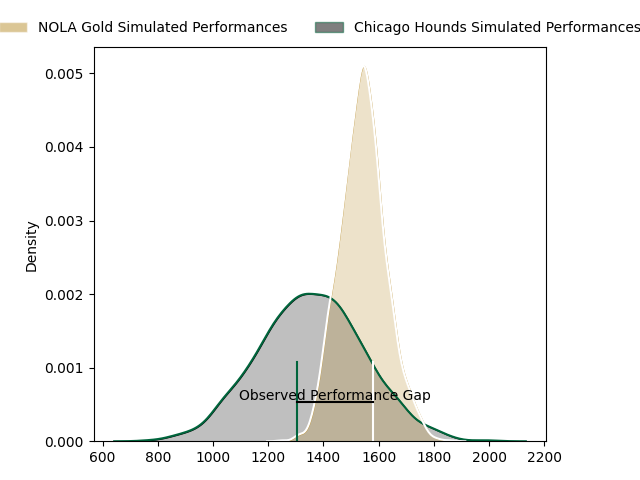
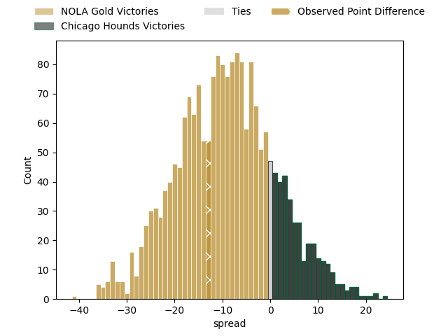

---  
layout: page  
title: NOLA Gold at Chicago Hounds; 37-24  
date: 2023-04-23 20:00:00 18:00:00 -0500  
categories: match review  
---
# NOLA Gold at Chicago Hounds; 37-24

# Club Level Predictions

The first set of predictions treats a club as the smallest object, as the club develops its members, organizes a gameplan, and deploys its players as needed for each match. This club model has a prediction of 0.26, which translates to predicting NOLA Gold to win by 9.4.

Each club has a rating and a rating deviation (simiar to a Glicko system), and expected performances can be generated. This allows for simulated matches and spreads like the ones below.
## Projected Performances

## Projected Spreads

## Projected Results

# Player Level Predictions

Treating teams instead as an entity made up of the currently active players, I have ratings for each player in an altogether different system. These can be combined to form team ratings once teamsheets are announced, weighting starters a bit higher than the reserves. After the match is played, players can be weighted by their minutes on the field, allowing for an accurate measure of the team's composition. With these compiled team ratings, we can make predictions, measure inaccuracy, and update the individual player ratings.
## Prediction with Player Minutes: Chicago Hounds by 8.0

Chicago Hounds by 4.0 on a neutral field

There were 6 large changes in win probability in this match
## Prediction without Player Minutes: Chicago Hounds by 4.7

Chicago Hounds by 0.7 on a neutral pitch

|   Away Minutes | Away Player                              |   Away elo |   Away Percentile |   Number |   Home Percentile |   Home elo | Home Player         |   Home Minutes |
|---------------:|:-----------------------------------------|-----------:|------------------:|---------:|------------------:|-----------:|:--------------------|---------------:|
|             49 | Jarred Adams                             |      52.8  |                 8 |        1 |                 4 |      46.32 | George Thornton     |             40 |
|             61 | Pat O'Toole                              |      67.54 |                30 |        2 |                15 |      57.87 | Mason Koch          |             72 |
|             61 | Sean Bradley Paranihi                    |      56.29 |                11 |        3 |               nan |      51.06 | Mika Felix          |             38 |
|             61 | Billy Stewart                            |     129.01 |                98 |        4 |                28 |      66.49 | Cam Dodson          |             80 |
|             80 | Liam Hallam-Eames                        |      40.15 |                 3 |        5 |                 0 |       5.88 | Mike Matarazzo      |             38 |
|             80 | Malcolm May                              |      51.51 |                 8 |        6 |                14 |      56.37 | Dacoda Worth        |             51 |
|             80 | Moni Tonga'uiha                          |      17.96 |                 0 |        7 |                 4 |      45.14 | Maclean Jones       |             80 |
|             73 | Cameron Dolan                            |      57.67 |                15 |        8 |                 8 |      50.69 | Luke White          |             80 |
|             70 | Luke Campbell                            |      63.98 |                23 |        9 |                56 |      80.16 | Michael Baska       |             40 |
|             70 | Rodney Iona                              |      58.01 |                15 |       10 |                 6 |      49.96 | Luke Carty          |             80 |
|             79 | Aaron Matthews                           |      -2.12 |                 0 |       11 |                13 |      54.32 | Julian Dominguez    |             80 |
|             80 | Jordan Jackson-Hope                      |      54.14 |                10 |       12 |                12 |      55.62 | Bill Meakes         |             80 |
|             80 | Philippus Jacobus Snyman (JP) du Plessis |      57.5  |                15 |       13 |                 9 |      51.11 | Bryce Campbell      |             51 |
|             80 | Ross Depperschmidt                       |      45.49 |                 3 |       14 |                 0 |      27.38 | Mark O'Keeffe       |             80 |
|             80 | Dougie Fife                              |      61.21 |                21 |       15 |                98 |     127.77 | Chris Mattina       |             61 |
|             31 | Kevin Sullivan                           |      96.21 |                71 |       16 |                17 |      61.28 | LaRome White        |             40 |
|             19 | Matt Harmon                              |      52.77 |                11 |       17 |               nan |      68.83 | Fred Fatumanu Apulu |              8 |
|             19 | Doc Irey                                 |      59.97 |                17 |       18 |                 5 |      47.71 | Charles Abel        |             42 |
|             19 | Maciu Koroi                              |      65.67 |               nan |       19 |                46 |      75.47 | John Cullen         |             42 |
|              7 | Will Waguespack                          |      64.21 |               nan |       20 |               nan |      54.36 | Nkombua Justice     |             29 |
|             10 | Damian Leothon Stevens                   |      48.53 |                 8 |       21 |               nan |      82.68 | Sidney Shoop        |             40 |
|             10 | Harley Wheeler                           |      71.32 |                38 |       22 |               nan |      54.48 | Matai Leuta         |             29 |
|              1 | Kenneth Jinkins                          |      54.72 |                13 |       23 |                 5 |      42.28 | Jean-Pierre Eloff   |             19 |

