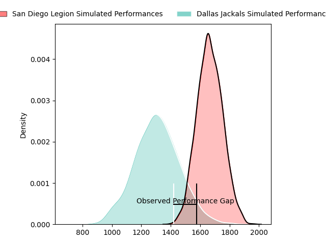
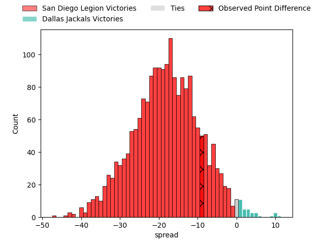
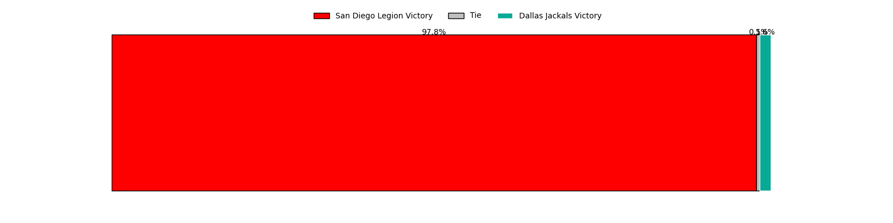

---  
layout: page  
title: San Diego Legion at Dallas Jackals; 47-38  
date: 2023-04-23 02:00:00 18:00:00 -0500  
categories: match review  
---
# San Diego Legion at Dallas Jackals; 47-38

# Club Level Predictions

The first set of predictions treats a club as the smallest object, as the club develops its members, organizes a gameplan, and deploys its players as needed for each match. This club model has a prediction of 0.118, which translates to predicting San Diego Legion to win by 18.1.

Each club has a rating and a rating deviation (simiar to a Glicko system), and expected performances can be generated. This allows for simulated matches and spreads like the ones below.
## Projected Performances

## Projected Spreads

## Projected Results

# Player Level Predictions

Treating teams instead as an entity made up of the currently active players, I have ratings for each player in an altogether different system. These can be combined to form team ratings once teamsheets are announced, weighting starters a bit higher than the reserves. After the match is played, players can be weighted by their minutes on the field, allowing for an accurate measure of the team's composition. With these compiled team ratings, we can make predictions, measure inaccuracy, and update the individual player ratings.
## Prediction with Player Minutes: San Diego Legion by 28.0

San Diego Legion by 32.0 on a neutral field

There were 8 large changes in win probability in this match
## Prediction without Player Minutes: San Diego Legion by 27.3

San Diego Legion by 31.3 on a neutral pitch

|   Away Minutes | Away Player             |   Away elo |   Away Percentile |   Number |   Home Percentile |   Home elo | Home Player         |   Home Minutes |
|---------------:|:------------------------|-----------:|------------------:|---------:|------------------:|-----------:|:--------------------|---------------:|
|             59 | Djustice Sears-Duru     |      68.12 |               nan |        1 |                 2 |      41.22 | Liam Murray         |             80 |
|             59 | Sean McNulty            |      37.05 |                 1 |        2 |                 3 |      40.3  | Tomas Baravalle     |             59 |
|             59 | Chris Baumann           |      68.76 |                29 |        3 |                 4 |      42.35 | Juan Pablo Zeiss    |             77 |
|             67 | Jale Railala Vakaloloma |      73.48 |                42 |        4 |                 2 |      41.08 | Sam Golla           |             80 |
|             54 | Isaac Ross              |      69.1  |                31 |        5 |                 5 |      45.58 | Lucas Bur           |             65 |
|             80 | Thomas Franklin         |      66.85 |                28 |        6 |                 5 |      47.04 | Jeronimo Gomez Vara |             80 |
|             80 | Dan Pryor               |      74.17 |                44 |        7 |                 0 |      16.1  | Conrado Roura       |             80 |
|             80 | David Tameilau          |      68.7  |                29 |        8 |                 3 |      38.88 | Jan Adriaan Booysen |             69 |
|             80 | Jason Higgins           |      66.76 |                29 |        9 |                 6 |      49.12 | Pedro Imhoff        |             80 |
|             80 | Will Hooley             |      78.56 |                49 |       10 |                94 |     112.79 | Martin Elias        |             80 |
|             80 | Tomas Aoake             |      68.49 |                32 |       11 |                 7 |      44.81 | Marcos Moroni       |             80 |
|             80 | Tiaan Loots             |      84.87 |                54 |       12 |                 5 |      46.13 | Juan Pablo Aguirre  |             56 |
|             80 | Filimona Waqainabete    |      82.76 |               nan |       13 |                54 |      80.33 | Tomas Malanos       |             80 |
|             14 | Thomas Morani           |      53.54 |               nan |       14 |                 0 |      20.26 | Campbell Johnstone  |             32 |
|             71 | Mike Te'o               |      74.81 |                44 |       15 |                 4 |      40.02 | Alejandro Torres    |             64 |
|             21 | Faka'osi Pifeleti       |      43.74 |                 3 |       16 |                 1 |      30.89 | Dewald Kotze        |             21 |
|             21 | Sama Malolo             |      94.02 |                83 |       17 |                 6 |      49.26 | Kyle Steeves        |              3 |
|             21 | Nathan Sylvia           |      62.98 |                20 |       18 |                11 |      53.38 | Matthew Gordon      |             15 |
|             13 | Chris Turori            |      81.88 |               nan |       19 |               nan |      53.34 | Cameron Nelson      |             11 |
|             26 | Finn Kearns             |      62.45 |               nan |       20 |                27 |      64.99 | Lui Sitama          |             24 |
|             66 | Nathaniel Augspurger    |      69.09 |                33 |       21 |               nan |      39.72 | Alex Tucci          |             48 |
|              9 | Luke Burton             |      65.6  |               nan |       22 |                68 |      85.96 | James Vaifale       |             16 |

