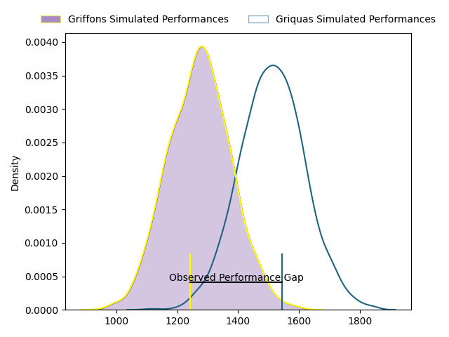
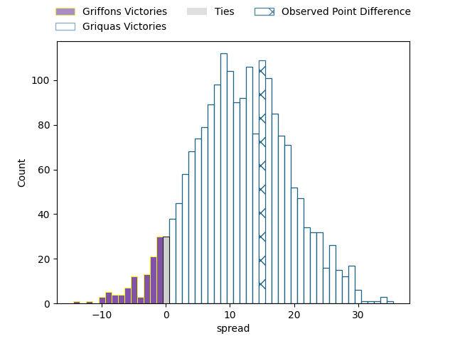
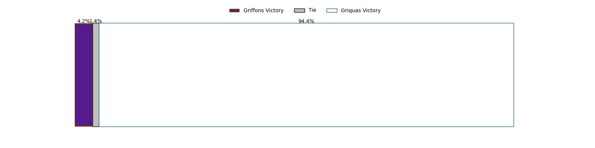

---  
layout: page  
title: Griffons at Griquas; 27-42  
date: 2023-04-23 14:00:00 18:00:00 -0500  
categories: match review  
---
# Griffons at Griquas; 27-42

# Club Level Predictions

The first set of predictions treats a club as the smallest object, as the club develops its members, organizes a gameplan, and deploys its players as needed for each match. This club model has a prediction of 0.782, which translates to predicting Griquas to win by 11.7.

Each club has a rating and a rating deviation (simiar to a Glicko system), and expected performances can be generated. This allows for simulated matches and spreads like the ones below.
## Projected Performances

## Projected Spreads

## Projected Results

# Player Level Predictions

Treating teams instead as an entity made up of the currently active players, I have ratings for each player in an altogether different system. These can be combined to form team ratings once teamsheets are announced, weighting starters a bit higher than the reserves. After the match is played, players can be weighted by their minutes on the field, allowing for an accurate measure of the team's composition. With these compiled team ratings, we can make predictions, measure inaccuracy, and update the individual player ratings.
## Prediction with Player Minutes: Griquas by 28.0

Griquas by 24.0 on a neutral field

There were 3 large changes in win probability in this match
## Prediction without Player Minutes: Griquas by 25.8

Griquas by 21.8 on a neutral pitch

|   Away Minutes | Away Player               |   Away elo |   Away Percentile |   Number |   Home Percentile |   Home elo | Home Player                |   Home Minutes |
|---------------:|:--------------------------|-----------:|------------------:|---------:|------------------:|-----------:|:---------------------------|---------------:|
|             62 | Stephan de Jager          |      66.42 |                26 |        1 |                57 |      79.94 | Kudzwai Dube               |             62 |
|             59 | Dandré Delport            |      75.1  |                50 |        2 |                60 |      80.89 | Janco Uys                  |             62 |
|             62 | Doctor Booysen            |      83.97 |                73 |        3 |                65 |      83.33 | Janu Botha                 |             56 |
|             62 | Jaco Willemse             |      59.08 |                17 |        4 |               nan |      78.88 | Johan Retief               |             80 |
|             50 | Curtley Thomas            |      57.39 |                15 |        5 |                16 |      57.73 | Derrick Pretorius          |              3 |
|             62 | Thato Siward Mavundla     |     108.87 |                94 |        6 |                42 |      73.31 | Stephan Smit               |             62 |
|             80 | Thomas Ulengo             |      57.02 |                14 |        7 |                80 |      95.12 | Hanru Sirgel               |             80 |
|             80 | Jean-Jacques Pretorius    |      68.42 |                31 |        8 |                37 |      72.87 | Carl Els                   |             80 |
|             80 | Jaywinn Juries            |      79.86 |                58 |        9 |                40 |      73.03 | Johan Mulder               |             80 |
|             80 | Duan Pretorius            |      92.75 |                78 |       10 |                83 |      99.16 | Eduard (Eddie) Fouche      |             80 |
|             69 | Jamba Isaac Ulengo        |      61.41 |                22 |       11 |                53 |      78.1  | Luther Obi                 |             65 |
|             51 | Marquit Virgil September  |      34.45 |                 1 |       12 |               nan |      78.13 | Tertius Kruger             |             59 |
|             80 | Carel-Jan Coetzee         |      62.3  |                23 |       13 |                93 |     109.65 | Jay Cee Nel                |             80 |
|             80 | Granwill Matthys          |      67.64 |                31 |       14 |                31 |      67.41 | Rosco Shane Specman        |             80 |
|             80 | Duren Hoffman             |      35.98 |                 2 |       15 |                47 |      77.29 | Malcolm Jaer               |             56 |
|             30 | Michael Benadie           |      56.23 |                16 |       16 |                46 |      77.04 | Cebolenkosi Dlamini        |             24 |
|             29 | Keanu Armandio Vers       |      47.11 |                 6 |       17 |                43 |      75.55 | Sango (Saida) Xamlashe     |             24 |
|             21 | Hendrik Petrus van Schoor |      71.2  |                38 |       18 |                51 |      78.41 | George Alexander Whitehead |             21 |
|             18 | Ludio Fernando Williams   |      36.96 |                 2 |       19 |               nan |      77.77 | Sean Swart                 |             18 |
|             18 | Wikus Nieuwenhuis         |      71.62 |                22 |       20 |                80 |      96.33 | Ashlon Davids              |             18 |
|             18 | Xolani Jacobs             |      56.13 |               nan |       21 |                89 |     104.1  | Niel Otto                  |             18 |
|             18 | Buhle Nojekwa             |      65.23 |                28 |       22 |                71 |      86.7  | Raegan Oranje              |             15 |
|             11 | Domenic Smit              |      62.04 |                22 |       23 |               nan |      77.94 | Dylan Sjoblom              |             77 |

