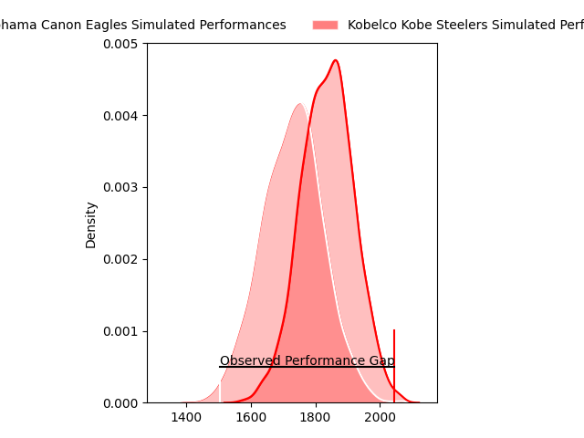
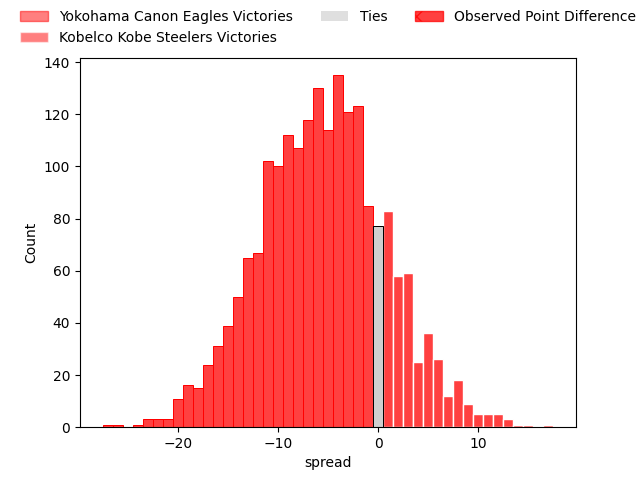
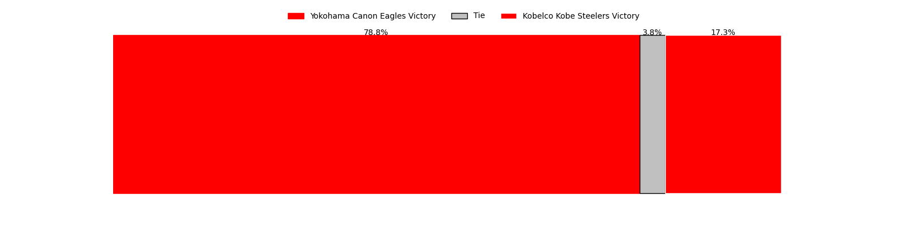

---  
layout: page  
title: Yokohama Canon Eagles at Kobelco Kobe Steelers; 52-26  
date: 2023-04-23 00:00:00 18:00:00 -0500  
categories: match review  
---
# Yokohama Canon Eagles at Kobelco Kobe Steelers; 52-26

# Club Level Predictions

The first set of predictions treats a club as the smallest object, as the club develops its members, organizes a gameplan, and deploys its players as needed for each match. This club model has a prediction of 0.351, which translates to predicting Yokohama Canon Eagles to win by 5.5.

Each club has a rating and a rating deviation (simiar to a Glicko system), and expected performances can be generated. This allows for simulated matches and spreads like the ones below.
## Projected Performances

## Projected Spreads

## Projected Results

# Player Level Predictions

Treating teams instead as an entity made up of the currently active players, I have ratings for each player in an altogether different system. These can be combined to form team ratings once teamsheets are announced, weighting starters a bit higher than the reserves. After the match is played, players can be weighted by their minutes on the field, allowing for an accurate measure of the team's composition. With these compiled team ratings, we can make predictions, measure inaccuracy, and update the individual player ratings.
## Prediction with Player Minutes: Yokohama Canon Eagles by 7.1

Yokohama Canon Eagles by 11.1 on a neutral field

There were 5 large changes in win probability in this match
## Prediction without Player Minutes: Yokohama Canon Eagles by 12.4

Yokohama Canon Eagles by 16.4 on a neutral pitch

|   Away Minutes | Away Player              |   Away elo |   Away Percentile |   Number |   Home Percentile |   Home elo | Home Player              |   Home Minutes |
|---------------:|:-------------------------|-----------:|------------------:|---------:|------------------:|-----------:|:-------------------------|---------------:|
|             55 | Takato Okabe             |     126.41 |                99 |        1 |               nan |      79.14 | Koki Yamamoto            |             40 |
|             55 | Yusuke Niwai             |      92.41 |                81 |        2 |                56 |      79.05 | Kenta Matsuoka           |             67 |
|             55 | Tatsuro Sugimoto         |      66.26 |                25 |        3 |                85 |      94.49 | Hiroshi Yamashita        |             64 |
|             80 | Cory Hill                |      90.19 |                76 |        4 |                97 |     125.31 | Seokhwan Jang            |             80 |
|             52 | Katsuto Kubo             |      88.34 |               nan |        5 |               nan |      80.67 | Naohiro Kotaki           |             80 |
|             80 | Sioeli Vakalahi          |     101.15 |                90 |        6 |                23 |      64.23 | Takara Imamura           |             80 |
|             80 | Naoto Shimada            |      87.23 |                72 |        7 |                96 |     116.21 | Hikaru Hashimoto         |             80 |
|             17 | Sione Halasili           |      99.07 |                86 |        8 |                28 |      68.25 | Amanaki Saumaki          |             64 |
|             52 | Francois (Faf) de Klerk  |      95.93 |                83 |        9 |                32 |      68.04 | Daiki Nakajima           |             52 |
|             80 | Junpei Ogura             |      85.58 |                76 |       10 |                61 |      83.6  | Lee Seung Sin            |             80 |
|             80 | Chihito Matsui           |      89.65 |                74 |       11 |                80 |      94.55 | Rakuhei Yamashita        |             68 |
|             73 | Yusuke Kajimura          |      96.6  |                80 |       12 |                69 |      88.16 | Richard Buckman          |             64 |
|             80 | Jesse Andre Kriel        |      92.65 |                75 |       13 |                33 |      70.15 | Junta Hamano             |             80 |
|             80 | Inoke Burua              |     106.81 |                91 |       14 |                35 |      70.02 | Kosuke Naka              |             80 |
|             67 | Sarel Petrus Marais      |      92.84 |                76 |       15 |                50 |      79.1  | Ryohei Yamanaka          |             80 |
|             63 | Sosefo Fakatava          |      78.38 |                45 |       16 |                91 |     100.81 | Isileli Nakajima Vakauta |             40 |
|             28 | Jacobus Johannes van Dyk |      92.41 |                80 |       17 |                55 |      80.04 | Atsushi Hiwasa           |             28 |
|             28 | Kafazumi Yamasuga        |      58.21 |                16 |       18 |                68 |      75.12 | Go Maeda                 |             16 |
|             25 | Shin Kawamura            |      83.11 |                65 |       19 |               nan |      73.81 | Shohei Maekawa           |             16 |
|             25 | Rento Tsukayama          |      99.86 |                90 |       20 |               nan |      88.02 | Rinpei Sasaki            |             13 |
|             25 | Chang Ho Ahn             |      83.94 |                66 |       21 |                70 |      80.8  | Kanta Matsunaga          |             12 |
|             13 | Viliame Takayawa         |     118.96 |                97 |       22 |               nan |      83.11 | Gentaro Ikenaga          |             16 |
|              7 | Naoya Minamihashi        |     108.16 |                92 |       23 |               nan |     nan    | nan                      |            nan |

