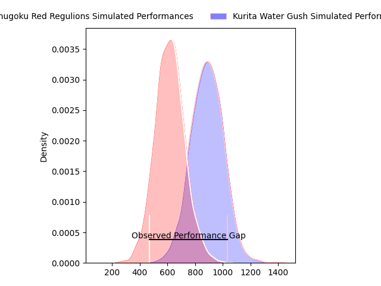
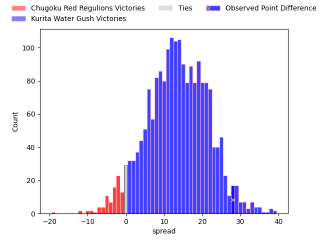
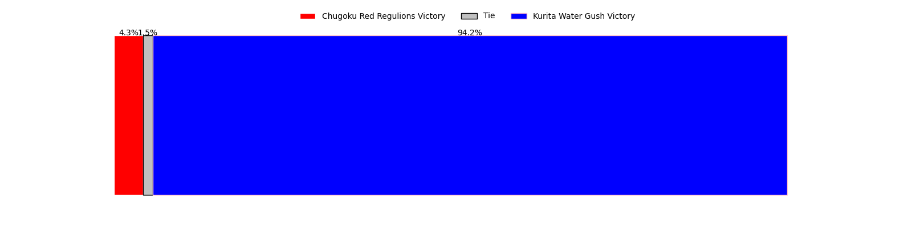

---  
layout: page  
title: Chugoku Red Regulions at Kurita Water Gush; 34-62  
date: 2023-04-23 00:00:00 18:00:00 -0500  
categories: match review  
---
# Chugoku Red Regulions at Kurita Water Gush; 34-62

# Club Level Predictions

The first set of predictions treats a club as the smallest object, as the club develops its members, organizes a gameplan, and deploys its players as needed for each match. This club model has a prediction of 0.814, which translates to predicting Kurita Water Gush to win by 13.6.

Each club has a rating and a rating deviation (simiar to a Glicko system), and expected performances can be generated. This allows for simulated matches and spreads like the ones below.
## Projected Performances

## Projected Spreads

## Projected Results

# Player Level Predictions

Treating teams instead as an entity made up of the currently active players, I have ratings for each player in an altogether different system. These can be combined to form team ratings once teamsheets are announced, weighting starters a bit higher than the reserves. After the match is played, players can be weighted by their minutes on the field, allowing for an accurate measure of the team's composition. With these compiled team ratings, we can make predictions, measure inaccuracy, and update the individual player ratings.
## Prediction with Player Minutes: Kurita Water Gush by 17.1

Kurita Water Gush by 13.1 on a neutral field

There were 1 large changes in win probability in this match
## Prediction without Player Minutes: Kurita Water Gush by 15.4

Kurita Water Gush by 11.4 on a neutral pitch

|   Away Minutes | Away Player          |   Away elo |   Away Percentile |   Number |   Home Percentile |   Home elo | Home Player          |   Home Minutes |
|---------------:|:---------------------|-----------:|------------------:|---------:|------------------:|-----------:|:---------------------|---------------:|
|             51 | Kojiro Arito         |      59.43 |                15 |        1 |                 4 |      46.21 | Kei Shibuya          |             50 |
|             40 | Kentaro Iwanaga      |      59.58 |                18 |        2 |                22 |      66.54 | Kota Hojo            |             58 |
|             61 | Kento Miyata         |      48.25 |                 4 |        3 |                19 |      58.22 | Kuriyama Rui         |             58 |
|             80 | Taro Nishikawa       |      42.9  |                 4 |        4 |                10 |      52.75 | Kota Nakamura        |             80 |
|             80 | Tomonari Aoki        |      48.24 |                 6 |        5 |                 4 |      43.51 | Mitsuo Nakao         |             60 |
|             80 | Kouta Moriyama       |      46.72 |                 6 |        6 |                 9 |      49.02 | Kengo Nakamura       |             80 |
|             70 | Kohei Matsunaga      |      66.67 |                27 |        7 |                27 |      66.42 | Yosuke Ishii         |             60 |
|             61 | Ed Quirk             |      52.04 |                 9 |        8 |                41 |      74.24 | Tebita Oto           |             80 |
|             61 | Rintaro Kawashima    |      57.53 |                14 |        9 |                18 |      60.03 | Kakeru Sugihara      |             60 |
|             70 | Ippei Yamada         |      48.08 |                 7 |       10 |                10 |      52.46 | Andrew Deegan        |             80 |
|             80 | Hirofumi Higashikawa |      32.17 |                 1 |       11 |                43 |      74.56 | Keigo Hamazoe        |             80 |
|             80 | Shinya Hirayama      |      47.43 |                 2 |       12 |                19 |      61.17 | Antonio Mikaele-Tu'u |             60 |
|             60 | Masaaki Morita       |      67.84 |                30 |       13 |               nan |      55.14 | Daiki Yokota         |             52 |
|             80 | Kentaro Fujii        |      48.39 |                 7 |       14 |                 2 |      37.17 | Kentaro Sugimori     |             80 |
|             80 | Masahiro Nakano      |      47.44 |                 6 |       15 |                63 |      86.09 | Koshi Emoto          |             80 |
|             40 | Yuuki Asai           |      49.64 |                 8 |       16 |                 2 |      44.4  | Shoya Koyama         |             30 |
|             29 | Toshiyuki Ooki       |      43.21 |                 3 |       17 |               nan |      71.27 | Takuto Mizuno        |             28 |
|             20 | Riki Yamaguchi       |      27.24 |                 0 |       18 |                19 |      59.79 | Ryota Kuribara       |             22 |
|             19 | Hidetatsu Tsuboi     |      72.17 |               nan |       19 |                13 |      57.19 | Masachi Debuchi      |             22 |
|             19 | Shun Kawaguchi       |      56.45 |                11 |       20 |               nan |      47.54 | Kai Yamasaki         |             20 |
|             19 | Shohei Tsukamoto     |      50.15 |                 6 |       21 |                 4 |      46.54 | Sho Nakamura         |             20 |
|             10 | Shintaro Matsuda     |      38.44 |                 2 |       22 |                14 |      55.8  | Takuro Hayashida     |             20 |
|             10 | Hashizo Yoshida      |      39.37 |                 3 |       23 |                31 |      68.48 | Taisei Nakao         |             20 |

