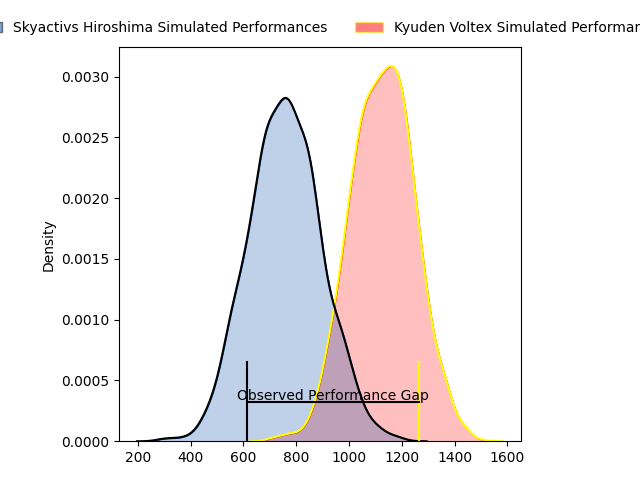
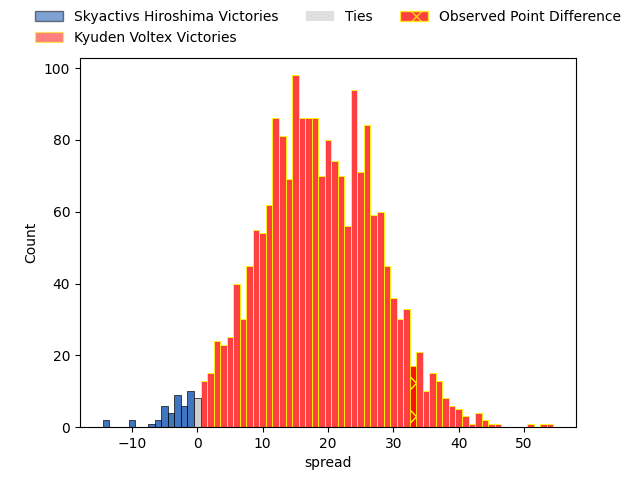
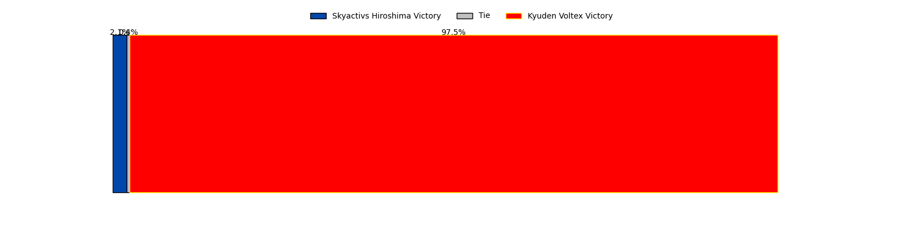

---  
layout: page  
title: Skyactivs Hiroshima at Kyuden Voltex; 7-40  
date: 2023-04-23 00:00:00 18:00:00 -0500  
categories: match review  
---
# Skyactivs Hiroshima at Kyuden Voltex; 7-40

# Club Level Predictions

The first set of predictions treats a club as the smallest object, as the club develops its members, organizes a gameplan, and deploys its players as needed for each match. This club model has a prediction of 0.875, which translates to predicting Kyuden Voltex to win by 18.5.

Each club has a rating and a rating deviation (simiar to a Glicko system), and expected performances can be generated. This allows for simulated matches and spreads like the ones below.
## Projected Performances

## Projected Spreads

## Projected Results

# Player Level Predictions

Treating teams instead as an entity made up of the currently active players, I have ratings for each player in an altogether different system. These can be combined to form team ratings once teamsheets are announced, weighting starters a bit higher than the reserves. After the match is played, players can be weighted by their minutes on the field, allowing for an accurate measure of the team's composition. With these compiled team ratings, we can make predictions, measure inaccuracy, and update the individual player ratings.
## Prediction with Player Minutes: Kyuden Voltex by 24.3

Kyuden Voltex by 20.3 on a neutral field

There were 2 large changes in win probability in this match
## Prediction without Player Minutes: Kyuden Voltex by 24.8

Kyuden Voltex by 20.8 on a neutral pitch

|   Away Minutes | Away Player        |   Away elo |   Away Percentile |   Number |   Home Percentile |   Home elo | Home Player            |   Home Minutes |
|---------------:|:-------------------|-----------:|------------------:|---------:|------------------:|-----------:|:-----------------------|---------------:|
|             63 | Koshiro Shigenobu  |      58.24 |                14 |        1 |                35 |      71.08 | Samuel Nozomu Faialaga |             62 |
|             63 | Tomohiro Takeda    |      58.52 |                17 |        2 |               nan |      64.13 | Ciaran Loh             |             58 |
|             51 | Tomoya Otake       |      51.28 |                 7 |        3 |                67 |      84.57 | Yasuo Saruwatari       |             58 |
|             63 | Rame Sato          |      45.65 |                 5 |        4 |                25 |      64.74 | Tomotaka Ishimatsu     |             80 |
|             80 | Lachlan Osborne    |      50.17 |                 8 |        5 |                33 |      69.67 | Ray Tatafu             |             55 |
|             60 | Koki Nakano        |      49.9  |                 7 |        6 |                 8 |      50.36 | Michiro Takai          |             80 |
|             80 | Tomoki Ashida      |      55.99 |                13 |        7 |                32 |      69.16 | Colby Fainga'a         |             80 |
|             75 | Tevin Ferris       |      86.49 |                77 |        8 |                43 |      75.11 | Walker Alex Takuya     |             62 |
|             80 | Jacob Abel         |      65.86 |                26 |        9 |                32 |      68.11 | Shunta Takenouchi      |             62 |
|             75 | Ryoutarou Saito    |      40.11 |                 3 |       10 |               nan |      66.15 | Kichi Uezato           |             80 |
|             80 | Kouhei Kamei       |      44.55 |                 4 |       11 |                37 |      72.34 | Keito Honda            |             80 |
|             53 | Sora Ohchi         |      47.14 |                 9 |       12 |                35 |      71.35 | Sam Vaka               |             80 |
|             80 | Tevita Tai         |      51.25 |                 9 |       13 |                 3 |      43.12 | Kenji Hayata           |             73 |
|             80 | Ren Ouchi          |      53.36 |                12 |       14 |                15 |      56.13 | Ren Hagiwara           |             80 |
|             80 | Ginjiro Sakiguchi  |      31.91 |                 1 |       15 |                29 |      68.59 | Makoto Kato            |             53 |
|             29 | Yuji Takahashi     |      50.8  |               nan |       16 |               nan |      67.5  | Akihito Yamada         |             27 |
|             27 | Hayato Kanamuru    |      38.7  |                 3 |       17 |               nan |      63.93 | Syuma Kanayama         |             25 |
|             20 | Iori Suzuki        |      40.43 |                 3 |       18 |                34 |      73.71 | Shinpei Kamata         |             22 |
|             17 | Tomonori Koyanagi  |      80.02 |                61 |       19 |                26 |      66.59 | Hayato Yoshida         |             22 |
|             17 | Yusuke Kitobayashi |      54.36 |                13 |       20 |               nan |      62.98 | Keiji Ikeda            |             18 |
|             17 | Yutaro Tanaka      |      50.06 |                 9 |       21 |               nan |      72.74 | Wataru Obara           |             18 |
|              5 | Shuhei Lee         |      46.51 |                 6 |       22 |               nan |      75.56 | Kotaro Komori          |             18 |
|              5 | Tsubasa Kono       |      69.12 |                29 |       23 |                36 |      71.62 | Hayato Kojyo           |              7 |

