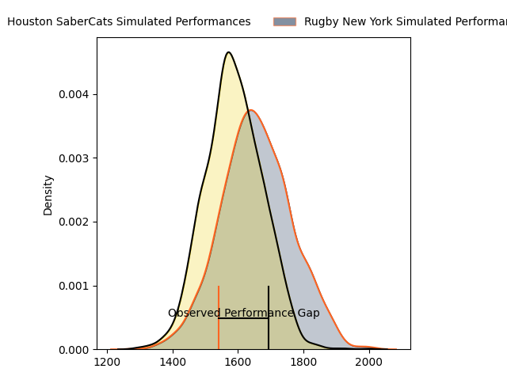
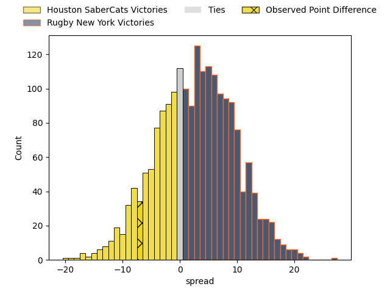

---  
layout: page  
title: Houston SaberCats at Rugby New York; 34-27  
date: 2023-04-23 20:30:00 18:00:00 -0500  
categories: match review  
---
# Houston SaberCats at Rugby New York; 34-27

# Club Level Predictions

The first set of predictions treats a club as the smallest object, as the club develops its members, organizes a gameplan, and deploys its players as needed for each match. This club model has a prediction of 0.575, which translates to predicting Rugby New York to win by 2.7.

Each club has a rating and a rating deviation (simiar to a Glicko system), and expected performances can be generated. This allows for simulated matches and spreads like the ones below.
## Projected Performances

## Projected Spreads

## Projected Results

# Player Level Predictions

Treating teams instead as an entity made up of the currently active players, I have ratings for each player in an altogether different system. These can be combined to form team ratings once teamsheets are announced, weighting starters a bit higher than the reserves. After the match is played, players can be weighted by their minutes on the field, allowing for an accurate measure of the team's composition. With these compiled team ratings, we can make predictions, measure inaccuracy, and update the individual player ratings.
## Prediction with Player Minutes: Houston SaberCats by 7.3

Houston SaberCats by 11.3 on a neutral field

There were 7 large changes in win probability in this match
## Prediction without Player Minutes: Houston SaberCats by 3.7

Houston SaberCats by 7.7 on a neutral pitch

|   Away Minutes | Away Player              |   Away elo |   Away Percentile |   Number |   Home Percentile |   Home elo | Home Player            |   Home Minutes |
|---------------:|:-------------------------|-----------:|------------------:|---------:|------------------:|-----------:|:-----------------------|---------------:|
|             59 | Rob Cobb                 |      61.46 |                18 |        1 |                64 |      59.61 | Sam Davies             |             49 |
|             80 | Dean Muir                |      58.57 |                17 |        2 |                 4 |      41.55 | Dylan Fawsitt          |             80 |
|             49 | Morgan Mitchell          |      52.74 |                 8 |        3 |                86 |      97.01 | Kaleb Geiger           |             47 |
|             50 | Siaosi Mahoni            |      84.18 |                65 |        4 |                 0 |      32.25 | Nate Brakeley          |             80 |
|             59 | Nathan Den Hoedt         |      57.03 |                15 |        5 |                 6 |      46.47 | Hamish Dalzell         |             73 |
|             80 | Marno Redelinghuys       |      82.11 |                61 |        6 |                15 |      57.74 | Brad Tucker            |             76 |
|             80 | Wynand Grassmann         |      74.62 |                42 |        7 |               nan |      57.31 | Akuei Monate           |             80 |
|             59 | Malon Maurice Al-Jiboori |      58.04 |               nan |        8 |                 5 |      45.8  | Kara Pryor             |             80 |
|             57 | Carlo de Nysschen        |      66.86 |                29 |        9 |                82 |      96.81 | Connor McManus         |             65 |
|             80 | David Coetzer            |      46.2  |                 6 |       10 |                17 |      60.09 | Jason Emery            |             80 |
|             80 | Vereniki Tikoisolomone   |      70.51 |                36 |       11 |                16 |      57.24 | Quinn Ngawati          |             70 |
|             80 | Louritz van der Schyff   |      65.2  |                24 |       12 |                 4 |      44.61 | Teihorangi Walden      |             80 |
|             80 | Dominic Akina            |      46.24 |                 5 |       13 |                 1 |      39.14 | Fa'asiu Fuatai         |             80 |
|             80 | Christian Dyer           |      53.35 |                12 |       14 |                 5 |      44.7  | Andrew Coe             |             80 |
|             25 | Drew Wild                |      52.69 |                12 |       15 |                 5 |      38    | Samuel Windsor         |             49 |
|             22 | Alec McDonnell           |      58.41 |                15 |       16 |                 8 |      53.85 | Luis Enrique Quinteros |             32 |
|             32 | Pono Davis               |      62.91 |               nan |       17 |               nan |      67.19 | Anthony Parry          |             34 |
|             31 | Emmanuel Albert          |      53.42 |                14 |       18 |                91 |     103.42 | Charlie Hewitt         |              8 |
|             22 | Keni Nasoqeqe            |      27.88 |                 0 |       19 |               nan |      60.94 | DaQuan Perry           |              5 |
|             22 | Danny Barrett            |      54.15 |                11 |       20 |                 8 |      49.62 | Cristian Rodriguez     |             16 |
|             56 | Zach Pangeliman          |      85.85 |                65 |       21 |               nan |      56.02 | Brooklyn Hardaker      |             11 |
|             24 | Devereaux Ferris         |       8.89 |                 0 |       22 |                10 |      49.76 | Nick Feakes            |             32 |

