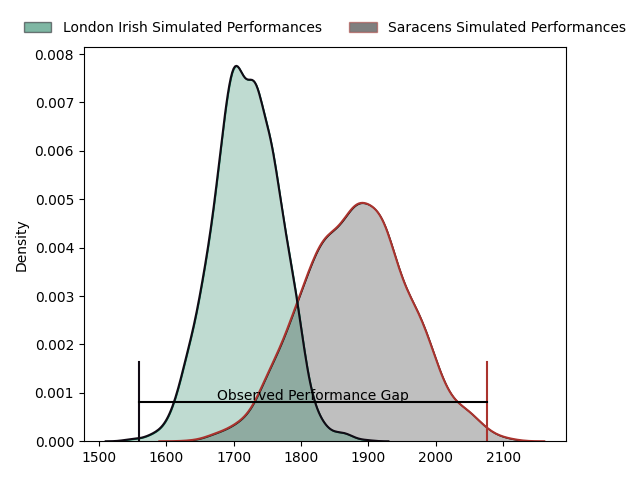
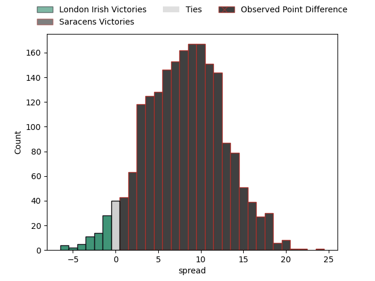
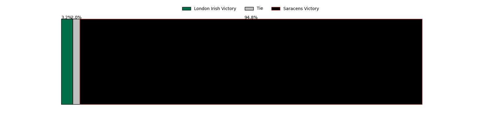

---  
layout: page  
title: London Irish at Saracens; 21.0-45.0  
date: 2023-04-23 10:00:00 18:00:00 -0500  
categories: match review  
---
# London Irish at Saracens; 21.0-45.0

# Club Level Predictions

The first set of predictions treats a club as the smallest object, as the club develops its members, organizes a gameplan, and deploys its players as needed for each match. This club model has a prediction of 0.72, which translates to predicting Saracens to win by 8.3.

Each club has a rating and a rating deviation (simiar to a Glicko system), and expected performances can be generated. This allows for simulated matches and spreads like the ones below.
## Projected Performances

## Projected Spreads

## Projected Results

# Player Level Predictions

Treating teams instead as an entity made up of the currently active players, I have ratings for each player in an altogether different system. These can be combined to form team ratings once teamsheets are announced, weighting starters a bit higher than the reserves. After the match is played, players can be weighted by their minutes on the field, allowing for an accurate measure of the team's composition. With these compiled team ratings, we can make predictions, measure inaccuracy, and update the individual player ratings.
## Prediction with Player Minutes: Saracens by 8.5

Saracens by 4.5 on a neutral field

There were 10 large changes in win probability in this match
## Prediction without Player Minutes: Saracens by 5.7

Saracens by 1.7 on a neutral pitch

|   Away Minutes | Away Player                |   Away elo |   Away Percentile |   Number |   Home Percentile |   Home elo | Home Player        |   Home Minutes |
|---------------:|:---------------------------|-----------:|------------------:|---------:|------------------:|-----------:|:-------------------|---------------:|
|             71 | Danilo Fischetti           |      78.06 |                52 |        1 |                95 |     109.58 | Mako Vunipola      |             65 |
|             45 | Agustin Creevy             |     108.2  |                95 |        2 |                65 |      84.74 | Theo Dan           |             72 |
|             59 | Oli Hoskins                |     115.99 |                97 |        3 |                53 |      78.5  | Marco Riccioni     |             69 |
|             54 | Api Ratuniyarawa           |      78.8  |                53 |        4 |                90 |     102.91 | Maro Itoje         |             80 |
|             80 | Rob Simmons                |     126.92 |                98 |        5 |                70 |      86.62 | Callum Hunter-Hill |             40 |
|             80 | Matt Rogerson              |      95.54 |                83 |        6 |                74 |      88.59 | Nick Isiekwe       |             75 |
|             67 | Tom Pearson                |     121.87 |                97 |        7 |                96 |     116.88 | Ben Earl           |             80 |
|             54 | So'otala Fa'aso'o          |     106.01 |                91 |        8 |                99 |     128.63 | Jackson Wray       |             80 |
|             67 | Ben White                  |      94.14 |                79 |        9 |                95 |     113.72 | Ivan van Zyl       |             71 |
|             80 | Paddy Jackson              |     128.19 |                98 |       10 |                99 |     139.41 | Owen Farrell       |             80 |
|             50 | Ollie Hassell-Collins      |      96.96 |                82 |       11 |                93 |     111.37 | Sean Maitland      |             73 |
|             80 | Rory Jennings              |     106.45 |                90 |       12 |                99 |     138.65 | Nick Tompkins      |             80 |
|             80 | Benhard Janse van Rensburg |     107.22 |                91 |       13 |                72 |      90.09 | Alex Lozowski      |             80 |
|             80 | Lucio Cinti                |      66.79 |                29 |       14 |                62 |      82.91 | Max Malins         |             76 |
|             80 | Ben Loader                 |     103.55 |                86 |       15 |                90 |     108.94 | Alex Goode         |             80 |
|             35 | Mike Willemse              |      81.93 |                62 |       16 |               nan |      90.48 | Ethan Lewis        |              8 |
|              9 | Tarek Haffar               |      90.94 |               nan |       17 |                 4 |      45.93 | Eroni Mawi         |             15 |
|             21 | Lovejoy Chawatama          |      65.76 |                23 |       18 |                51 |      77.64 | Christian Judge    |             11 |
|             26 | Chunya Munga               |      98.95 |                90 |       19 |                29 |      67.9  | Hugh Tizard        |             40 |
|             13 | Juan Martin Gonzalez       |      81    |                60 |       20 |                54 |      78.46 | Toby Knight        |              5 |
|             26 | Chandler Cunningham-South  |     104.21 |                90 |       21 |                66 |      86.46 | Ruben de Haas      |              9 |
|             13 | Hugh O'Sullivan            |      88.11 |                70 |       22 |                22 |      63.32 | Olly Hartley       |              4 |
|             30 | Henry Arundell             |      96.3  |                82 |       23 |                78 |      94.02 | Ben Harris         |              7 |

