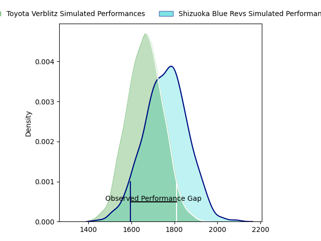
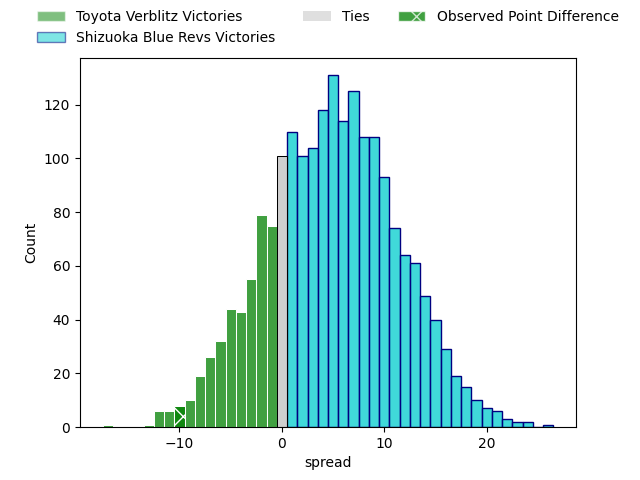
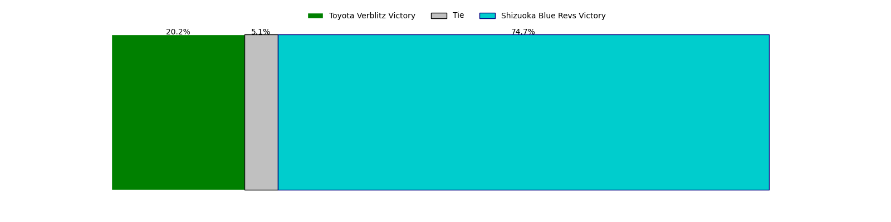

---  
layout: page  
title: Toyota Verblitz at Shizuoka Blue Revs; 37-27  
date: 2023-04-23 00:00:00 18:00:00 -0500  
categories: match review  
---
# Toyota Verblitz at Shizuoka Blue Revs; 37-27

# Club Level Predictions

The first set of predictions treats a club as the smallest object, as the club develops its members, organizes a gameplan, and deploys its players as needed for each match. This club model has a prediction of 0.629, which translates to predicting Shizuoka Blue Revs to win by 4.7.

Each club has a rating and a rating deviation (simiar to a Glicko system), and expected performances can be generated. This allows for simulated matches and spreads like the ones below.
## Projected Performances

## Projected Spreads

## Projected Results

# Player Level Predictions

Treating teams instead as an entity made up of the currently active players, I have ratings for each player in an altogether different system. These can be combined to form team ratings once teamsheets are announced, weighting starters a bit higher than the reserves. After the match is played, players can be weighted by their minutes on the field, allowing for an accurate measure of the team's composition. With these compiled team ratings, we can make predictions, measure inaccuracy, and update the individual player ratings.
## Prediction with Player Minutes: Shizuoka Blue Revs by 7.3

Shizuoka Blue Revs by 3.3 on a neutral field

There were 12 large changes in win probability in this match
## Prediction without Player Minutes: Shizuoka Blue Revs by 7.1

Shizuoka Blue Revs by 3.1 on a neutral pitch

|   Away Minutes | Away Player         |   Away elo |   Away Percentile |   Number |   Home Percentile |   Home elo | Home Player        |   Home Minutes |
|---------------:|:--------------------|-----------:|------------------:|---------:|------------------:|-----------:|:-------------------|---------------:|
|             75 | Shogo Miura         |      77.24 |                49 |        1 |                58 |      80.63 | Kazuhiro Kawata    |             65 |
|             52 | Yoshikatsu Hikosaka |      96.79 |                86 |        2 |                84 |      95.68 | Takeshi Hino       |             76 |
|             47 | Runya Choi          |     100.89 |                91 |        3 |                86 |      95.16 | Heiichiro Ito      |             76 |
|             17 | Daichi Akiyama      |      88.01 |                73 |        4 |                95 |     112.63 | Eishin Kuwano      |             49 |
|             52 | Joe Launchbury      |      81.5  |                56 |        5 |                58 |      80.67 | Murray Douglas     |             80 |
|             80 | Isaiah Mapusua      |      85.4  |                64 |        6 |                64 |      83.21 | Yuya Odo           |             80 |
|             80 | Kazuki Himeno       |      96.04 |                84 |        7 |                80 |      92.31 | Richard Goh Jones  |             76 |
|             80 | Lautaimi Fetuani    |      90.28 |                75 |        8 |                66 |      85.44 | Malgene Ilaua      |             80 |
|             65 | Kenta Fukuda        |     101    |                87 |        9 |                82 |      96.8  | Yuki Yatomi        |             52 |
|             80 | Rintaro Maruyama    |      82.94 |               nan |       10 |                63 |      84.9  | Kenta Iemura       |             80 |
|             80 | Viliame Tuidraki    |      98.71 |                84 |       11 |                95 |     114.66 | Malo Tuitama       |             80 |
|             80 | Rob Thompson        |      73.43 |                31 |       12 |                80 |      97.45 | Viliami Tahitu'a   |             80 |
|             76 | Yuki Okada          |     108.37 |                92 |       13 |                60 |      83.08 | Alapati Leiua      |             52 |
|             80 | Taichi Takahashi    |      93.35 |                78 |       14 |                80 |      94.89 | Kakeru Okumura     |             68 |
|             80 | Tiaan Falcon        |      92    |                74 |       15 |                71 |      89.88 | Keagan Faria       |             80 |
|             33 | Yusuke Kizu         |      72.5  |                31 |       16 |                77 |      89.33 | Samuela Anise      |             31 |
|             28 | Michael Allardice   |      81.41 |                59 |       17 |                59 |      86.22 | Bryn Hall          |             28 |
|             28 | Ryusei Kato         |      92.3  |                75 |       18 |                88 |     107.46 | Hiroto Kobayashi   |             28 |
|             15 | Kaito Shigeno       |      89.07 |                64 |       19 |                82 |      92.31 | Yuji Ueki          |             15 |
|             57 | Kyo Yoshida         |      90.26 |                76 |       20 |                79 |      93.98 | Eito Maki          |             12 |
|              6 | Will Tupou          |      81.34 |                49 |       21 |                70 |      83.08 | Takayoshi Mohara   |              4 |
|              5 | Shunsuke Asaoka     |      79.98 |                60 |       22 |                71 |      82.55 | Shoji Takuma       |              4 |
|              4 | Shuhei Yamaguchi    |      79.08 |                46 |       23 |               nan |      84.09 | Richmond Tongatama |              4 |

