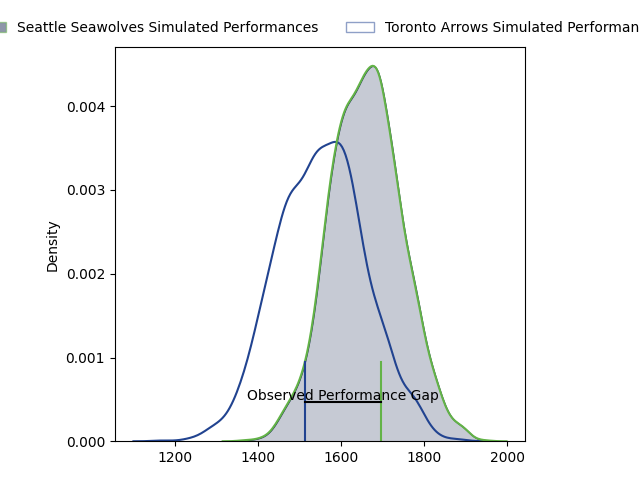

---  
layout: page  
title: Seattle Seawolves at Toronto Arrows; 36-27  
date: 2023-04-23 22:00:00 18:00:00 -0500  
categories: match review  
---
# Seattle Seawolves at Toronto Arrows; 36-27

# Club Level Predictions

The first set of predictions treats a club as the smallest object, as the club develops its members, organizes a gameplan, and deploys its players as needed for each match. This club model has a prediction of 0.353, which translates to predicting Seattle Seawolves to win by 5.4.

Each club has a rating and a rating deviation (simiar to a Glicko system), and expected performances can be generated. This allows for simulated matches and spreads like the ones below.
## Projected Performances

## Projected Spreads

## Projected Results

# Player Level Predictions

Treating teams instead as an entity made up of the currently active players, I have ratings for each player in an altogether different system. These can be combined to form team ratings once teamsheets are announced, weighting starters a bit higher than the reserves. After the match is played, players can be weighted by their minutes on the field, allowing for an accurate measure of the team's composition. With these compiled team ratings, we can make predictions, measure inaccuracy, and update the individual player ratings.
## Prediction with Player Minutes: Seattle Seawolves by 19.2

Seattle Seawolves by 23.2 on a neutral field

There were 7 large changes in win probability in this match
## Prediction without Player Minutes: Seattle Seawolves by 20.6

Seattle Seawolves by 24.6 on a neutral pitch

|   Away Minutes | Away Player          |   Away elo |   Away Percentile |   Number |   Home Percentile |   Home elo | Home Player      |   Home Minutes |
|---------------:|:---------------------|-----------:|------------------:|---------:|------------------:|-----------:|:-----------------|---------------:|
|             57 | Jake Turnbull        |      86.4  |                71 |        1 |                 0 |      19.07 | Lolani Faleiva   |             80 |
|             57 | James Malcolm        |      64.24 |                25 |        2 |                12 |      53.43 | Gene Syminton    |             73 |
|             52 | Sam Matenga          |      57.04 |                13 |        3 |                10 |      54.09 | Isaac Salmon     |             62 |
|             80 | Ben Landry           |      63.37 |                24 |        4 |                 0 |      24.88 | Adrian Wadden    |             62 |
|             57 | Ben Mitchell         |     -40.93 |                 0 |        5 |                 5 |      44.42 | Shay Kerry       |             80 |
|             80 | Charles Elton        |      61.07 |                20 |        6 |                 1 |      32.95 | Mason Flesch     |             80 |
|             73 | Nakai Penny          |      59.59 |                18 |        7 |                10 |      53.66 | Lucas Rumball    |             77 |
|             80 | Riekert Hattingh     |      60.51 |                17 |        8 |                12 |      51.91 | Mitch Eadie      |             80 |
|             70 | JP Smith             |      82.64 |                60 |        9 |                15 |      57.77 | Ross Braude      |             73 |
|             80 | AJ Alatimu           |      58.64 |                15 |       10 |                 2 |      37.35 | Shane O'Leary    |             80 |
|             80 | Lauina Futi          |     118.82 |                97 |       11 |                 6 |      47.16 | Dawson Fatoric   |             80 |
|             80 | Daniel David Kriel   |      58.01 |                15 |       12 |                 0 |      13.74 | Mitch Richardson |             80 |
|             80 | Martin Iosefo        |      59.9  |                20 |       13 |                75 |      89.92 | Fabian Goodall   |             80 |
|             73 | Conner Mooneyham     |      35.43 |                 2 |       14 |                11 |      51.43 | D'Shawn Bowen    |             80 |
|             62 | Adriaan John Carelse |      75.76 |                44 |       15 |                26 |      61.85 | Kobe Faust       |             80 |
|             23 | Mzamo Majola         |      65.96 |                26 |       16 |                 0 |      32.5  | Tyler Rowland    |             18 |
|             23 | Peter Malcolm        |      63.19 |                22 |       17 |                 4 |      44.04 | Michael Sheppard |             18 |
|             28 | Mason Pedersen       |      73.31 |                45 |       18 |                14 |      56.96 | Owain Ruttan     |              3 |
|             23 | Ronan Foley          |      49.86 |                 7 |       19 |               nan |      52.72 | Will Grant       |              7 |
|              7 | Isaia Lotawa         |      60.73 |               nan |       20 |               nan |      43.99 | Tyler Wong       |              7 |
|              7 | Cole Zarcone         |      62.09 |               nan |       21 |               nan |     nan    | nan              |            nan |
|             18 | Mathew Turner        |      59.47 |               nan |       22 |               nan |     nan    | nan              |            nan |
|             10 | Karl Keane           |      71.66 |               nan |       23 |               nan |     nan    | nan              |            nan |

