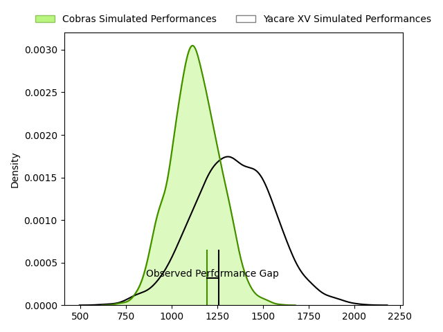
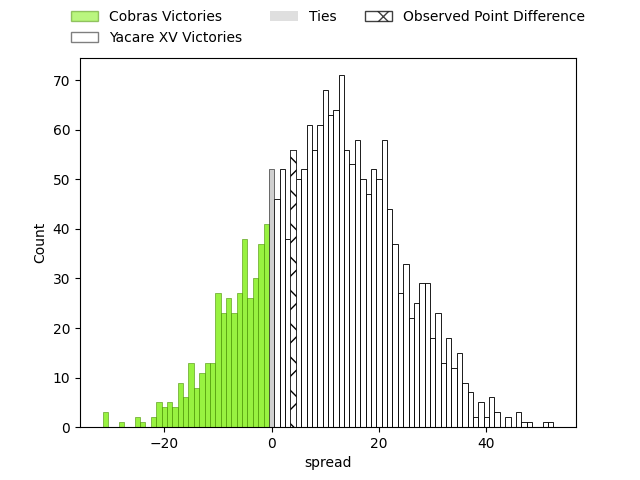

---  
layout: page  
title: Cobras at Yacare XV; 30-34  
date: 2023-04-23 00:00:00 18:00:00 -0500  
categories: match review  
---
# Cobras at Yacare XV; 30-34

# Club Level Predictions

The first set of predictions treats a club as the smallest object, as the club develops its members, organizes a gameplan, and deploys its players as needed for each match. This club model has a prediction of 0.751, which translates to predicting Yacare XV to win by 10.4.

Each club has a rating and a rating deviation (simiar to a Glicko system), and expected performances can be generated. This allows for simulated matches and spreads like the ones below.
## Projected Performances

## Projected Spreads

## Projected Results

# Player Level Predictions

Treating teams instead as an entity made up of the currently active players, I have ratings for each player in an altogether different system. These can be combined to form team ratings once teamsheets are announced, weighting starters a bit higher than the reserves. After the match is played, players can be weighted by their minutes on the field, allowing for an accurate measure of the team's composition. With these compiled team ratings, we can make predictions, measure inaccuracy, and update the individual player ratings.
## Prediction with Player Minutes: Cobras by 4.5

Cobras by 8.5 on a neutral field

There were 14 large changes in win probability in this match
## Prediction without Player Minutes: Cobras by 3.4

Cobras by 7.4 on a neutral pitch

|   Away Minutes | Away Player                   |   Away elo |   Away Percentile |   Number |   Home Percentile |   Home elo | Home Player             |   Home Minutes |
|---------------:|:------------------------------|-----------:|------------------:|---------:|------------------:|-----------:|:------------------------|---------------:|
|             46 | Levy Marinho                  |      43.46 |                 2 |        1 |                 5 |      47.09 | Lucas Noguera Paz       |             56 |
|             80 | Endy Willian                  |      47.21 |                 7 |        2 |                 1 |      32.91 | Mariano Muntaner        |             56 |
|             60 | Henrique Ribeiro Ferreira     |      50.03 |                 6 |        3 |                29 |      68.21 | Facundo Pomponio        |             65 |
|             56 | Cleber Dias                   |      54.43 |                11 |        4 |                 1 |      37.11 | Ignacio Martinez        |             59 |
|             80 | Lucio Anconetani              |      61.62 |                21 |        5 |                 6 |      47.51 | Mariano Garcete Elli    |             80 |
|             80 | Donnacha Byrne                |      56.2  |                13 |        6 |                 2 |      40.02 | Felipe Villagran        |             51 |
|             80 | Matheus Claudio               |      46.09 |                 5 |        7 |                59 |      80.69 | Felipe Puertas          |             80 |
|             48 | Andre Arruda                  |      55.48 |                11 |        8 |                 0 |      27.94 | Juan Cruz Perez Rachel  |             80 |
|             59 | Facundo Vilalba               |      54.97 |                11 |        9 |                47 |      76.56 | Ignacio Inchauspe       |             80 |
|             80 | Lucas Ferrer Spago            |      56.69 |                13 |       10 |                 3 |      39.6  | Federico Cacciabúe      |             25 |
|             80 | Ariel Rodrigues               |      59.01 |                18 |       11 |                 7 |      48.78 | Arturo Lopez            |             80 |
|             80 | Robert Tenorio                |      69.58 |                32 |       12 |                16 |      58.39 | Sebastian Urbieta       |             80 |
|             68 | Victor Silva                  |      53.71 |                10 |       13 |                 8 |      49.14 | Ramiro Amarilla         |             80 |
|             80 | Guilherme Coghetto            |      52.13 |                12 |       14 |                11 |      52.52 | Federico Gauna          |             65 |
|             80 | Lucas Tranquez                |      76.82 |                46 |       15 |                 2 |      35.69 | Tomas McCall            |             80 |
|             32 | Adrio Luiz de Melo            |      45.25 |                 5 |       16 |                 4 |      42.07 | Estanislao Gomez        |             55 |
|             21 | Douglas Rauth                 |      56.11 |                13 |       17 |                 5 |      43.35 | Marcos Riquelme         |             29 |
|             20 | Bautista Vidal                |      56.01 |                11 |       18 |                20 |      60.4  | Emilio Gorostiaga       |             24 |
|             12 | Alain Andres Altahona Fulleda |      43.77 |                 4 |       19 |                 1 |      33.6  | Julian Martin           |             24 |
|             24 | Gabriel Paganini              |      51.14 |                 7 |       20 |               nan |      54.99 | Alvaro Baez             |             21 |
|             34 | Alexandre Alves               |      55.6  |                10 |       21 |                21 |      61.13 | Juan David Agudelo Rojo |             15 |
|            nan | nan                           |     nan    |               nan |       22 |                11 |      54.32 | Estefano Aranda         |             15 |

