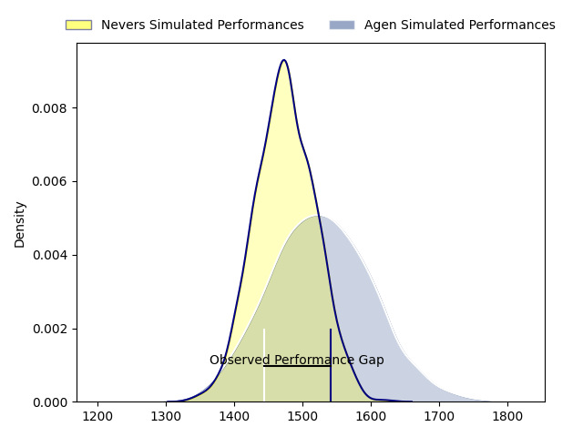
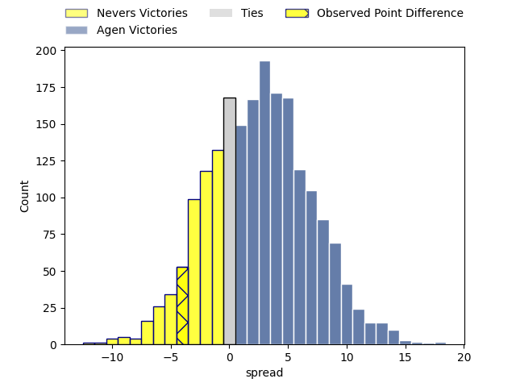
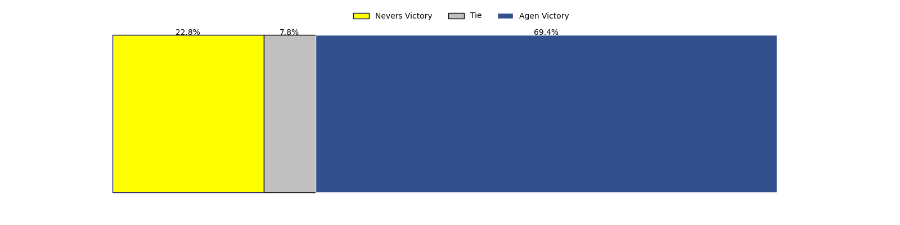

---  
layout: page  
title: Nevers at Agen; 21-17  
date: 2023-04-27 21:00:00 18:00:00 -0500  
categories: match review  
---
# Nevers at Agen; 21-17

# Club Level Predictions

The first set of predictions treats a club as the smallest object, as the club develops its members, organizes a gameplan, and deploys its players as needed for each match. This club model has a prediction of 0.575, which translates to predicting Agen to win by 2.6.

Each club has a rating and a rating deviation (simiar to a Glicko system), and expected performances can be generated. This allows for simulated matches and spreads like the ones below.
## Projected Performances

## Projected Spreads

## Projected Results

# Player Level Predictions

Treating teams instead as an entity made up of the currently active players, I have ratings for each player in an altogether different system. These can be combined to form team ratings once teamsheets are announced, weighting starters a bit higher than the reserves. After the match is played, players can be weighted by their minutes on the field, allowing for an accurate measure of the team's composition. With these compiled team ratings, we can make predictions, measure inaccuracy, and update the individual player ratings.
## Prediction with Player Minutes: Agen by 13.0

Agen by 9.0 on a neutral field

There were 12 large changes in win probability in this match
## Prediction without Player Minutes: Agen by 13.4

Agen by 9.4 on a neutral pitch

|   Away Minutes | Away Player                 |   Away elo |   Away Percentile |   Number |   Home Percentile |   Home elo | Home Player        |   Home Minutes |
|---------------:|:----------------------------|-----------:|------------------:|---------:|------------------:|-----------:|:-------------------|---------------:|
|             44 | Kamaliele Tufele            |      89.4  |                77 |        1 |                83 |      93.05 | Hans Lombard-Buret |             54 |
|             54 | Elia Elia                   |      85.02 |                55 |        2 |                76 |      89.61 | Loris Zarantonello |             54 |
|             72 | Cleopas Kundiona            |      65.58 |                26 |        3 |                85 |      94.4  | Alex Burin         |             45 |
|             34 | Maxence Barjaud             |     106.61 |                91 |        4 |                65 |      83.82 | Corentin Vernet    |             45 |
|             58 | Maka Polutele               |      69.26 |                30 |        5 |                76 |      90.84 | William Demotte    |             80 |
|             80 | Luka Plataret               |      75.77 |                49 |        6 |                96 |     114.22 | Matthieu Bonnet    |             80 |
|             56 | Hugues Bastide              |     110.54 |                94 |        7 |                47 |      75.04 | Vincent Farré      |             80 |
|             80 | Steven David                |      48.64 |                 9 |        8 |                64 |      86.63 | Afa Amosa          |             45 |
|             39 | Guillaume Manevy            |      97.29 |                82 |        9 |                58 |      86.74 | Sonatane Takulua   |             80 |
|             80 | Tanguy Ménoret              |      74.91 |                47 |       10 |                74 |      91.73 | Thomas Vincent     |             24 |
|             80 | Lucas Blanc                 |      79.98 |                58 |       11 |                80 |      94.26 | Iban Etcheverry    |             39 |
|             50 | Leonard Paris               |      80.52 |                41 |       12 |                85 |     103.98 | Kolinio Ramoka     |             80 |
|             80 | Alifereti Loaloa            |     100.55 |                84 |       13 |                80 |      96.86 | Théo Belan         |             39 |
|             80 | Christian Guetang Ambadiang |      80.78 |               nan |       14 |                78 |      92.69 | Loris Tolot        |             80 |
|             80 | Kylian Jaminet              |      84.05 |                62 |       15 |                85 |      94.12 | Jefferson Joseph   |             80 |
|             46 | Senio Toleafoa              |      99.84 |                87 |       16 |                65 |      88.15 | Emile Dayral       |             56 |
|             22 | Kevin Noah                  |      93.44 |                82 |       17 |                58 |      81.85 | Clément Garrigues  |             41 |
|             36 | Jordan Seneca               |      73.61 |               nan |       18 |                46 |      74.82 | Theo Idjellidaine  |             41 |
|              8 | Ilia Kaikatsishvili         |      87.88 |                74 |       19 |                39 |      71.92 | Antoine Erbani     |             35 |
|             30 | Mattéo Faucher              |      97.77 |                81 |       20 |                46 |      76.01 | Evan Olmstead      |             35 |
|             26 | Issam Hamel                 |      86.56 |                72 |       21 |                52 |      77.33 | Beau Farrance      |             35 |
|             24 | Julien Kazubek              |      75    |                35 |       22 |                 3 |      48.67 | Florent Guion      |             26 |
|             41 | Yoan Cottin                 |      88.53 |                70 |       23 |                25 |      66.56 | Clément Martinez   |             26 |

