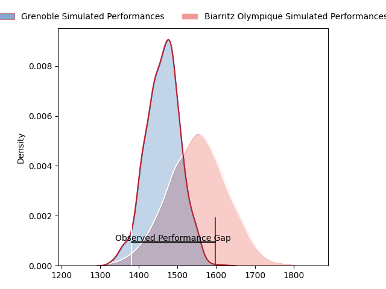
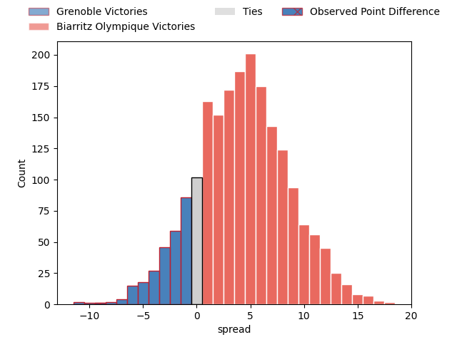
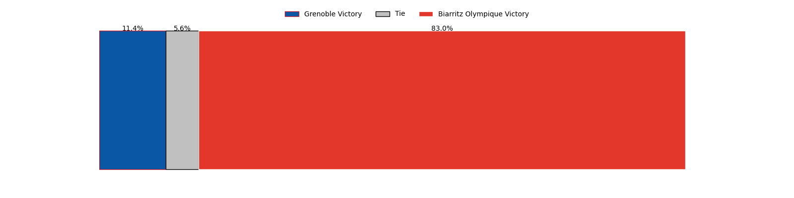

---  
layout: page  
title: Grenoble at Biarritz Olympique; 35-26  
date: 2023-04-28 21:00:00 18:00:00 -0500  
categories: match review  
---
# Grenoble at Biarritz Olympique; 35-26

# Club Level Predictions

The first set of predictions treats a club as the smallest object, as the club develops its members, organizes a gameplan, and deploys its players as needed for each match. This club model has a prediction of 0.625, which translates to predicting Biarritz Olympique to win by 4.5.

Each club has a rating and a rating deviation (simiar to a Glicko system), and expected performances can be generated. This allows for simulated matches and spreads like the ones below.
## Projected Performances

## Projected Spreads

## Projected Results

# Player Level Predictions

Treating teams instead as an entity made up of the currently active players, I have ratings for each player in an altogether different system. These can be combined to form team ratings once teamsheets are announced, weighting starters a bit higher than the reserves. After the match is played, players can be weighted by their minutes on the field, allowing for an accurate measure of the team's composition. With these compiled team ratings, we can make predictions, measure inaccuracy, and update the individual player ratings.
## Prediction with Player Minutes: Grenoble by 6.3

Grenoble by 10.3 on a neutral field

There were 11 large changes in win probability in this match
## Prediction without Player Minutes: Grenoble by 8.4

Grenoble by 12.4 on a neutral pitch

|   Away Minutes | Away Player         |   Away elo |   Away Percentile |   Number |   Home Percentile |   Home elo | Home Player        |   Home Minutes |
|---------------:|:--------------------|-----------:|------------------:|---------:|------------------:|-----------:|:-------------------|---------------:|
|             53 | Luka Goginava       |      71.29 |                37 |        1 |                40 |      75.45 | Baptiste Erdocio   |             72 |
|             59 | Jean-Charles Orioli |      82.81 |                64 |        2 |                60 |      80.66 | Clément Renaud     |             40 |
|             52 | Irakli Aptsiauri    |      75.26 |                47 |        3 |                37 |      71.41 | Guy Millar         |             80 |
|             52 | Thomas Lainault     |     114.67 |                96 |        4 |                36 |      71.4  | Adrian Motoc       |             61 |
|             80 | Tanginoa Halaifonua |      88.78 |                73 |        5 |                50 |      76.8  | John Dyer          |             80 |
|             57 | Antonin Berruyer    |      97.27 |                86 |        6 |                35 |      70.69 | Simon Augry        |             80 |
|             80 | Steeve Blanc-Mappaz |      76.13 |                48 |        7 |                81 |      93.29 | Thomas Hebert      |             80 |
|             57 | Pio Muarua          |     110.07 |                95 |        8 |                86 |      97.87 | Temo Matiu         |             57 |
|             62 | Éric Escande        |      96.73 |                84 |        9 |                55 |      79.62 | Barnabé Couilloud  |             68 |
|             80 | Thomas Fortunel     |      89.11 |                70 |       10 |                56 |      81.99 | Baptiste Germain   |             80 |
|             80 | Erwan Dridi         |      81.51 |                60 |       11 |                62 |      84.9  | Steeve Barry       |             38 |
|             80 | Romain Trouilloud   |      83.81 |                62 |       12 |                65 |      84.1  | Tyler Morgan       |             80 |
|             80 | Romain Fusier       |      80.57 |                58 |       13 |                42 |      74.23 | Francois Vergnaud  |             80 |
|             48 | Karim Qadiri        |      69.79 |                37 |       14 |                48 |      75.65 | Vincent Martin     |             80 |
|             80 | Julien Farnoux      |      98.23 |                82 |       15 |                49 |      74.97 | Romain Lonca       |              1 |
|             32 | Wilfried Hulleu     |      81.08 |                59 |       16 |                50 |      77.53 | Auguste Cadot      |             79 |
|             28 | José Duarte Madeira |      70.41 |                36 |       17 |               nan |      67.88 | Gilles Bosch       |             42 |
|             28 | Sam Nixon           |      75.27 |                47 |       18 |               nan |      83.29 | Leo Carella        |             40 |
|             27 | Zack Gauthier       |     104.69 |                93 |       19 |                43 |      74.15 | Zakaria El Fakir   |              8 |
|             23 | Talalelei Gray      |      58.59 |                15 |       20 |               nan |      74.6  | Charlie Francoz    |             23 |
|             23 | Thibaut Martel      |      85.37 |                68 |       21 |                37 |      72.74 | Johan Aliouat      |             19 |
|             21 | Mathis Sarragallet  |      55.16 |                14 |       22 |                57 |      80.32 | Kerman Aurrekoetea |             12 |
|             18 | Felipe Ezcurra      |      69.9  |                35 |       23 |               nan |     nan    | nan                |            nan |

