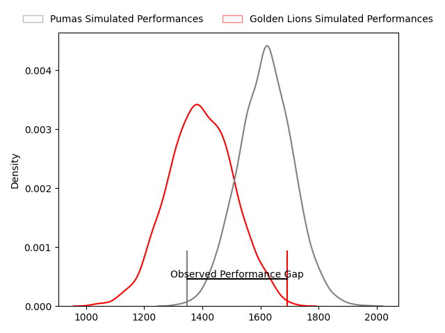
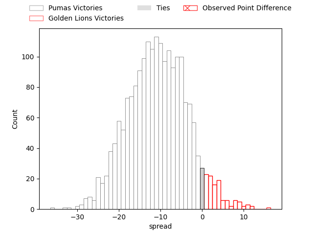
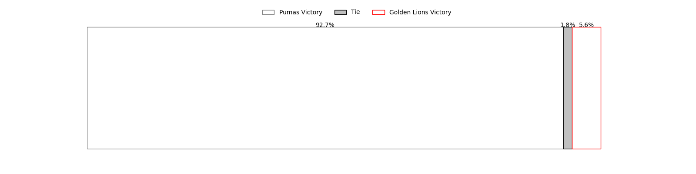

---  
layout: page  
title: Pumas at Golden Lions; 10-26  
date: 2023-04-28 17:00:00 18:00:00 -0500  
categories: match review  
---
# Pumas at Golden Lions; 10-26

# Club Level Predictions

The first set of predictions treats a club as the smallest object, as the club develops its members, organizes a gameplan, and deploys its players as needed for each match. This club model has a prediction of 0.23, which translates to predicting Pumas to win by 10.9.

Each club has a rating and a rating deviation (simiar to a Glicko system), and expected performances can be generated. This allows for simulated matches and spreads like the ones below.
## Projected Performances

## Projected Spreads

## Projected Results

# Player Level Predictions

Treating teams instead as an entity made up of the currently active players, I have ratings for each player in an altogether different system. These can be combined to form team ratings once teamsheets are announced, weighting starters a bit higher than the reserves. After the match is played, players can be weighted by their minutes on the field, allowing for an accurate measure of the team's composition. With these compiled team ratings, we can make predictions, measure inaccuracy, and update the individual player ratings.
## Prediction with Player Minutes: Golden Lions by 3.6

Pumas by 0.4 on a neutral field

There were 2 large changes in win probability in this match
## Prediction without Player Minutes: Golden Lions by 0.3

Pumas by 3.7 on a neutral pitch

|   Away Minutes | Away Player           |   Away elo |   Away Percentile |   Number |   Home Percentile |   Home elo | Home Player                 |   Home Minutes |
|---------------:|:----------------------|-----------:|------------------:|---------:|------------------:|-----------:|:----------------------------|---------------:|
|             34 | Cameron Dawson        |      76.82 |                50 |        1 |                86 |      95.56 | Rhynardt Rijnsburger        |             73 |
|             60 | Corne Fourie          |      71.97 |                41 |        2 |                51 |      76.26 | Gerrit Jacobus Visagie      |             55 |
|             65 | Njabula Juice Gumede  |      67.99 |                29 |        3 |               nan |      67.59 | Ruan Martin Dreyer          |             62 |
|             65 | Malembe Mpofu         |      71.82 |                39 |        4 |                69 |      86.21 | Ruben (Hobo) Schoeman       |             80 |
|             80 | Shane Monro Kirkwood  |     108.1  |                92 |        5 |                83 |      95.94 | Darrien-Lane Landsberg      |             73 |
|             80 | Jaco Labuschagne      |      71.94 |                39 |        6 |               nan |      84.45 | Johannes JC Pretorius       |             74 |
|             80 | Andre Fouché          |      58.26 |                19 |        7 |                19 |      62.45 | Travis Gordon               |             80 |
|             65 | Ruwald Van der Merwe  |      76.24 |               nan |        8 |                33 |      70.05 | Francke Horn                |             80 |
|             48 | Giovanne Snyman       |      58.07 |                15 |        9 |                38 |      71.17 | Morne van der Berg          |             72 |
|             80 | Tinus de Beer         |     100.92 |                86 |       10 |                45 |      75.81 | Gianni Dean Lombard         |             80 |
|             69 | Lundi Msenge          |      72.09 |                41 |       11 |                42 |      72.41 | Sibahle Ndiphiwe Maxwane    |             80 |
|             27 | Ali Mgijima           |     106.12 |                90 |       12 |                60 |      84.29 | Rynardt Jonker              |             80 |
|             80 | Stefan Coetzee        |      77.87 |                53 |       13 |                25 |      65.92 | Manuel Johern (Mannie) Rass |             80 |
|             80 | Jade Kyle Stighling   |      71.27 |                39 |       14 |                60 |      81.5  | Prince Nkabinde             |             80 |
|             80 | Devon Frank Williams  |      73.55 |                41 |       15 |                44 |      75.94 | Andries Coetzee             |             80 |
|             53 | Brandon Terry Thomson |      71.23 |                32 |       16 |                44 |      74.5  | Ruan-Henry Smith            |             18 |
|             46 | PJ Jacobs             |      88.57 |               nan |       17 |                21 |      61.88 | Morné Brandon               |             25 |
|             32 | Chriswill September   |      94.07 |                83 |       18 |                47 |      76.03 | Nico Steyn                  |              8 |
|             20 | Etienne Janeke        |      88.69 |               nan |       19 |               nan |      64.55 | Kayden Kiewit               |              7 |
|             15 | Francois Kleinhans    |      72.76 |                41 |       20 |                84 |      97.03 | Raynard Roets               |              7 |
|             15 | Simon Raw             |      53.26 |               nan |       21 |                63 |      84.41 | Ruhan Straeuli              |              6 |
|             15 | Jeandré Leonard       |      81.97 |               nan |       22 |               nan |     nan    | nan                         |            nan |
|             11 | Andrew Kota           |      74    |               nan |       23 |               nan |     nan    | nan                         |            nan |

