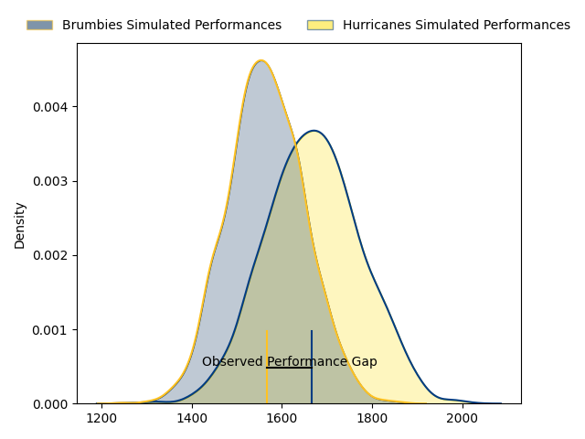
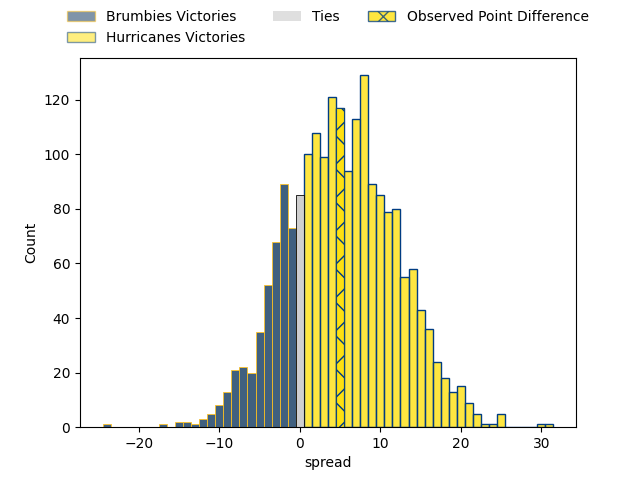

---  
layout: page  
title: Brumbies at Hurricanes; 27.0-32.0  
date: 2023-04-28 03:05:00 18:00:00 -0500  
categories: match review  
---
# Brumbies at Hurricanes; 27.0-32.0

# Club Level Predictions

The first set of predictions treats a club as the smallest object, as the club develops its members, organizes a gameplan, and deploys its players as needed for each match. This club model has a prediction of 0.638, which translates to predicting Hurricanes to win by 5.1.

Each club has a rating and a rating deviation (simiar to a Glicko system), and expected performances can be generated. This allows for simulated matches and spreads like the ones below.
## Projected Performances

## Projected Spreads

## Projected Results

# Player Level Predictions

Treating teams instead as an entity made up of the currently active players, I have ratings for each player in an altogether different system. These can be combined to form team ratings once teamsheets are announced, weighting starters a bit higher than the reserves. After the match is played, players can be weighted by their minutes on the field, allowing for an accurate measure of the team's composition. With these compiled team ratings, we can make predictions, measure inaccuracy, and update the individual player ratings.
## Prediction with Player Minutes: Hurricanes by 3.7

Brumbies by 0.3 on a neutral field

There were 9 large changes in win probability in this match
## Prediction without Player Minutes: Hurricanes by 2.2

Brumbies by 1.8 on a neutral pitch

|   Away Minutes | Away Player      |   Away elo |   Away Percentile |   Number |   Home Percentile |   Home elo | Home Player          |   Home Minutes |
|---------------:|:-----------------|-----------:|------------------:|---------:|------------------:|-----------:|:---------------------|---------------:|
|             64 | James Slipper    |     141.79 |               100 |        1 |                92 |     102.86 | Xavier Numia         |             57 |
|             53 | Billy Pollard    |      85.9  |               nan |        2 |                95 |     110.77 | Asafo Aumua          |             82 |
|             53 | Allan Alaalatoa  |     123.58 |                98 |        3 |                99 |     141.15 | Tyrel Lomax          |             57 |
|             67 | Nick Frost       |      71.92 |                40 |        4 |                61 |      81.76 | James Blackwell      |              7 |
|             82 | Cadeyrn Neville  |     110.08 |                93 |        5 |                90 |     104.66 | Isaia Walker-Leawere |             82 |
|             82 | Rob Valetini     |     100.19 |                87 |        6 |                54 |      78.24 | Devan Flanders       |             78 |
|             82 | Rory Scott       |      84.59 |                67 |        7 |                69 |      85.6  | Du'Plessis Kirifi    |             82 |
|             59 | Charlie Cale     |      86.98 |                69 |        8 |                98 |     123.46 | Ardie Savea          |             82 |
|             53 | Nic White        |     123.3  |                98 |        9 |                79 |      94.05 | Cam Roigard          |             64 |
|             53 | Noah Lolesio     |      96.45 |                81 |       10 |                63 |      85.17 | Aidan Morgan         |             82 |
|             82 | Corey Toole      |      86.31 |                69 |       11 |                51 |      76.77 | Salesi Rayasi        |             78 |
|             68 | Tamati Tua       |      94    |                76 |       12 |                97 |     122.14 | Jordie Barrett       |             82 |
|             82 | Ollie Sapsford   |      83.37 |                61 |       13 |                61 |      83.08 | Peter Umaga-Jensen   |             65 |
|             82 | Andy Muirhead    |     111.65 |                94 |       14 |                97 |     117.82 | Julian Savea         |             82 |
|             82 | Tom Wright       |     103.96 |                86 |       15 |                62 |      84.33 | Joshua Moorby        |             82 |
|             29 | Lachlan Lonergan |      66.77 |                31 |       16 |               nan |      84.7  | Jacob Devery         |              4 |
|             18 | Fred Kaihea      |      83.22 |               nan |       17 |                89 |      93.73 | Tevita Mafileo       |             25 |
|             29 | Sefo Kautai      |      86.29 |                73 |       18 |                88 |      96.26 | Owen Franks          |             25 |
|             15 | Darcy Swain      |      77.12 |                51 |       19 |                84 |      94.47 | Caleb Delany         |             26 |
|             23 | Luke Reimer      |     102.12 |                87 |       20 |                16 |      56.22 | Brayden Iose         |             49 |
|             29 | Ryan Lonergan    |      99.46 |                84 |       21 |                 7 |      49.67 | Jamie Booth          |             18 |
|             29 | Jack Debreczeni  |      94.5  |                79 |       22 |                34 |      69.49 | Harry Godfrey        |              4 |
|             12 | Ben O'Donnell    |      78.2  |                55 |       23 |                94 |     109.83 | Kini Naholo          |             17 |

