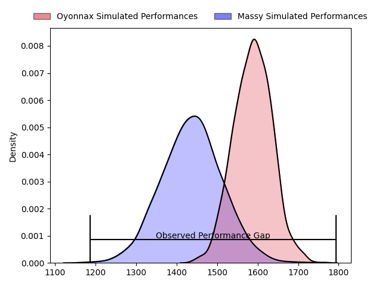
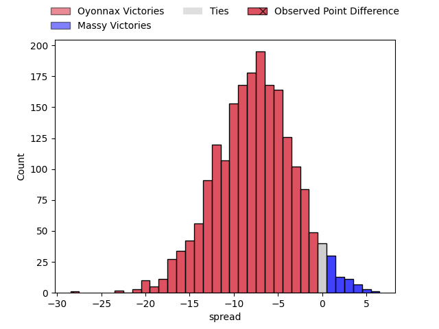
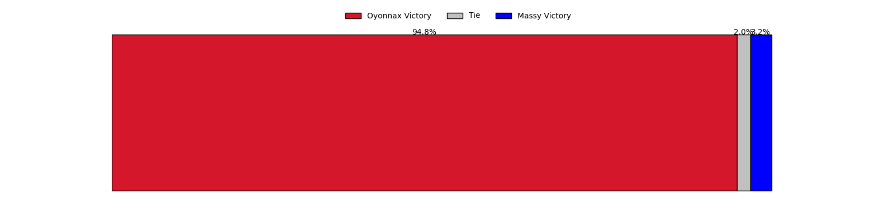

---  
layout: page  
title: Oyonnax at Massy; 33-5  
date: 2023-04-28 19:30:00 18:00:00 -0500  
categories: match review  
---
# Oyonnax at Massy; 33-5

# Club Level Predictions

The first set of predictions treats a club as the smallest object, as the club develops its members, organizes a gameplan, and deploys its players as needed for each match. This club model has a prediction of 0.297, which translates to predicting Oyonnax to win by 7.6.

Each club has a rating and a rating deviation (simiar to a Glicko system), and expected performances can be generated. This allows for simulated matches and spreads like the ones below.
## Projected Performances

## Projected Spreads

## Projected Results

# Player Level Predictions

Treating teams instead as an entity made up of the currently active players, I have ratings for each player in an altogether different system. These can be combined to form team ratings once teamsheets are announced, weighting starters a bit higher than the reserves. After the match is played, players can be weighted by their minutes on the field, allowing for an accurate measure of the team's composition. With these compiled team ratings, we can make predictions, measure inaccuracy, and update the individual player ratings.
## Prediction with Player Minutes: Oyonnax by 2.7

Oyonnax by 6.7 on a neutral field

There were 3 large changes in win probability in this match
## Prediction without Player Minutes: Oyonnax by 4.5

Oyonnax by 8.5 on a neutral pitch

|   Away Minutes | Away Player             |   Away elo |   Away Percentile |   Number |   Home Percentile |   Home elo | Home Player           |   Home Minutes |
|---------------:|:------------------------|-----------:|------------------:|---------:|------------------:|-----------:|:----------------------|---------------:|
|             56 | Antoine Abraham         |      70.02 |                35 |        1 |                20 |      67.2  | Fernandez Correa      |             51 |
|             46 | Benjamin Geledan        |      76.79 |                49 |        2 |                44 |      66.46 | Randy Grelleaud       |             46 |
|             46 | Thomas Laclayat         |      84.64 |                68 |        3 |                67 |      84.17 | Nicolas Ferrer        |             51 |
|             56 | Phoenix Battye          |      75.76 |                48 |        4 |                29 |      73.76 | Abongile Nonkontwana  |             80 |
|             60 | Hugo Fabregue           |      64.82 |                26 |        5 |                45 |      74.44 | Andrew Chauveau       |             55 |
|             80 | Wandrille Picault       |      91.02 |                77 |        6 |                12 |      54.79 | Jean Maurice Decubber |             80 |
|             80 | Loïc Credoz             |     106.4  |                92 |        7 |                41 |      72.86 | Clément Lanen         |             80 |
|             53 | Rory Grice              |      81.65 |                58 |        8 |                54 |      78.19 | Maxime Danton         |             30 |
|             53 | Charlie Cassang         |      79.18 |                54 |        9 |                80 |      95.69 | Benjamin Prier        |             48 |
|             80 | Justin Bouraux          |      88.08 |                68 |       10 |                35 |      70.38 | Massimo Ortolan       |             80 |
|             41 | Enzo Reybier            |      92.09 |                78 |       11 |                12 |      53.89 | Yanis Dit Robaglia    |             80 |
|             80 | Théo Millet             |      84.8  |                63 |       12 |                38 |      72.67 | Victorien Jacomme     |             46 |
|             80 | Chris Farrell           |      78.87 |                52 |       13 |                58 |      81.15 | Arthur Seigneuret     |             10 |
|             80 | Joe Ravouvou            |      85.53 |                67 |       14 |                95 |     115.6  | Alex Preira           |             80 |
|             80 | Aurelien Callandret     |      92.31 |                75 |       15 |                49 |      76.17 | Thomas Rozière        |             80 |
|             39 | Pedro Bettencourt Avila |      58.47 |                16 |       16 |                80 |      96.36 | Tom Cusson            |             70 |
|             34 | Manu Leiataua           |      80.65 |               nan |       17 |                79 |      93.89 | Yohann Gbizie         |             50 |
|             34 | Thibault Berthaud       |      82.01 |                63 |       18 |                58 |      85.91 | Tom Deleuze           |             34 |
|             27 | Kevin Lebreton          |     115.27 |                95 |       19 |                96 |     111.83 | Pierre Trassoudaine   |             34 |
|             27 | Ilan El Khattabi        |      63.36 |                23 |       20 |                52 |      78.76 | Gaëtan Pichon         |             32 |
|             24 | Tommy Raynaud           |      84.85 |                68 |       21 |                48 |      75.86 | Ushangi Tcheishvili   |             29 |
|             24 | Victor Lebas            |      79.01 |                59 |       22 |                71 |      93.15 | Guiterembi Vickos     |             29 |
|             20 | Steve Mafi              |      84.7  |                66 |       23 |                47 |      75.54 | Ewan Coetzee          |             25 |

