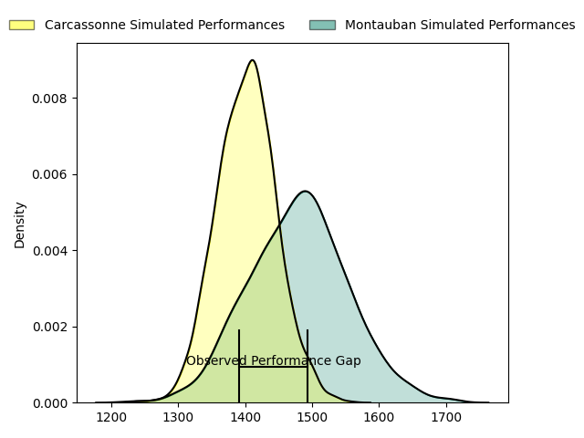
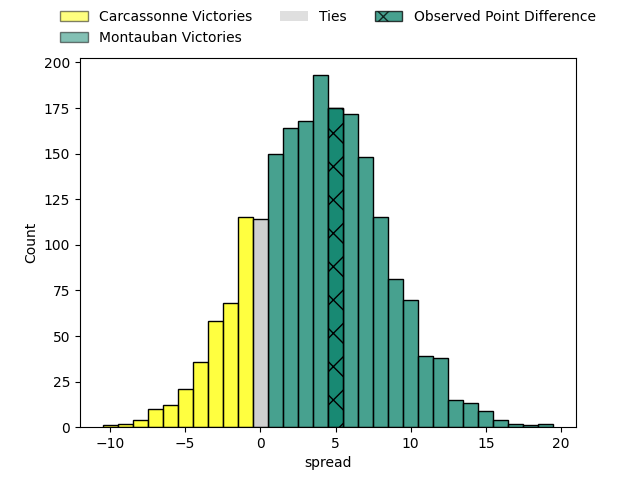
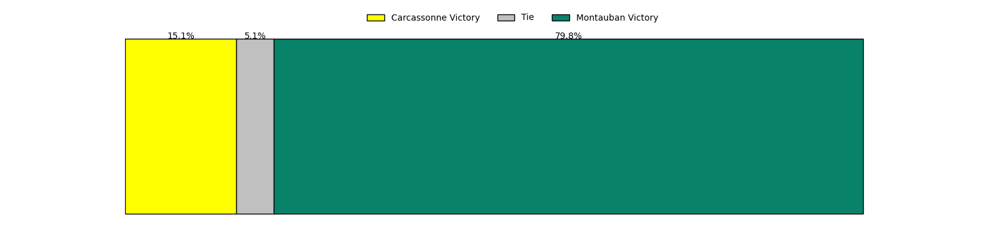

---  
layout: page  
title: Carcassonne at Montauban; 23-28  
date: 2023-04-28 19:30:00 18:00:00 -0500  
categories: match review  
---
# Carcassonne at Montauban; 23-28

# Club Level Predictions

The first set of predictions treats a club as the smallest object, as the club develops its members, organizes a gameplan, and deploys its players as needed for each match. This club model has a prediction of 0.61, which translates to predicting Montauban to win by 3.9.

Each club has a rating and a rating deviation (simiar to a Glicko system), and expected performances can be generated. This allows for simulated matches and spreads like the ones below.
## Projected Performances

## Projected Spreads

## Projected Results

# Player Level Predictions

Treating teams instead as an entity made up of the currently active players, I have ratings for each player in an altogether different system. These can be combined to form team ratings once teamsheets are announced, weighting starters a bit higher than the reserves. After the match is played, players can be weighted by their minutes on the field, allowing for an accurate measure of the team's composition. With these compiled team ratings, we can make predictions, measure inaccuracy, and update the individual player ratings.
## Prediction with Player Minutes: Carcassonne by 2.1

Carcassonne by 6.1 on a neutral field

There were 10 large changes in win probability in this match
## Prediction without Player Minutes: Carcassonne by 3.2

Carcassonne by 7.2 on a neutral pitch

|   Away Minutes | Away Player              |   Away elo |   Away Percentile |   Number |   Home Percentile |   Home elo | Home Player        |   Home Minutes |
|---------------:|:-------------------------|-----------:|------------------:|---------:|------------------:|-----------:|:-------------------|---------------:|
|             76 | Sami Mavinga             |      75.22 |                47 |        1 |                 2 |      43.19 | Lucas Seyrolle     |             49 |
|             31 | Raphaël Carbou           |      90.77 |                79 |        2 |                73 |      86.72 | Cyril Deligny      |             20 |
|             31 | Vakhtangi Akhobadze      |      75.3  |                48 |        3 |                57 |      76.44 | Tietie Tuimauga    |             40 |
|             80 | Romain Manchia           |      97.05 |                85 |        4 |                75 |      89.98 | Dimitri Vaotoa     |             49 |
|             71 | Rynard Ligtoring Landman |      79.24 |                56 |        5 |                32 |      68.09 | Alexandre Manukula |             57 |
|             80 | Simon Meka               |      70.55 |                37 |        6 |                36 |      70.36 | Tomas Lezana       |             80 |
|             51 | Aaron Carroll            |      77.76 |                49 |        7 |                21 |      61.21 | Frédéric Quercy    |             54 |
|             80 | Étienne Herjean          |      83.79 |                65 |        8 |                75 |      88.02 | Quentin Witt       |             80 |
|             49 | Pierre Pagès             |      70.84 |                38 |        9 |                55 |      79.36 | Shaun Venter       |             80 |
|             80 | Dorian Jones             |      93.27 |                75 |       10 |                81 |      97.09 | Jérôme Bosviel     |             80 |
|             80 | Léo Darrelatour          |      98.66 |                85 |       11 |                36 |      69.94 | Bastien Guillemin  |             80 |
|             80 | Jordan Puletua           |      91    |                73 |       12 |                77 |      94.1  | Sevenaia Galala    |             58 |
|             80 | Pierre Aguillon          |      72.91 |                39 |       13 |                67 |      87.07 | Josua Vici         |             80 |
|             49 | Maxime Marty             |      76.12 |               nan |       14 |                73 |      86.48 | Semesa Rokoduguni  |             80 |
|             51 | Baptiste Mouchous        |      92.65 |                75 |       15 |                53 |      77.43 | Segundo Tuculet    |             80 |
|             49 | Luka Petriashvili        |      77.72 |                57 |       16 |                53 |      77.22 | Kevin Firmin       |             60 |
|             49 | Jérémy Boyadjis          |      99.15 |                89 |       17 |                19 |      61.29 | Mirian Burduli     |             40 |
|             31 | Samuel Marques           |      63.86 |                24 |       18 |                50 |      76.63 | Tjiuee Uanivi      |             31 |
|             31 | Clément Clavières        |      91.85 |                77 |       19 |                62 |      83.04 | Malino Vanai       |             31 |
|             29 | Pierre Reynaud           |      83.72 |                62 |       20 |                67 |      84.97 | Otar Giorgadze     |             26 |
|             29 | Damien Añon              |      53.06 |                11 |       21 |               nan |      73.55 | Maselino Paulino   |             23 |
|              9 | George Merrick           |      73.56 |                45 |       22 |                74 |      91.45 | Maxime Mathy       |             22 |
|              4 | Jules Martinez           |      50.76 |                11 |       23 |               nan |     nan    | nan                |            nan |

