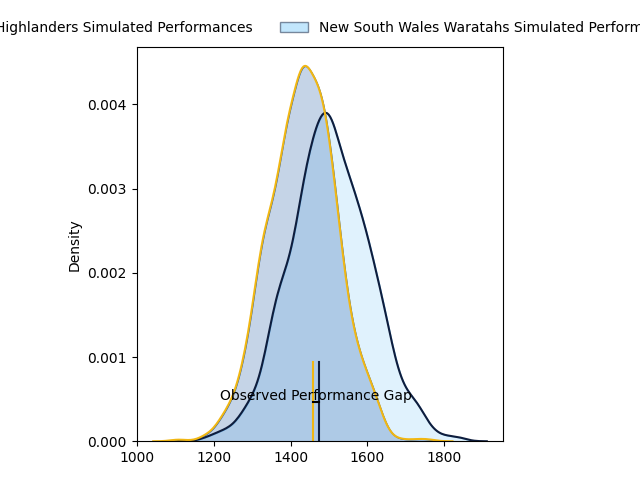
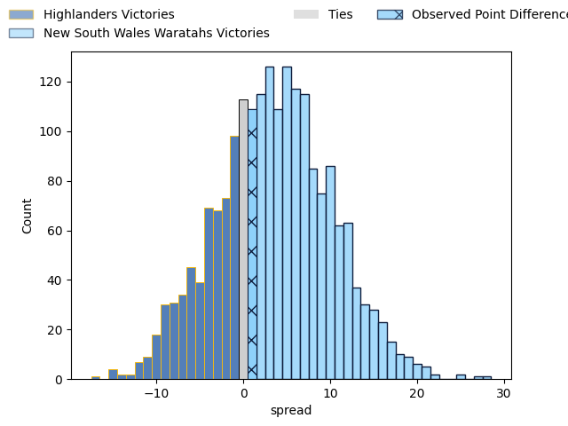
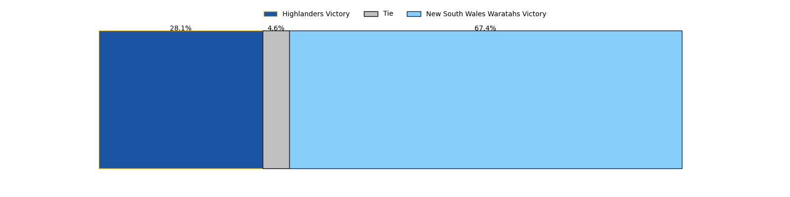

---  
layout: page  
title: Highlanders at New South Wales Waratahs; 20.0-21.0  
date: 2023-04-28 05:35:00 18:00:00 -0500  
categories: match review  
---
# Highlanders at New South Wales Waratahs; 20.0-21.0

# Club Level Predictions

The first set of predictions treats a club as the smallest object, as the club develops its members, organizes a gameplan, and deploys its players as needed for each match. This club model has a prediction of 0.597, which translates to predicting New South Wales Waratahs to win by 3.5.

Each club has a rating and a rating deviation (simiar to a Glicko system), and expected performances can be generated. This allows for simulated matches and spreads like the ones below.
## Projected Performances

## Projected Spreads

## Projected Results

# Player Level Predictions

Treating teams instead as an entity made up of the currently active players, I have ratings for each player in an altogether different system. These can be combined to form team ratings once teamsheets are announced, weighting starters a bit higher than the reserves. After the match is played, players can be weighted by their minutes on the field, allowing for an accurate measure of the team's composition. With these compiled team ratings, we can make predictions, measure inaccuracy, and update the individual player ratings.
## Prediction with Player Minutes: New South Wales Waratahs by 17.7

New South Wales Waratahs by 13.7 on a neutral field

There were 10 large changes in win probability in this match
## Prediction without Player Minutes: New South Wales Waratahs by 16.3

New South Wales Waratahs by 12.3 on a neutral pitch

|   Away Minutes | Away Player          |   Away elo |   Away Percentile |   Number |   Home Percentile |   Home elo | Home Player          |   Home Minutes |
|---------------:|:---------------------|-----------:|------------------:|---------:|------------------:|-----------:|:---------------------|---------------:|
|             62 | Ethan de Groot       |      87.13 |                73 |        1 |                77 |      90.38 | Tetera Faulkner      |             52 |
|             52 | Andrew Makalio       |      90.71 |                79 |        2 |                94 |     107.72 | Dave Porecki         |             67 |
|             62 | Jermaine Ainsley     |      86.9  |                72 |        3 |                68 |      84.53 | Harry Johnson-Holmes |             61 |
|             80 | Fabian Holland       |      92.25 |                80 |        4 |                52 |      77.93 | Jed Holloway         |             80 |
|             55 | Will Tucker          |      81.15 |                59 |        5 |                86 |      98.52 | Hugh Sinclair        |             61 |
|             68 | Shannon Frizell      |      98.72 |                87 |        6 |                59 |      81.3  | Taleni Seu           |             80 |
|             80 | Sean Withy           |      72.97 |                46 |        7 |                99 |     146.12 | Michael Hooper       |             80 |
|             80 | Hugh Renton          |      50.82 |                 8 |        8 |                73 |      89.2  | Langi Gleeson        |             41 |
|             72 | Aaron Smith          |      96.98 |                82 |        9 |                95 |     113.26 | Jake Gordon          |             80 |
|             80 | Mitch Hunt           |      98.13 |                83 |       10 |                66 |      87.25 | Ben Donaldson        |             80 |
|             55 | Scott Gregory        |      80.33 |                56 |       11 |                86 |     100.45 | Dylan Pietsch        |             80 |
|             80 | Sam Gilbert          |      83.56 |                60 |       12 |                77 |      94.15 | Lalakai Foketi       |             80 |
|             56 | Fetuli Paea          |      92.21 |                74 |       13 |                45 |      75.52 | Izaia Perese         |             80 |
|             80 | Jonah Lowe           |      73.86 |                45 |       14 |                77 |      91.88 | Mark Nawaqanitawase  |             80 |
|             80 | Connor Garden-Bachop |     100.07 |                86 |       15 |                90 |     105.12 | Max Jorgensen        |             80 |
|             28 | Rhys Marshall        |      85.85 |                75 |       16 |                 9 |      50.18 | Mahe Vailanu         |             13 |
|             18 | Dan Lienert-Brown    |      88.25 |                77 |       17 |               nan |      74.21 | Nephi Leatigaga      |             28 |
|             18 | Saula Mau            |      84.45 |                75 |       18 |               nan |      87.17 | Daniel Botha         |             19 |
|             25 | Pari Pari Parkinson  |     125.28 |                97 |       19 |                79 |      93.55 | Will Harris          |             39 |
|             12 | Marino Mikaele-Tu'u  |      81.41 |                57 |       20 |                65 |      83.96 | Charlie Gamble       |             19 |
|              8 | Folau Fakatava       |      77.24 |                49 |       21 |               nan |      84.63 | Harrison Goddard     |              0 |
|             24 | Thomas Umaga-Jensen  |      73.62 |                40 |       22 |                55 |      80.36 | Joey Walton          |              0 |
|             25 | Jona Nareki          |      90.47 |                75 |       23 |               nan |      89.62 | Mosese Tuipulotu     |              0 |

