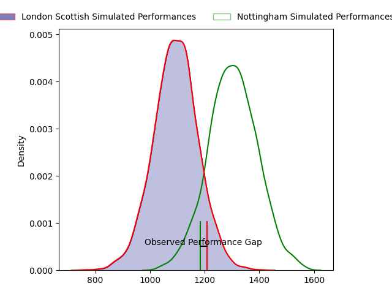
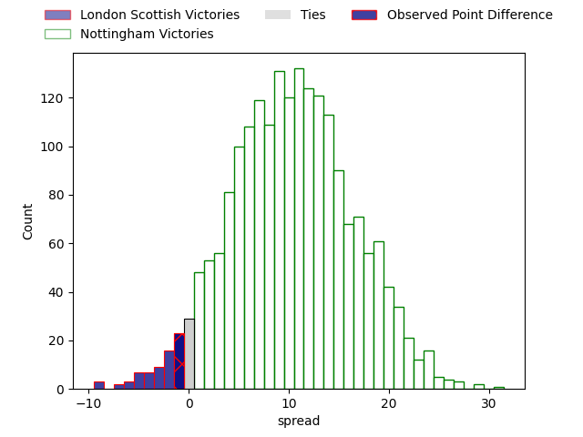
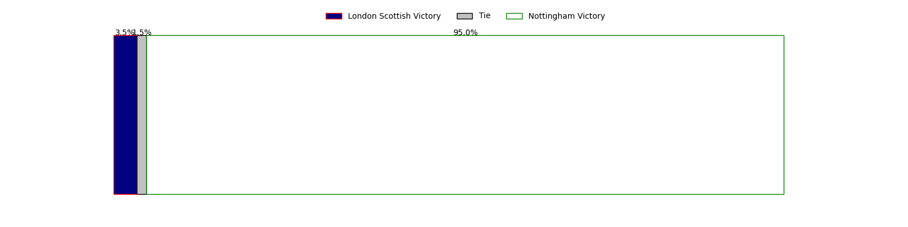

---  
layout: page  
title: London Scottish at Nottingham; 20-19  
date: 2023-04-28 20:45:00 18:00:00 -0500  
categories: match review  
---
# London Scottish at Nottingham; 20-19

# Club Level Predictions

The first set of predictions treats a club as the smallest object, as the club develops its members, organizes a gameplan, and deploys its players as needed for each match. This club model has a prediction of 0.762, which translates to predicting Nottingham to win by 10.4.

Each club has a rating and a rating deviation (simiar to a Glicko system), and expected performances can be generated. This allows for simulated matches and spreads like the ones below.
## Projected Performances

## Projected Spreads

## Projected Results

# Player Level Predictions

Treating teams instead as an entity made up of the currently active players, I have ratings for each player in an altogether different system. These can be combined to form team ratings once teamsheets are announced, weighting starters a bit higher than the reserves. After the match is played, players can be weighted by their minutes on the field, allowing for an accurate measure of the team's composition. With these compiled team ratings, we can make predictions, measure inaccuracy, and update the individual player ratings.
## Prediction with Player Minutes: London Scottish by 4.0

London Scottish by 8.0 on a neutral field

There were 9 large changes in win probability in this match
## Prediction without Player Minutes: Nottingham by 0.5

London Scottish by 3.5 on a neutral pitch

|   Away Minutes | Away Player        |   Away elo |   Away Percentile |   Number |   Home Percentile |   Home elo | Home Player               |   Home Minutes |
|---------------:|:-------------------|-----------:|------------------:|---------:|------------------:|-----------:|:--------------------------|---------------:|
|             70 | Will Prior         |      72.21 |                39 |        1 |                56 |      79.31 | Aniseko Sio               |             53 |
|             70 | Jack Musk          |      88.79 |                76 |        2 |                65 |      83.43 | Jack Dickinson            |             61 |
|             53 | Joe Rees           |      73.11 |                41 |        3 |                63 |      82.33 | Xavier Valentine          |             67 |
|             67 | Matas Jurevicius   |      71.44 |                39 |        4 |                65 |      83.54 | Iosefa Danny Wayne Fiaola |             80 |
|             80 | Bailey Ransom      |     119.57 |                96 |        5 |                13 |      56.15 | Scott Hall                |             24 |
|             80 | Will Trenholm      |      75.79 |                48 |        6 |                53 |      78.26 | George Cox                |             80 |
|             80 | Charlie Ingall     |      73.79 |                41 |        7 |                60 |      81.6  | Carl Kirwan               |             70 |
|             51 | Cameron King       |      53.31 |                10 |        8 |                31 |      69.59 | Josh Poullet              |             80 |
|             70 | Daniel Nutton      |      75.26 |                45 |        9 |                40 |      72.73 | Micheal Stronge           |             67 |
|             80 | Nathan Chamberlain |      79.85 |                52 |       10 |                74 |      93.24 | Sam Hollingsworth         |             48 |
|             80 | Cassius Cleaves    |     102.47 |                88 |       11 |                24 |      63.54 | Harry Graham              |             80 |
|             70 | Lennox Anyanwu     |      65.11 |                24 |       12 |                44 |      74.87 | Javiah Pohe               |             80 |
|             80 | Hayden Hyde        |      53.71 |                10 |       13 |                 8 |      50.95 | John Joseph Neville       |             48 |
|             80 | Luke Mehson        |      85.36 |                67 |       14 |                63 |      83.28 | David Williams            |             80 |
|             80 | Cameron Anderson   |     103.24 |                87 |       15 |                60 |      83.53 | Jordan Kehinde Olowofela  |             80 |
|             29 | Viliami Taulani    |      70.07 |                25 |       16 |                 6 |      49.63 | Ross Bundy                |             56 |
|             27 | Rhys Litterick     |      64.11 |               nan |       17 |                 8 |      46.64 | Morgan Bunting            |             32 |
|             13 | Angus Southon      |      65.67 |                25 |       18 |                 7 |      57.66 | Michael Green             |             32 |
|             10 | Nathan Jibulu      |      65.8  |               nan |       19 |                45 |      74.56 | Toby Williams             |             27 |
|             10 | Jack Ingall        |      72.96 |                41 |       20 |                64 |      86.09 | Harry Clayton             |             19 |
|             10 | Luca Petrozzi      |      59.39 |               nan |       21 |                18 |      59.93 | Liam Slatem               |             13 |
|             10 | Rhys Charalambous  |      63.35 |               nan |       22 |                40 |      77.91 | Dan Richardson            |             13 |
|            nan | nan                |     nan    |               nan |       23 |               nan |      69.46 | Jacob Wright              |             10 |

