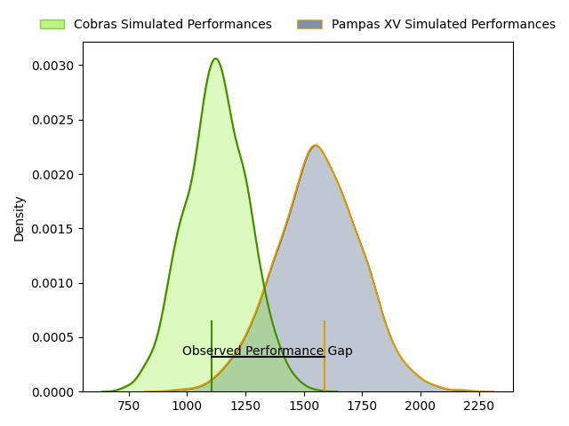
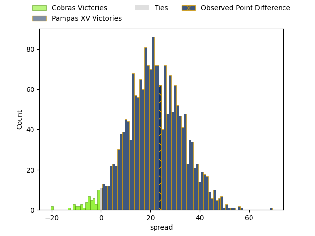

---  
layout: page  
title: Cobras at Pampas XV; 14-38  
date: 2023-04-28 22:00:00 18:00:00 -0500  
categories: match review  
---
# Cobras at Pampas XV; 14-38

# Club Level Predictions

The first set of predictions treats a club as the smallest object, as the club develops its members, organizes a gameplan, and deploys its players as needed for each match. This club model has a prediction of 0.908, which translates to predicting Pampas XV to win by 21.7.

Each club has a rating and a rating deviation (simiar to a Glicko system), and expected performances can be generated. This allows for simulated matches and spreads like the ones below.
## Projected Performances

## Projected Spreads

## Projected Results

# Player Level Predictions

Treating teams instead as an entity made up of the currently active players, I have ratings for each player in an altogether different system. These can be combined to form team ratings once teamsheets are announced, weighting starters a bit higher than the reserves. After the match is played, players can be weighted by their minutes on the field, allowing for an accurate measure of the team's composition. With these compiled team ratings, we can make predictions, measure inaccuracy, and update the individual player ratings.
## Prediction with Player Minutes: Pampas XV by 27.1

Pampas XV by 23.1 on a neutral field

There were 2 large changes in win probability in this match
## Prediction without Player Minutes: Pampas XV by 26.8

Pampas XV by 22.8 on a neutral pitch

|   Away Minutes | Away Player                   |   Away elo |   Away Percentile |   Number |   Home Percentile |   Home elo | Home Player                    |   Home Minutes |
|---------------:|:------------------------------|-----------:|------------------:|---------:|------------------:|-----------:|:-------------------------------|---------------:|
|             68 | Levy Marinho                  |      40.12 |                 2 |        1 |                69 |      85.33 | Rodrigo Martinez Manzano       |             49 |
|             40 | Diego Vidal                   |      51    |               nan |        2 |               nan |      62.46 | Rodrigo Boulan                 |             61 |
|             49 | Bautista Vidal                |      54.7  |                12 |        3 |                22 |      62.86 | Javier Angel Coronel           |             49 |
|             80 | Ben Donald                    |      56.76 |                15 |        4 |                 3 |      40.92 | Eliseo Fourcade                |             61 |
|             62 | Gabriel Paganini              |      48.71 |                 7 |        5 |                66 |      84.45 | Rodrigo Fernandez Criado       |             80 |
|             40 | Diver Ceballos                |      38.76 |                 2 |        6 |                37 |      70.74 | Nicolas Damorim                |             49 |
|             80 | Adrio Luiz de Melo            |      45.6  |                 6 |        7 |                16 |      58.75 | Manuel Bernstein               |             80 |
|             80 | Donnacha Byrne                |      50.04 |                 8 |        8 |                 9 |      50.91 | Jeronimo Ureta                 |             57 |
|             59 | Douglas Rauth                 |      55.1  |                13 |        9 |                21 |      61.54 | Eliseo Nicolas Morales Abraham |             57 |
|             40 | Lucas Ferrer Spago            |      50.97 |                 9 |       10 |                 3 |      40.35 | Joaquin de la Vega Mendia      |             49 |
|             80 | Ariel Rodrigues               |      57.23 |                17 |       11 |                31 |      67.07 | Lucio Auad                     |             80 |
|             80 | Robert Tenorio                |      72.66 |                39 |       12 |               nan |      59.28 | Santiago Castro                |             80 |
|             80 | Victor Silva                  |      52.68 |                10 |       13 |                29 |      67.11 | Benjamin Elizalde              |             80 |
|             80 | Alain Andres Altahona Fulleda |      43.76 |                 6 |       14 |                67 |      85.24 | Inaki Delguy                   |             80 |
|             63 | Guilherme Coghetto            |      46.1  |                 6 |       15 |                76 |      93.27 | Juan Ignacio Lando             |             80 |
|             40 | Cleber Dias                   |      52.62 |                11 |       16 |                32 |      66.29 | Miguel Angel Prince            |             31 |
|             40 | Leonardo de Souza da Silva    |      40.48 |                 3 |       17 |                15 |      56.3  | Javier Corvalan                |             31 |
|             40 | Lucas Tranquez                |      69.28 |                33 |       18 |                12 |      55.21 | Eliseo Chiavassa               |             31 |
|             31 | Henrique Ribeiro Ferreira     |      49.62 |                 6 |       19 |                26 |      64.5  | Joaquin Lamas                  |             31 |
|             21 | Facundo Vilalba               |      50.71 |                 7 |       20 |                47 |      79.31 | Rafael Iriarte                 |             23 |
|             18 | Gabriel Oliveira              |      47.35 |               nan |       21 |               nan |      63.26 | Benjamin Grondona              |             23 |
|             17 | Augusto Jose Silva Fonseca    |      48.6  |               nan |       22 |                49 |      79.02 | Matias Medrano                 |             19 |
|             12 | João Lucas Marino de Souza    |      48.49 |               nan |       23 |                45 |      74.02 | Lorenzo Colidio                |             19 |

