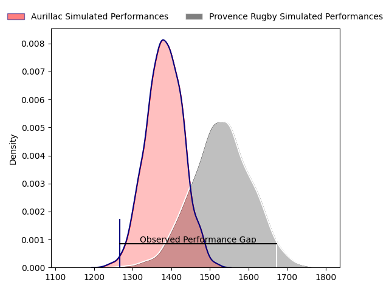
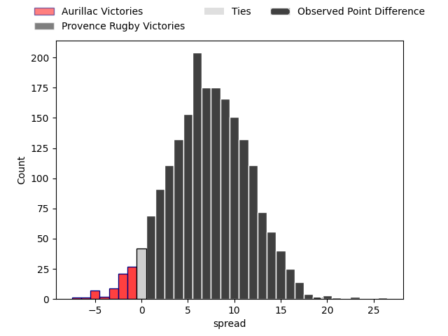
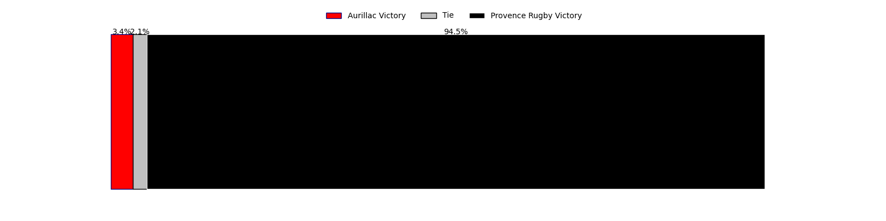

---  
layout: page  
title: Aurillac at Provence Rugby; 14-33  
date: 2023-04-28 19:30:00 18:00:00 -0500  
categories: match review  
---
# Aurillac at Provence Rugby; 14-33

# Club Level Predictions

The first set of predictions treats a club as the smallest object, as the club develops its members, organizes a gameplan, and deploys its players as needed for each match. This club model has a prediction of 0.696, which translates to predicting Provence Rugby to win by 7.3.

Each club has a rating and a rating deviation (simiar to a Glicko system), and expected performances can be generated. This allows for simulated matches and spreads like the ones below.
## Projected Performances

## Projected Spreads

## Projected Results

# Player Level Predictions

Treating teams instead as an entity made up of the currently active players, I have ratings for each player in an altogether different system. These can be combined to form team ratings once teamsheets are announced, weighting starters a bit higher than the reserves. After the match is played, players can be weighted by their minutes on the field, allowing for an accurate measure of the team's composition. With these compiled team ratings, we can make predictions, measure inaccuracy, and update the individual player ratings.
## Prediction with Player Minutes: Provence Rugby by 8.5

Provence Rugby by 4.5 on a neutral field

There were 6 large changes in win probability in this match
## Prediction without Player Minutes: Provence Rugby by 7.8

Provence Rugby by 3.8 on a neutral pitch

|   Away Minutes | Away Player          |   Away elo |   Away Percentile |   Number |   Home Percentile |   Home elo | Home Player           |   Home Minutes |
|---------------:|:---------------------|-----------:|------------------:|---------:|------------------:|-----------:|:----------------------|---------------:|
|             52 | Robert Rodgers       |      69.48 |                41 |        1 |                81 |      85.97 | Thomas Vernet         |             58 |
|             52 | Theo Lachaud         |      62.51 |                29 |        2 |                48 |      73.4  | German Kessler        |             80 |
|             34 | Tim Daniel-Meissen   |      74.43 |                44 |        3 |                53 |      72.15 | Mohammed Loukia       |             55 |
|             80 | Georgi Javakhia      |      92.71 |                81 |        4 |                26 |      60.61 | Hans Nkinsi           |             52 |
|             80 | Jean-Baptiste Singer |      73.19 |                42 |        5 |                38 |      71.49 | Alexandre Flanquart   |             80 |
|             56 | Eoghan Masterson     |      77.25 |                51 |        6 |                61 |      81.82 | Guillaume Piazzoli    |             80 |
|             80 | Hugo Huurman         |      70.73 |                36 |        7 |                30 |      67.73 | Bilel Taieb           |             52 |
|             58 | Latuka Maituku       |      43.54 |                 5 |        8 |                 3 |      34.33 | Charles Malet         |             48 |
|             52 | Mikheil Alania       |      77    |                49 |        9 |                22 |      63.02 | Joris Cazenave        |             54 |
|             80 | Marc Palmier         |      92.4  |                76 |       10 |                30 |      68.43 | Enzo Selponi          |             80 |
|             80 | Simeli Yabaki        |      39.52 |                 3 |       11 |                38 |      71.63 | Adrien Lapègue        |             47 |
|             80 | Christa Powell       |      77.31 |                49 |       12 |                29 |      67.91 | Louis Marrou          |             80 |
|             80 | Jimmy Yobo           |      76    |                46 |       13 |                81 |      98.27 | Adrian Sanday         |             54 |
|             52 | Albert Valentin      |      66.44 |                29 |       14 |                61 |      81.84 | Kevin Bly             |             80 |
|             52 | Gautier Minguillon   |      67.99 |               nan |       15 |                90 |     109.14 | Florent Massip        |             80 |
|             46 | Henzo Kiteau         |      56.55 |                15 |       16 |                19 |      60.2  | Nadir Bouhedjeur      |             33 |
|             28 | Giorgi Gogoladze     |      90.28 |                71 |       17 |                50 |      82.19 | Joseph Laget          |             32 |
|             28 | Luka Nioradze        |      79.52 |                57 |       18 |                69 |      86.13 | Jérôme Dufour         |             28 |
|             28 | Hugo Bouyssou        |      52.6  |                14 |       19 |                31 |      68.59 | Jessy Jegerlhener     |             28 |
|             28 | Anderson Neisen      |     104.62 |                89 |       20 |                14 |      58.21 | Simon Tarel           |             26 |
|             28 | Alexandre Plantier   |      79.86 |                57 |       21 |                39 |      72.56 | Dorian Lavernhe       |             26 |
|             24 | Steve Moukete        |      63.33 |                25 |       22 |               nan |      69.31 | Jean-Pierre Maugateau |             25 |
|             22 | Lucas Vaccaro        |      55.15 |                12 |       23 |               nan |      69.47 | Tom Marino            |             22 |

