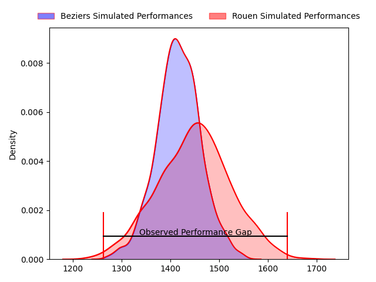
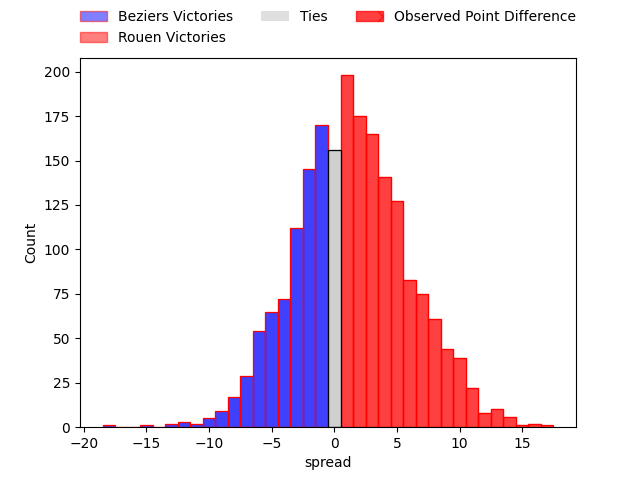
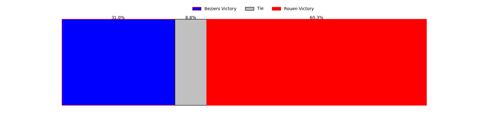

---  
layout: page  
title: Beziers at Rouen; 17-34  
date: 2023-04-28 19:30:00 18:00:00 -0500  
categories: match review  
---
# Beziers at Rouen; 17-34

# Club Level Predictions

The first set of predictions treats a club as the smallest object, as the club develops its members, organizes a gameplan, and deploys its players as needed for each match. This club model has a prediction of 0.544, which translates to predicting Rouen to win by 1.5.

Each club has a rating and a rating deviation (simiar to a Glicko system), and expected performances can be generated. This allows for simulated matches and spreads like the ones below.
## Projected Performances

## Projected Spreads

## Projected Results

# Player Level Predictions

Treating teams instead as an entity made up of the currently active players, I have ratings for each player in an altogether different system. These can be combined to form team ratings once teamsheets are announced, weighting starters a bit higher than the reserves. After the match is played, players can be weighted by their minutes on the field, allowing for an accurate measure of the team's composition. With these compiled team ratings, we can make predictions, measure inaccuracy, and update the individual player ratings.
## Prediction with Player Minutes: Rouen by 7.1

Rouen by 3.1 on a neutral field

There were 9 large changes in win probability in this match
## Prediction without Player Minutes: Rouen by 8.4

Rouen by 4.4 on a neutral pitch

|   Away Minutes | Away Player           |   Away elo |   Away Percentile |   Number |   Home Percentile |   Home elo | Home Player           |   Home Minutes |
|---------------:|:----------------------|-----------:|------------------:|---------:|------------------:|-----------:|:----------------------|---------------:|
|             50 | Francisco Fernandes   |      54.32 |                11 |        1 |                56 |      78    | Soulemane Camara      |             54 |
|             52 | Clément Esteriola     |      89.56 |                77 |        2 |                42 |      72.8  | Efitusi Ma'afu        |             47 |
|             50 | Yannick Arroyo        |      63.58 |                21 |        3 |                36 |      71.49 | Hugo Ndiaye           |             54 |
|             80 | Pierre Gayraud        |      69.8  |                45 |        4 |                86 |     107.05 | Raphaël Vieilledent   |             64 |
|             80 | John Madigan          |      74.88 |                44 |        5 |                73 |      88.47 | Jimi Maximin          |             80 |
|             47 | William van Bost      |      56.46 |                14 |        6 |                34 |      69.65 | Samuel Maximin        |             80 |
|             80 | Éloi Massot           |      69.85 |                35 |        7 |                63 |      82.98 | Fabien Vincent        |             80 |
|             50 | Thomas Hoarau         |      70.85 |                38 |        8 |                38 |      72.54 | Valentino Mapapalangi |             35 |
|             50 | Josh Valentine        |      65.94 |                24 |        9 |                33 |      69.44 | Théo Nanette          |             54 |
|             44 | Romain Uruty          |      74.18 |                44 |       10 |                78 |      94.15 | Thibault Olender      |             80 |
|             80 | Paul Alquier          |      70.17 |                36 |       11 |                44 |      74.16 | Benito Masilevu       |             66 |
|             80 | Watisoni Votu         |      77.59 |                61 |       12 |                38 |      72.28 | Taylor Gontineac      |             80 |
|             80 | Maxime Espeut         |     119.86 |                97 |       13 |                22 |      63.94 | Opetera Peleseuma     |             49 |
|             80 | Paul Reau             |      79.12 |                55 |       14 |                77 |      94.16 | Paul Surano           |             80 |
|             80 | Victor Dreuille       |      81.53 |                55 |       15 |                25 |      69.15 | Peter Lydon           |             80 |
|             31 | Gabin Lorre           |      93.65 |                76 |       16 |                57 |      81.22 | Willy N'Diaye         |             45 |
|             33 | Jean-Baptiste Barrère |      59.66 |                18 |       17 |                67 |      83.81 | Mathieu Bonnot        |             33 |
|             30 | Giorgi Akhaladze      |      78.95 |                55 |       18 |                12 |      57.53 | John Thomas Jackson   |             31 |
|             30 | Jean Victor Goillot   |      75.65 |                56 |       19 |               nan |      73.54 | Dylan Jacquot         |             26 |
|             30 | Jamie Hagan           |      70.64 |                31 |       20 |                48 |      78.15 | Cody Thomas           |             26 |
|             30 | Maxence Lemardelet    |      76.03 |                45 |       21 |                 8 |      53.42 | Florent Campeggia     |             26 |
|             28 | Yvann Lalevee         |      88.54 |                76 |       22 |                31 |      68.55 | Jean Leleu            |             16 |
|              5 | Adrien Latorre        |      67.53 |               nan |       23 |                33 |      67.69 | Kevin Milhorat        |             14 |

