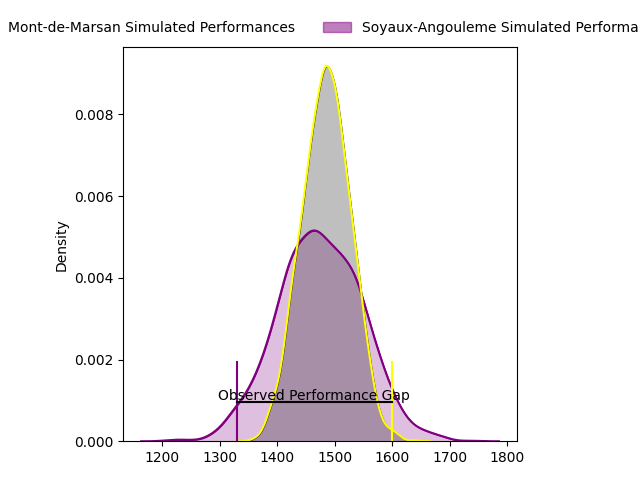
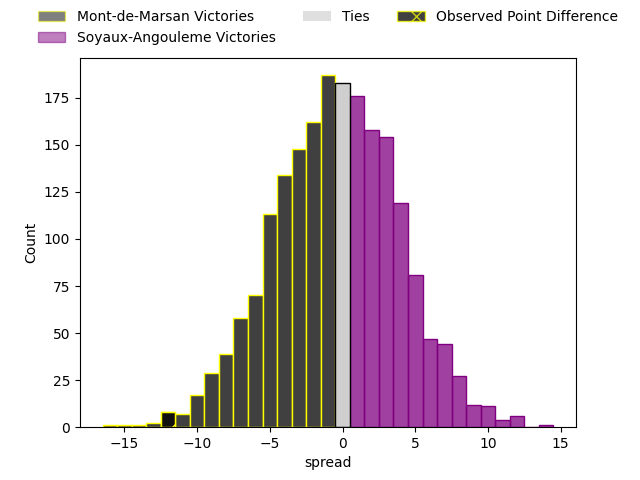

---  
layout: page  
title: Mont-de-Marsan at Soyaux-Angouleme; 34-22  
date: 2023-04-28 19:30:00 18:00:00 -0500  
categories: match review  
---
# Mont-de-Marsan at Soyaux-Angouleme; 34-22

# Club Level Predictions

The first set of predictions treats a club as the smallest object, as the club develops its members, organizes a gameplan, and deploys its players as needed for each match. This club model has a prediction of 0.485, which translates to predicting Mont-de-Marsan to win by 0.5.

Each club has a rating and a rating deviation (simiar to a Glicko system), and expected performances can be generated. This allows for simulated matches and spreads like the ones below.
## Projected Performances

## Projected Spreads

## Projected Results

# Player Level Predictions

Treating teams instead as an entity made up of the currently active players, I have ratings for each player in an altogether different system. These can be combined to form team ratings once teamsheets are announced, weighting starters a bit higher than the reserves. After the match is played, players can be weighted by their minutes on the field, allowing for an accurate measure of the team's composition. With these compiled team ratings, we can make predictions, measure inaccuracy, and update the individual player ratings.
## Prediction with Player Minutes: Mont-de-Marsan by 4.8

Mont-de-Marsan by 8.8 on a neutral field

There were 7 large changes in win probability in this match
## Prediction without Player Minutes: Mont-de-Marsan by 4.0

Mont-de-Marsan by 8.0 on a neutral pitch

|   Away Minutes | Away Player               |   Away elo |   Away Percentile |   Number |   Home Percentile |   Home elo | Home Player          |   Home Minutes |
|---------------:|:--------------------------|-----------:|------------------:|---------:|------------------:|-----------:|:---------------------|---------------:|
|             49 | Jean-Luc Innocente        |      83.77 |                84 |        1 |                49 |      76.4  | Khatchik Vartan      |             80 |
|             50 | Romain Laterrade          |      47.22 |                14 |        2 |                40 |      71.54 | Patxi Bidart         |             80 |
|             50 | Gheorge Gajion            |      70.23 |                34 |        3 |                40 |      74.59 | Yassin Boutemani     |             80 |
|             80 | Nicolas Garrault          |      65.63 |                27 |        4 |                43 |      72.85 | Robin Copeland       |             80 |
|             80 | Romain Durand             |      95.74 |                83 |        5 |                53 |      78    | Sikeli Nabou         |             80 |
|             72 | Yann Brethous             |      75.71 |                48 |        6 |                11 |      54.47 | Gautier Gibouin      |             80 |
|             80 | Léo Banos                 |      67.7  |                29 |        7 |                84 |      90.29 | Germain Burgaud      |             80 |
|             51 | Michael Faleafa           |      74.73 |                44 |        8 |                52 |      79.05 | Matt Va'ai           |             80 |
|             66 | Christophe Loustalot      |      66.22 |                28 |        9 |                62 |      81.47 | Emmanuel Saubusse    |             80 |
|             80 | Willie du Plessis         |      83.84 |                59 |       10 |                19 |      61.55 | Benjamin Botica      |             80 |
|             80 | Kaminieli Rasaku          |      91.46 |                76 |       11 |                72 |      87.9  | Marvin Lestremau     |             80 |
|             80 | Jules Even                |     107.92 |                91 |       12 |                27 |      66.71 | Inaki Ayarza Saporta |             80 |
|             58 | Nacani Wakaya             |     101.33 |                85 |       13 |                43 |      74.83 | Ledua Mau            |             80 |
|             80 | Wame Naituvi              |      81.57 |                69 |       14 |                79 |      92.6  | Maxime Laforgue      |             80 |
|             58 | Yoann Laousse Azpiazu     |      98.82 |                83 |       15 |                26 |      66.24 | Pierre Lafitte       |             80 |
|             31 | Max Curie                 |      59.53 |                16 |       16 |               nan |     nan    | nan                  |            nan |
|             30 | Anthony Alves             |      72.37 |                38 |       17 |               nan |     nan    | nan                  |            nan |
|             30 | Simon Labouyrie           |      81.78 |                63 |       18 |               nan |     nan    | nan                  |            nan |
|             29 | Veresa Tuqovu Ramototabua |      93.67 |                81 |       19 |               nan |     nan    | nan                  |            nan |
|             22 | Alexandre de Nardi        |      72.84 |                37 |       20 |               nan |     nan    | nan                  |            nan |
|             22 | Simon Renda               |      93.55 |                77 |       21 |               nan |     nan    | nan                  |            nan |
|             14 | Clément Darbo             |      74.81 |               nan |       22 |               nan |     nan    | nan                  |            nan |
|              8 | Leandro Luis Cedaro       |      82.23 |               nan |       23 |               nan |     nan    | nan                  |            nan |

