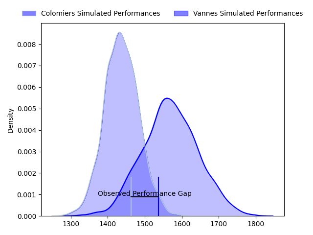
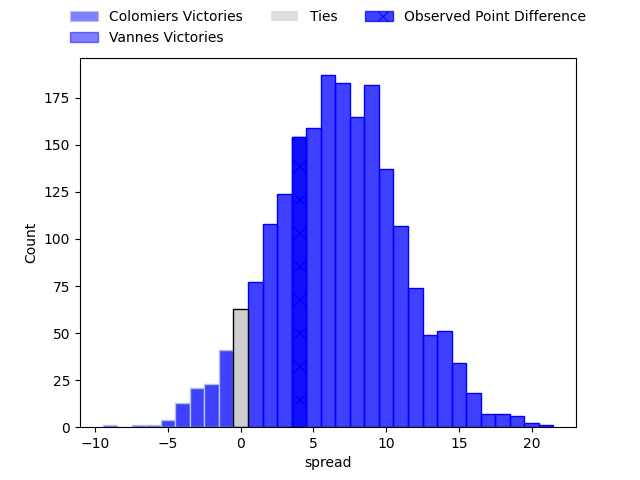
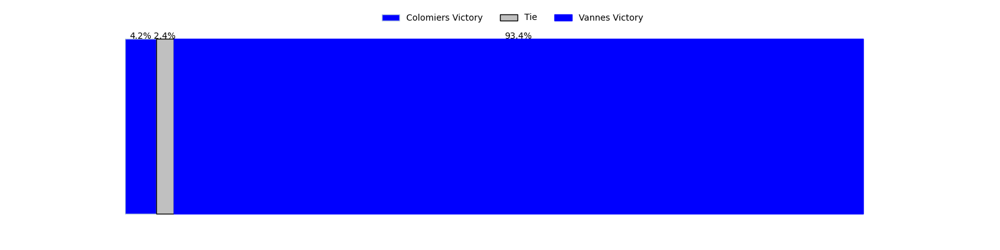

---  
layout: page  
title: Colomiers at Vannes; 23-27  
date: 2023-04-28 19:00:00 18:00:00 -0500  
categories: match review  
---
# Colomiers at Vannes; 23-27

# Club Level Predictions

The first set of predictions treats a club as the smallest object, as the club develops its members, organizes a gameplan, and deploys its players as needed for each match. This club model has a prediction of 0.681, which translates to predicting Vannes to win by 6.7.

Each club has a rating and a rating deviation (simiar to a Glicko system), and expected performances can be generated. This allows for simulated matches and spreads like the ones below.
## Projected Performances

## Projected Spreads

## Projected Results

# Player Level Predictions

Treating teams instead as an entity made up of the currently active players, I have ratings for each player in an altogether different system. These can be combined to form team ratings once teamsheets are announced, weighting starters a bit higher than the reserves. After the match is played, players can be weighted by their minutes on the field, allowing for an accurate measure of the team's composition. With these compiled team ratings, we can make predictions, measure inaccuracy, and update the individual player ratings.
## Prediction with Player Minutes: Vannes by 25.8

Vannes by 21.8 on a neutral field

There were 5 large changes in win probability in this match
## Prediction without Player Minutes: Vannes by 23.7

Vannes by 19.7 on a neutral pitch

|   Away Minutes | Away Player        |   Away elo |   Away Percentile |   Number |   Home Percentile |   Home elo | Home Player           |   Home Minutes |
|---------------:|:-------------------|-----------:|------------------:|---------:|------------------:|-----------:|:----------------------|---------------:|
|             58 | Hugo Djehi         |      70.08 |                49 |        1 |                97 |     113.12 | Andy Bordelai         |             62 |
|             64 | Andrew Ready       |      65.95 |                28 |        2 |                66 |      81.82 | Cyril Blanchard       |             45 |
|              9 | Marco Fepulea'i    |      59.48 |                22 |        3 |                59 |      78.48 | Phil Kite             |             45 |
|             80 | Jean Thomas        |      73.49 |                42 |        4 |                70 |      88.54 | Edoardo Iachizzi      |             69 |
|             44 | Jack Whetton       |      48.29 |                 7 |        5 |                86 |      98.24 | Ewan Thomas Johnson   |             80 |
|             80 | Waël Ponpon        |      45.4  |                 5 |        6 |                62 |      83.9  | Karl Chateau          |             45 |
|             52 | Aldric Lescure     |      70.2  |                35 |        7 |                 9 |      48.58 | Gregoire Bazin        |             80 |
|             80 | Yann Peysson       |      66.28 |                25 |        8 |                60 |      79.66 | Joe Edwards           |             80 |
|             55 | Edoardo Gori       |      72.81 |                51 |        9 |                34 |      69.88 | Erwan Nicolas         |             80 |
|             62 | Romuald Séguy      |      92.95 |                76 |       10 |                52 |      79.17 | Maxime Lafage         |             77 |
|             80 | Valentin Saurs     |      62.28 |                23 |       11 |                52 |      77.31 | Romaric Camou         |             80 |
|             80 | Michele Campagnaro |      68.09 |                29 |       12 |                64 |      85.89 | Kevin Burgaud         |             52 |
|             55 | Fabien Perrin      |      86.02 |                65 |       13 |                71 |      89.77 | Sacha Valleau         |             80 |
|             80 | Max Auriac         |      59.13 |                18 |       14 |                64 |      85.19 | Nathanael Hulleu      |             80 |
|             80 | Thomas Girard      |      72.64 |                43 |       15 |                78 |      94.81 | Gwenaël Duplenne      |             80 |
|             71 | Hugo Pirlet        |      51.2  |                 7 |       16 |                55 |      85.2  | Théo Beziat           |             35 |
|             36 | Louis Descoux      |      75.54 |               nan |       17 |                70 |      85.88 | Francisco Gorrisen    |             35 |
|             25 | Paul Pimienta      |     100.04 |                83 |       18 |                50 |      76.84 | John Afoa             |             35 |
|             25 | Ugo Seguela        |      68.29 |                32 |       19 |                29 |      67.35 | Nicolas Freitas       |             28 |
|             28 | Elliott Maurel     |      65.48 |               nan |       20 |                 8 |      52.1  | Charles-Henri Berguet |             18 |
|             22 | Thomas Dubois      |      54.91 |                10 |       21 |                13 |      55.48 | Myles Edwards         |             11 |
|             18 | Simon Delas        |      77.19 |                52 |       22 |                59 |      84.17 | Jean Chezeau          |              3 |
|             16 | Guillaume Tartas   |      76.11 |                48 |       23 |               nan |     nan    | nan                   |            nan |

