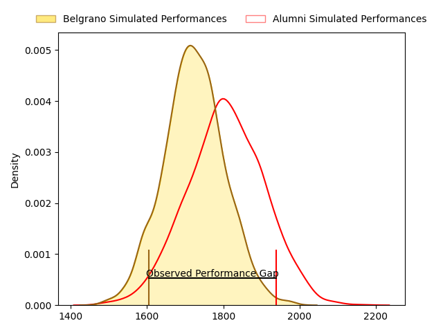
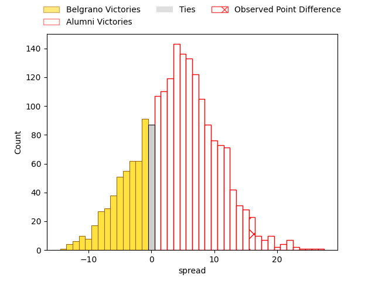
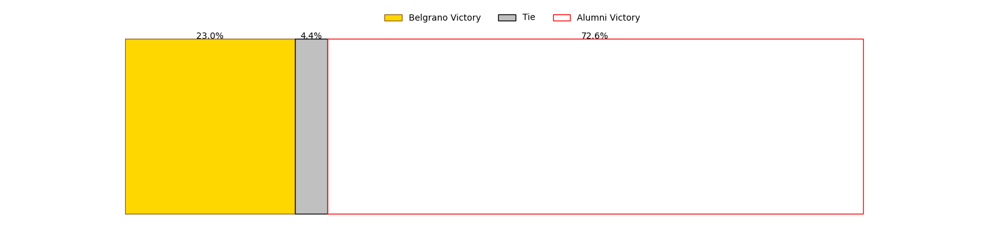

---  
layout: page  
title: Belgrano at Alumni; 17-33  
date: 2023-04-29 20:30:00 18:00:00 -0500  
categories: match review  
---
# Belgrano at Alumni; 17-33

# Club Level Predictions

The first set of predictions treats a club as the smallest object, as the club develops its members, organizes a gameplan, and deploys its players as needed for each match. This club model has a prediction of 0.617, which translates to predicting Alumni to win by 4.3.

Each club has a rating and a rating deviation (simiar to a Glicko system), and expected performances can be generated. This allows for simulated matches and spreads like the ones below.
## Projected Performances

## Projected Spreads

## Projected Results

# Player Level Predictions

Treating teams instead as an entity made up of the currently active players, I have ratings for each player in an altogether different system. These can be combined to form team ratings once teamsheets are announced, weighting starters a bit higher than the reserves. After the match is played, players can be weighted by their minutes on the field, allowing for an accurate measure of the team's composition. With these compiled team ratings, we can make predictions, measure inaccuracy, and update the individual player ratings.
## Prediction with Player Minutes: Belgrano by 6.0

Belgrano by 10.0 on a neutral field

There were 7 large changes in win probability in this match
## Prediction without Player Minutes: Belgrano by 4.7

Belgrano by 8.7 on a neutral pitch

|   Away Minutes | Away Player            |   Away elo |   Away Percentile |   Number |   Home Percentile |   Home elo | Home Player               |   Home Minutes |
|---------------:|:-----------------------|-----------:|------------------:|---------:|------------------:|-----------:|:--------------------------|---------------:|
|             80 | Francisco Ferronato    |      68.43 |                31 |        1 |                 1 |      36.98 | Ezequiel Oliva            |             45 |
|             80 | Francisco Lusaretta    |      68.18 |               nan |        2 |                 0 |      19.86 | Tomas Bivort              |             80 |
|             61 | Lisandro Garcia Dragui |      75.94 |                49 |        3 |                30 |      71.52 | Francisco Bottoni         |             80 |
|             80 | Augusto Vaccarino      |      75.14 |                47 |        4 |                54 |      78.49 | Manuel Mora               |             30 |
|             57 | Ramon Duggan           |      70.11 |                36 |        5 |                19 |      59.9  | Nicolas Promanzio         |             50 |
|             80 | Joaquin De la Serna    |      69    |                34 |        6 |                29 |      65.8  | Ignacio Cubilla           |             80 |
|             80 | Joaquin Moro           |      81.53 |                60 |        7 |                19 |      59.89 | Juan Patricio Anderson    |             80 |
|             22 | Matias Filgueira       |      60.37 |                19 |        8 |                71 |      88.03 | Tobias Moyano             |             80 |
|             48 | Ignacio Marino         |      81.05 |                58 |        9 |                23 |      64.35 | Santiago Ambroa           |             63 |
|             80 | Martin Arana           |      82.83 |                59 |       10 |               nan |      66.51 | Bautista Canzani          |             80 |
|             80 | Felipe Adrogue         |      87.08 |                70 |       11 |               nan |      62.79 | Santiago Pernas           |             80 |
|             80 | Santiago Ruzzante      |      66.8  |                28 |       12 |                45 |      75.26 | Franco Battezzati         |             63 |
|             80 | Tomas Teglia           |      83.69 |                55 |       13 |                43 |      74.28 | Alejo Gonzalez Chavez     |             80 |
|             50 | Tobias Bernabé         |      68.33 |                33 |       14 |                91 |     104.88 | Franco Sabato             |             80 |
|             80 | Pedro Arana            |      67.82 |               nan |       15 |                56 |      81.27 | Maximo Provenzano         |             80 |
|             58 | Luciano Tecca          |      67.99 |               nan |       16 |                 6 |      45.77 | Santiago Alduncin         |             50 |
|             32 | Theo Blaksley          |      69.64 |               nan |       17 |               nan |      68.36 | Juan Cruz Bottoni         |             35 |
|             30 | Félix Ceñal            |      65.73 |                29 |       18 |                 1 |      36.42 | Ignacio Milou             |             30 |
|             23 | Juan Zaballa           |      52.2  |                10 |       19 |                30 |      66.75 | Tomas Passerotti          |             17 |
|             19 | Justo Durañona         |      62.26 |               nan |       20 |               nan |      91.52 | Joaquin Gonzalez Iglesias |             17 |

