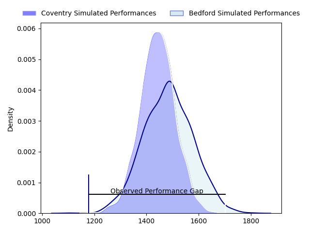
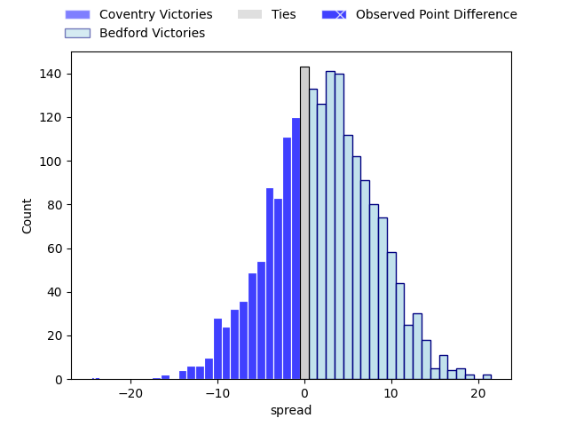
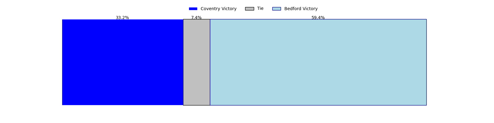

---  
layout: page  
title: Coventry at Bedford; 43-19  
date: 2023-04-29 16:00:00 18:00:00 -0500  
categories: match review  
---
# Coventry at Bedford; 43-19

# Club Level Predictions

The first set of predictions treats a club as the smallest object, as the club develops its members, organizes a gameplan, and deploys its players as needed for each match. This club model has a prediction of 0.557, which translates to predicting Bedford to win by 2.0.

Each club has a rating and a rating deviation (simiar to a Glicko system), and expected performances can be generated. This allows for simulated matches and spreads like the ones below.
## Projected Performances

## Projected Spreads

## Projected Results

# Player Level Predictions

Treating teams instead as an entity made up of the currently active players, I have ratings for each player in an altogether different system. These can be combined to form team ratings once teamsheets are announced, weighting starters a bit higher than the reserves. After the match is played, players can be weighted by their minutes on the field, allowing for an accurate measure of the team's composition. With these compiled team ratings, we can make predictions, measure inaccuracy, and update the individual player ratings.
## Prediction with Player Minutes: Bedford by 3.8

Coventry by 0.2 on a neutral field

There were 5 large changes in win probability in this match
## Prediction without Player Minutes: Bedford by 2.7

Coventry by 1.3 on a neutral pitch

|   Away Minutes | Away Player        |   Away elo |   Away Percentile |   Number |   Home Percentile |   Home elo | Home Player          |   Home Minutes |
|---------------:|:-------------------|-----------:|------------------:|---------:|------------------:|-----------:|:---------------------|---------------:|
|             57 | Toby Trinder       |      89.48 |                78 |        1 |                40 |      72.54 | Joey Conway          |             60 |
|             63 | Suva Ma'asi        |      77.81 |                53 |        2 |                27 |      64.51 | James Fish           |             53 |
|             54 | Ollie Andrews      |      75.25 |                47 |        3 |                37 |      71.66 | Osman Dimen          |             40 |
|             74 | James Tyas         |      63.14 |                23 |        4 |                48 |      75.79 | Robin Williams       |             53 |
|             80 | Adam Peters        |      72.25 |                40 |        5 |                12 |      54.62 | Alex Woolford        |             40 |
|             80 | Tom Dodd           |      72.32 |                38 |        6 |                51 |      77.67 | Luke Frost           |             80 |
|             80 | Josh Bainbridge    |      86.08 |                70 |        7 |                21 |      61.07 | Kayde Sylvester      |             53 |
|             68 | Senitiki Nayalo    |     103.98 |                92 |        8 |                19 |      61.06 | Tui Uru              |             80 |
|             70 | Will Chudley       |      69.89 |                35 |        9 |                93 |     109.67 | Alex Day             |             56 |
|             80 | Evan Mitchell      |      41.34 |                 6 |       10 |                42 |      74.27 | Louis Grimoldby      |             56 |
|             80 | James Martin       |      65.74 |                28 |       11 |                 7 |      48.44 | Dean Adamson         |             80 |
|             63 | Lucas Titherington |      82.09 |                58 |       12 |                96 |     118.7  | William Maisey       |             80 |
|             80 | Will Rigg          |      75.5  |                45 |       13 |                59 |      82.36 | Michael Le Bourgeois |             80 |
|             57 | Tobi Wilson        |      71.8  |               nan |       14 |                27 |      65.14 | Sean French          |             80 |
|             80 | Louis Brown        |      69.12 |                31 |       15 |                28 |      66.94 | Richard Lane         |             80 |
|             26 | Jake Bridges       |      55.34 |                14 |       16 |                21 |      62.92 | Corrie Barrett       |             40 |
|             23 | James Kenny        |      69.88 |                45 |       17 |                26 |      63.78 | Jordan Onojaife      |             40 |
|             23 | Louis James        |      74.36 |                46 |       18 |                22 |      54.23 | Charles Rylands      |             27 |
|             17 | Will Biggs         |      67.3  |                37 |       19 |                25 |      64.83 | Emeka Atuanya        |             27 |
|             17 | Fred Betteridge    |      65.99 |                34 |       20 |                73 |      80.89 | Jack Hughes          |             27 |
|             12 | Tom Ball           |      83.06 |                63 |       21 |                63 |      83.55 | Patrick Tapley       |             24 |
|             10 | Will Lane          |      80.27 |                61 |       22 |                43 |      70.88 | Jake Garside         |             24 |
|              6 | George Smith       |      73.42 |                48 |       23 |               nan |      74.89 | Monty Royston        |             20 |

