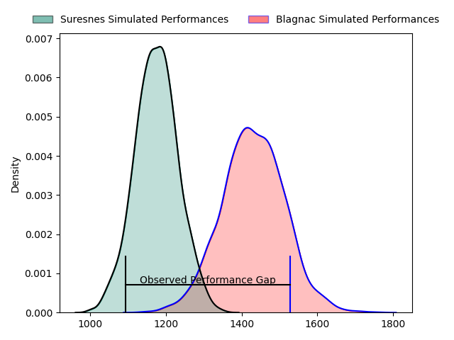
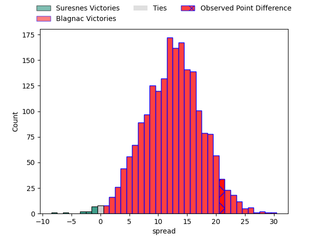
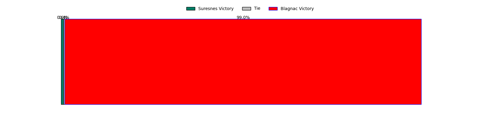

---  
layout: page  
title: Suresnes at Blagnac; 7-28  
date: 2023-04-29 16:00:00 18:00:00 -0500  
categories: match review  
---
# Suresnes at Blagnac; 7-28

# Club Level Predictions

The first set of predictions treats a club as the smallest object, as the club develops its members, organizes a gameplan, and deploys its players as needed for each match. This club model has a prediction of 0.808, which translates to predicting Blagnac to win by 12.7.

Each club has a rating and a rating deviation (simiar to a Glicko system), and expected performances can be generated. This allows for simulated matches and spreads like the ones below.
## Projected Performances

## Projected Spreads

## Projected Results

# Player Level Predictions

Treating teams instead as an entity made up of the currently active players, I have ratings for each player in an altogether different system. These can be combined to form team ratings once teamsheets are announced, weighting starters a bit higher than the reserves. After the match is played, players can be weighted by their minutes on the field, allowing for an accurate measure of the team's composition. With these compiled team ratings, we can make predictions, measure inaccuracy, and update the individual player ratings.
## Prediction with Player Minutes: Blagnac by 8.7

Blagnac by 4.7 on a neutral field

There were 6 large changes in win probability in this match
## Prediction without Player Minutes: Blagnac by 7.0

Blagnac by 3.0 on a neutral pitch

|   Away Minutes | Away Player             |   Away elo |   Away Percentile |   Number |   Home Percentile |   Home elo | Home Player          |   Home Minutes |
|---------------:|:------------------------|-----------:|------------------:|---------:|------------------:|-----------:|:---------------------|---------------:|
|             44 | Sébastien Lafrancesca   |      81.86 |                49 |        1 |                45 |      74.77 | Jean-Baptiste Martin |             49 |
|             44 | Hayam El Bibouji        |      58.99 |                15 |        2 |                53 |      77.15 | Gabin Villerouge     |             49 |
|             44 | Leandro Mario Assi      |      88.56 |                76 |        3 |                26 |      65.99 | Marco Trauth         |             71 |
|             80 | Damien Bozic            |      67    |               nan |        4 |                76 |      87.81 | Vincent Mutel        |             80 |
|             63 | Yakine Djebarri         |      79.01 |                54 |        5 |                 9 |      50.73 | Lucas Tolofua        |             49 |
|             80 | Youssouf Yatera         |      61.87 |                19 |        6 |                39 |      72.17 | Benjamin Collet      |             80 |
|             80 | Théo David Nathan Tanda |      57.8  |                15 |        7 |                19 |      60.23 | Loïc Verdy           |              9 |
|             38 | Florian Desbordes       |      64.04 |                24 |        8 |                65 |      84.46 | Mathieu Vachon       |             80 |
|             80 | Quentin Dauvergne       |      44.43 |                 3 |        9 |                43 |      71.7  | Paul Ravier          |             74 |
|             80 | Goulwen Gueho           |      75.97 |                45 |       10 |                37 |      70.46 | Gérald Augustin      |             80 |
|             60 | Ervin Muric             |     154.45 |               100 |       11 |                17 |      57.98 | Francois Tardieu     |             80 |
|             80 | Petero Tuwai            |      69.64 |                36 |       12 |                21 |      63.49 | Aurelien Labau       |             80 |
|             80 | Arthur Proult           |      40.72 |                 2 |       13 |                 3 |      43.27 | Clément Vareilles    |             57 |
|             80 | Alexis Clement          |      41.39 |                 4 |       14 |                45 |      75.3  | Thibault Moleana     |             80 |
|             80 | Thomas Baudy            |      39.81 |                 2 |       15 |                28 |      68.75 | Antoine Renaud       |             61 |
|             36 | Lucas Dycke             |      61.3  |                19 |       16 |                20 |      59.55 | Alexis Decaux        |             31 |
|             36 | Thomas Bordes           |      70.25 |                36 |       17 |                29 |      65.68 | Florian Bertrand     |             31 |
|             36 | Victor Damian Arias     |     120.45 |                98 |       18 |                29 |      67.45 | Baptiste Collet      |              9 |
|             17 | Sacha Yahi              |      42.79 |                 4 |       19 |                31 |      68.23 | Lilian Rousset       |             31 |
|             42 | Louis-Mathieu Jazeix    |      71.71 |                37 |       20 |                66 |      84.83 | Nikita Bekov         |             71 |
|             20 | Pierre Le Huby          |      85.23 |                62 |       21 |                20 |      61.55 | Corentin Penc'hoat   |             32 |
|            nan | nan                     |     nan    |               nan |       22 |                33 |      68.19 | Dorian Terrou        |              3 |
|            nan | nan                     |     nan    |               nan |       23 |                90 |     108.11 | Jean-Andre Vernetti  |             19 |

