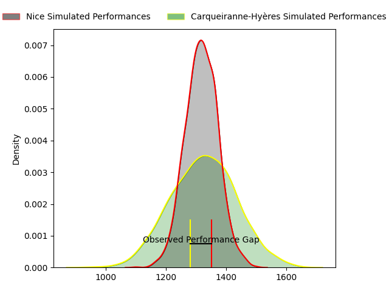
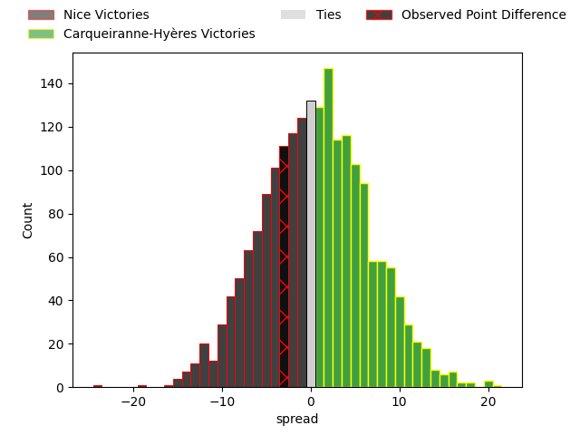

---  
layout: page  
title: Nice at Carqueiranne-Hyères; 31-28  
date: 2023-04-29 16:00:00 18:00:00 -0500  
categories: match review  
---
# Nice at Carqueiranne-Hyères; 31-28

# Club Level Predictions

The first set of predictions treats a club as the smallest object, as the club develops its members, organizes a gameplan, and deploys its players as needed for each match. This club model has a prediction of 0.513, which translates to predicting Carqueiranne-Hyères to win by 0.5.

Each club has a rating and a rating deviation (simiar to a Glicko system), and expected performances can be generated. This allows for simulated matches and spreads like the ones below.
## Projected Performances

## Projected Spreads

## Projected Results

# Player Level Predictions

Treating teams instead as an entity made up of the currently active players, I have ratings for each player in an altogether different system. These can be combined to form team ratings once teamsheets are announced, weighting starters a bit higher than the reserves. After the match is played, players can be weighted by their minutes on the field, allowing for an accurate measure of the team's composition. With these compiled team ratings, we can make predictions, measure inaccuracy, and update the individual player ratings.
## Prediction with Player Minutes: Carqueiranne-Hyères by 12.0

Carqueiranne-Hyères by 8.0 on a neutral field

There were 14 large changes in win probability in this match
## Prediction without Player Minutes: Carqueiranne-Hyères by 11.6

Carqueiranne-Hyères by 7.6 on a neutral pitch

|   Away Minutes | Away Player           |   Away elo |   Away Percentile |   Number |   Home Percentile |   Home elo | Home Player              |   Home Minutes |
|---------------:|:----------------------|-----------:|------------------:|---------:|------------------:|-----------:|:-------------------------|---------------:|
|             80 | Nicolas Ciancio       |      75.74 |                51 |        1 |                39 |      75    | Jean-Baptiste Reggiardo  |             49 |
|             43 | Louis Martin          |      80.78 |                62 |        2 |                30 |      66.78 | Pierre Traiter           |             51 |
|             50 | Nika Neparidze        |      87.33 |                77 |        3 |                35 |      70.77 | Loni Uhila               |             45 |
|             50 | Marvin Woki           |      68.98 |                33 |        4 |                33 |      69.14 | César Damiani            |             55 |
|             50 | Louis Vincent         |      72.44 |                50 |        5 |                34 |      68.34 | Geoffrey Nouhaillaguet   |             80 |
|             56 | Arthur Vignolles      |      43.68 |                 5 |        6 |                16 |      58.1  | Alexander Nowicki        |             55 |
|             80 | Martin Freytes        |      47.22 |                 6 |        7 |                76 |      91.93 | Julien Ormea             |             80 |
|             80 | Andy Joseph           |      66.47 |               nan |        8 |                45 |      74.48 | Joachim Beaumont         |             80 |
|             61 | Mathieu Lorée         |      62.58 |                20 |        9 |                12 |      53.36 | Rémi Dubié               |             49 |
|             80 | Mathis Viard          |      75.92 |                48 |       10 |                39 |      72.8  | Lachie Munro             |             49 |
|             80 | Hugo Martin           |      68.79 |                36 |       11 |               nan |      67.61 | David Smith              |             47 |
|             24 | Julien Fritz          |      75.22 |                48 |       12 |                34 |      70.67 | Charles Brousse          |             80 |
|             80 | Baptiste Delage       |      61.27 |                19 |       13 |                86 |     102.42 | Romain Leveque           |             80 |
|             80 | Clement Egiziano      |      67.94 |                32 |       14 |                41 |      73.95 | Vincent Alessi           |             80 |
|             80 | David Odiete          |      55.75 |                15 |       15 |                28 |      67.93 | Ionel Melinte            |             80 |
|             56 | Sakiusa Bureitakiyaca |      77.93 |                54 |       16 |                36 |      62.92 | Miguel Mathieu           |             31 |
|             37 | Badri Alkhazashvili   |      61.84 |                22 |       17 |                 6 |      45.93 | Michael Tyumenev         |             29 |
|             30 | Steffon Armitage      |      59.5  |                18 |       18 |               nan |      77.1  | Wilson Lucien            |             35 |
|             30 | Thibaud Rey           |      63.15 |                23 |       19 |                69 |      84.03 | Nathan Gendre            |             25 |
|             30 | Sunia Vola            |      85.33 |                69 |       20 |                17 |      59.57 | Christian Marian Chirica |             25 |
|             19 | Louis Peutin          |      65.68 |                27 |       21 |                82 |      97.07 | Thomas Sonetti           |             31 |
|             24 | Louis Suaud           |      86.95 |                72 |       22 |                12 |      55.37 | Théo Defrance            |             31 |
|            nan | nan                   |     nan    |               nan |       23 |                33 |      68.06 | Dylan Michael Sage       |             33 |

