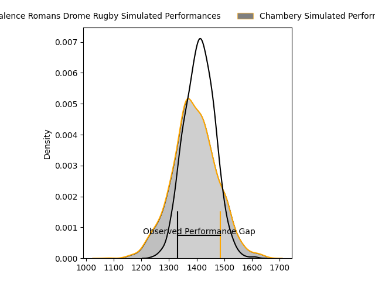
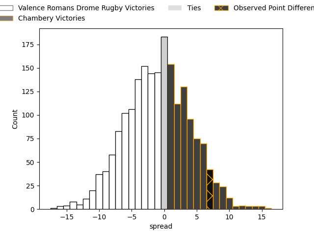

---  
layout: page  
title: Valence Romans Drome Rugby at Chambery; 17-24  
date: 2023-04-29 16:00:00 18:00:00 -0500  
categories: match review  
---
# Valence Romans Drome Rugby at Chambery; 17-24

# Club Level Predictions

The first set of predictions treats a club as the smallest object, as the club develops its members, organizes a gameplan, and deploys its players as needed for each match. This club model has a prediction of 0.476, which translates to predicting Valence Romans Drome Rugby to win by 0.8.

Each club has a rating and a rating deviation (simiar to a Glicko system), and expected performances can be generated. This allows for simulated matches and spreads like the ones below.
## Projected Performances

## Projected Spreads

## Projected Results

# Player Level Predictions

Treating teams instead as an entity made up of the currently active players, I have ratings for each player in an altogether different system. These can be combined to form team ratings once teamsheets are announced, weighting starters a bit higher than the reserves. After the match is played, players can be weighted by their minutes on the field, allowing for an accurate measure of the team's composition. With these compiled team ratings, we can make predictions, measure inaccuracy, and update the individual player ratings.
## Prediction with Player Minutes: Valence Romans Drome Rugby by 11.6

Valence Romans Drome Rugby by 15.6 on a neutral field

There were 10 large changes in win probability in this match
## Prediction without Player Minutes: Valence Romans Drome Rugby by 14.6

Valence Romans Drome Rugby by 18.6 on a neutral pitch

|   Away Minutes | Away Player                   |   Away elo |   Away Percentile |   Number |   Home Percentile |   Home elo | Home Player                  |   Home Minutes |
|---------------:|:------------------------------|-----------:|------------------:|---------:|------------------:|-----------:|:-----------------------------|---------------:|
|             43 | Anthony Aléo                  |      96.03 |                85 |        1 |                22 |      63.98 | Fabio Gonzalez               |             55 |
|             41 | Yanis Gimenez                 |      94.56 |                81 |        2 |                77 |      90.03 | Gauthier Brute de Remur      |             55 |
|             52 | Kevin Goze                    |      79.9  |                51 |        3 |                13 |      57.11 | Giorgi Pertaia               |             59 |
|             80 | François Uys                  |      74.83 |                43 |        4 |                61 |      82.45 | Jean-Baptiste Grenod         |             80 |
|             80 | John Adriaan (Ian) Groenewald |      79.88 |                56 |        5 |                10 |      53.03 | Romain Guyot                 |             80 |
|             48 | Alexis Armary                 |     105.77 |                91 |        6 |                48 |      76    | Matheo Triki                 |             57 |
|             80 | Sven Bernat Girlando          |     101.17 |                88 |        7 |                20 |      61.54 | Colin Lebian                 |             80 |
|             48 | Dylan Lam                     |      75.25 |                44 |        8 |                80 |      94.84 | Thomas Coignat               |             70 |
|             20 | Léopold Dupas                 |      67.93 |                28 |        9 |                23 |      63.7  | Thibault Dufau               |             57 |
|             80 | Lucas Méret                   |      67.7  |                23 |       10 |                25 |      65.47 | Victor Pisano                |             55 |
|             80 | Tim Giresse                   |      72.57 |                42 |       11 |                46 |      74.67 | Vereniki Goneva              |             80 |
|             80 | Akuila Joeli Tabualevu        |      91.36 |                73 |       12 |                11 |      54.7  | Mickael Blanc                |             80 |
|             39 | Anatole Pauvert               |      81.97 |                59 |       13 |                12 |      54.85 | Maewen Sao                   |             80 |
|             80 | Bart Wierenga                 |      30.39 |                 1 |       14 |                21 |      60.83 | Paul Baptiste Florent Altier |             53 |
|             41 | Quentin Gobet                 |      88.07 |                68 |       15 |                15 |      54.01 | Jules Dorrival               |             80 |
|             60 | Tim Menzel                    |      52.45 |                 9 |       16 |                71 |      85.61 | Arthur Nennig                |             27 |
|             41 | Charles Bouldoire             |      77.33 |                48 |       17 |                30 |      65.89 | Géraud Clermont              |             25 |
|             39 | Mehdi Boundjema               |      78.27 |               nan |       18 |                43 |      73.89 | Thibault Moreno              |             25 |
|             39 | Guillaume Cazes               |      72.02 |                38 |       19 |                59 |      80.61 | Julien Primault              |             25 |
|             37 | Andrea Pontanier              |      91.2  |                76 |       20 |                53 |      77.44 | Dylan Nocete                 |             23 |
|             32 | Ioane Iashagashvili           |      85.09 |                64 |       21 |                24 |      62.54 | Luka Begic                   |             23 |
|             32 | Charles Brayer                |      79.19 |                64 |       22 |                23 |      64.42 | Lautaro Caro Saisi           |             21 |
|             28 | John Henry Fincham            |      83.96 |                65 |       23 |                29 |      61.77 | Revan Gautier                |             10 |

