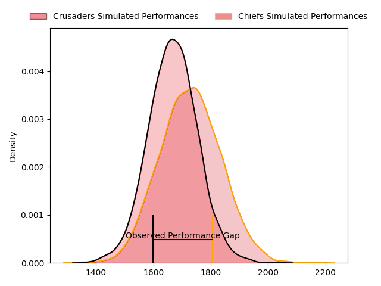
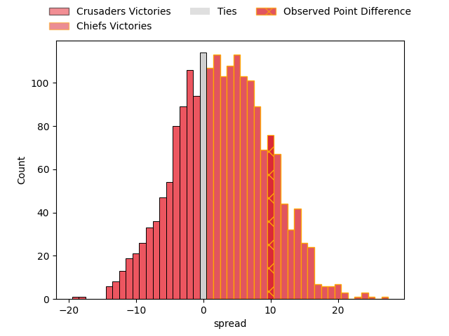

---  
layout: page  
title: Crusaders at Chiefs; 24.0-34.0  
date: 2023-04-29 03:05:00 18:00:00 -0500  
categories: match review  
---
# Crusaders at Chiefs; 24.0-34.0

# Club Level Predictions

The first set of predictions treats a club as the smallest object, as the club develops its members, organizes a gameplan, and deploys its players as needed for each match. This club model has a prediction of 0.583, which translates to predicting Chiefs to win by 3.0.

Each club has a rating and a rating deviation (simiar to a Glicko system), and expected performances can be generated. This allows for simulated matches and spreads like the ones below.
## Projected Performances

## Projected Spreads

## Projected Results

# Player Level Predictions

Treating teams instead as an entity made up of the currently active players, I have ratings for each player in an altogether different system. These can be combined to form team ratings once teamsheets are announced, weighting starters a bit higher than the reserves. After the match is played, players can be weighted by their minutes on the field, allowing for an accurate measure of the team's composition. With these compiled team ratings, we can make predictions, measure inaccuracy, and update the individual player ratings.
## Prediction with Player Minutes: Chiefs by 8.2

Chiefs by 4.2 on a neutral field

There were 10 large changes in win probability in this match
## Prediction without Player Minutes: Chiefs by 9.0

Chiefs by 5.0 on a neutral pitch

|   Away Minutes | Away Player            |   Away elo |   Away Percentile |   Number |   Home Percentile |   Home elo | Home Player         |   Home Minutes |
|---------------:|:-----------------------|-----------:|------------------:|---------:|------------------:|-----------:|:--------------------|---------------:|
|             63 | Joe Moody              |      84.68 |                68 |        1 |                79 |      90.34 | Aidan Ross          |             50 |
|             69 | Codie Taylor           |      98.38 |                87 |        2 |                97 |     112.74 | Samisoni Taukei'aho |             69 |
|             63 | Tamaiti Williams       |      90.08 |                79 |        3 |                65 |      83.1  | George Dyer         |             63 |
|             81 | Scott Barrett          |     118.28 |                96 |        4 |                97 |     123.43 | Brodie Retallick    |             81 |
|             81 | Sam Whitelock          |     112.57 |                94 |        5 |                38 |      70.7  | Tupou Vaa'i         |             69 |
|             48 | Dom Gardiner           |      85.22 |                68 |        6 |                91 |     105.5  | Samipeni Finau      |             55 |
|             81 | Tom Christie           |      94.81 |                82 |        7 |                98 |     131.24 | Sam Cane            |             81 |
|             72 | Cullen Grace           |     108.8  |                94 |        8 |                99 |     129.99 | Luke Jacobson       |             81 |
|             81 | Mitchell Drummond      |      85    |                65 |        9 |               100 |     139.75 | Brad Weber          |             55 |
|             81 | Richie Mo'unga         |     133.16 |                98 |       10 |                64 |      85.8  | Damian McKenzie     |             81 |
|             81 | Leicester Fainga'anuku |      78.48 |                52 |       11 |                85 |      98.94 | Etene Nanai-Seturo  |             64 |
|             81 | David Havili           |     110.44 |                93 |       12 |                80 |      96.59 | Rameka Poihipi      |             81 |
|             81 | Braydon Ennor          |     101.04 |                84 |       13 |                61 |      82.8  | Daniel Rona         |             72 |
|             47 | Dallas McLeod          |     101.89 |                84 |       14 |                76 |      90.64 | Emoni Narawa        |             81 |
|             74 | Fergus Burke           |      82.2  |                57 |       15 |                79 |      93.28 | Shaun Stevenson     |             81 |
|             12 | Brodie McAlister       |     100.38 |                88 |       16 |                68 |      85.01 | Tyrone Thompson     |             12 |
|             18 | Kershawl Sykes-Martin  |      83.74 |                66 |       17 |                81 |      91.52 | Ollie Norris        |             31 |
|             18 | Oli Jager              |     104.01 |                93 |       18 |                90 |      99.45 | John Ryan           |             18 |
|             33 | Quinten Strange        |      75.57 |                47 |       19 |                88 |     103.13 | Naitoa Ah Kuoi      |             12 |
|              9 | Christian Lio-Willie   |      77.66 |                49 |       20 |                86 |      99.79 | Pita Gus Sowakula   |             26 |
|              0 | Chay Fihaki            |     104.29 |                86 |       21 |                88 |     103.1  | Cortez Ratima       |             26 |
|             34 | Jack Goodhue           |     107.56 |                91 |       22 |                72 |      90.57 | Bryn Gatland        |             17 |
|              7 | Macca Springer         |      88.66 |                72 |       23 |               nan |      95.32 | Lalomilo Lalomilo   |              9 |

