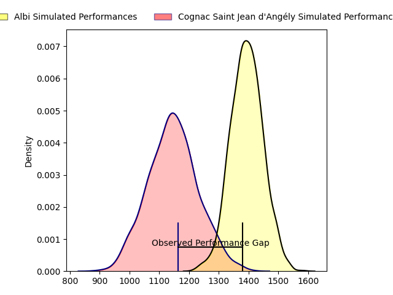
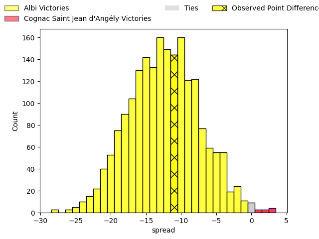
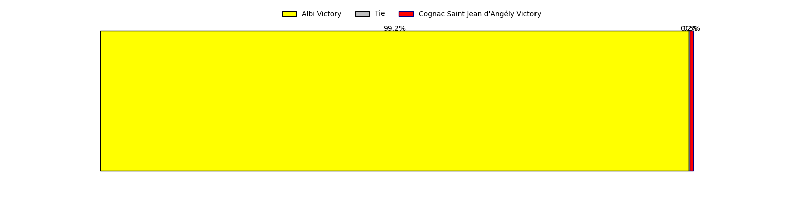

---  
layout: page  
title: Albi at Cognac Saint Jean d'Angély; 24-13  
date: 2023-04-29 16:00:00 18:00:00 -0500  
categories: match review  
---
# Albi at Cognac Saint Jean d'Angély; 24-13

# Club Level Predictions

The first set of predictions treats a club as the smallest object, as the club develops its members, organizes a gameplan, and deploys its players as needed for each match. This club model has a prediction of 0.196, which translates to predicting Albi to win by 12.4.

Each club has a rating and a rating deviation (simiar to a Glicko system), and expected performances can be generated. This allows for simulated matches and spreads like the ones below.
## Projected Performances

## Projected Spreads

## Projected Results

# Player Level Predictions

Treating teams instead as an entity made up of the currently active players, I have ratings for each player in an altogether different system. These can be combined to form team ratings once teamsheets are announced, weighting starters a bit higher than the reserves. After the match is played, players can be weighted by their minutes on the field, allowing for an accurate measure of the team's composition. With these compiled team ratings, we can make predictions, measure inaccuracy, and update the individual player ratings.
## Prediction with Player Minutes: Albi by 8.5

Albi by 12.5 on a neutral field

There were 9 large changes in win probability in this match
## Prediction without Player Minutes: Albi by 9.7

Albi by 13.7 on a neutral pitch

|   Away Minutes | Away Player                |   Away elo |   Away Percentile |   Number |   Home Percentile |   Home elo | Home Player         |   Home Minutes |
|---------------:|:---------------------------|-----------:|------------------:|---------:|------------------:|-----------:|:--------------------|---------------:|
|             52 | Thibaud Sebire             |      76.06 |               nan |        1 |                41 |      73.29 | Kevin Tougne        |             80 |
|             36 | Romain Maurice             |      67.05 |                36 |        2 |                22 |      61.8  | Maxime Gau          |             65 |
|             52 | Kevin Brou                 |      64.95 |                24 |        3 |                13 |      52.4  | Giorgi Sharashidze  |              8 |
|             67 | Charles Foures             |      91.39 |                77 |        4 |                31 |      68.3  | Utu Maninoa         |             48 |
|             80 | Pilbarnon Djossou Lokossou |      78.69 |                53 |        5 |                22 |      61.05 | Clément Praud       |             80 |
|             80 | Hugo Boutin                |      59.26 |                15 |        6 |                58 |      80.97 | Damien Bonnet       |             80 |
|             80 | Luke Joseph Stringer       |      83.18 |                63 |        7 |                 6 |      46.02 | Lucas Gulizzi       |             80 |
|             80 | Guillem Calmon             |      64.49 |                30 |        8 |                28 |      68.1  | Filipe Manu         |             40 |
|             80 | Valentin Raphaël           |      72.78 |               nan |        9 |                25 |      63.22 | William Beaudon     |             54 |
|             80 | Gabriel Aviragnet          |      69.25 |               nan |       10 |                35 |      70.38 | Serafin Bordoli     |             49 |
|             80 | Louis Decrop               |      71.41 |                40 |       11 |                36 |      69.61 | Vincent Pageneau    |             40 |
|             36 | Baptiste Couchinave        |     136.82 |                99 |       12 |                54 |      79.5  | Henry Tuilagi       |             80 |
|             80 | James Haydn Tedder         |      62.67 |                21 |       13 |                25 |      65.49 | Isimeli Kuruibua    |             80 |
|             48 | Luca Sperandio             |      67.76 |                32 |       14 |                29 |      65.96 | Eneri Lotawa        |             80 |
|             80 | Téo Dospital               |      62.56 |                20 |       15 |                10 |      48.29 | Dany Antunes        |             80 |
|             28 | Pierre Commenge            |      68.76 |                31 |       16 |                32 |      67.05 | Bryan Bruno         |             15 |
|             44 | Reinach Venter             |      85.59 |                70 |       17 |                44 |      74.52 | Manasa Saulo Romumu |             50 |
|             28 | Georges Vea                |      71.71 |               nan |       18 |                27 |      66.21 | Martin Augeix       |             22 |
|             13 | Pierre Roussel             |      71.27 |                38 |       19 |                49 |      76.41 | Thomas Toevalu      |             32 |
|             22 | Gael Ekpe                  |      82.26 |                63 |       20 |                16 |      58.63 | Matthieu Thomas     |             40 |
|             22 | Charly Vicenzo Trussardi   |      78.34 |                55 |       21 |                14 |      56.92 | Mathieu Billou      |             26 |
|             32 | Avenisi Vasuinubu          |      70.7  |                39 |       22 |                17 |      59.85 | Mathis Garnier      |             31 |
|            nan | nan                        |     nan    |               nan |       23 |                18 |      58.83 | Nils Guyon          |             40 |

