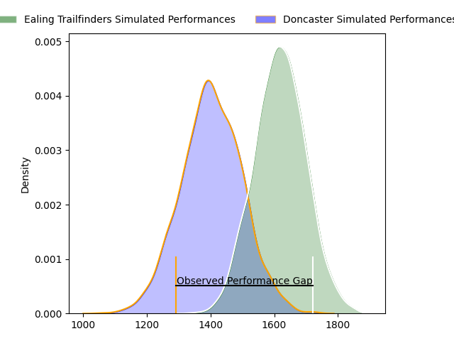
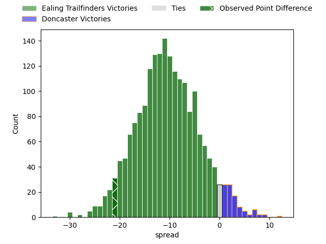

---  
layout: page  
title: Ealing Trailfinders at Doncaster; 35-14  
date: 2023-04-29 15:30:00 18:00:00 -0500  
categories: match review  
---
# Ealing Trailfinders at Doncaster; 35-14

# Club Level Predictions

The first set of predictions treats a club as the smallest object, as the club develops its members, organizes a gameplan, and deploys its players as needed for each match. This club model has a prediction of 0.235, which translates to predicting Ealing Trailfinders to win by 10.6.

Each club has a rating and a rating deviation (simiar to a Glicko system), and expected performances can be generated. This allows for simulated matches and spreads like the ones below.
## Projected Performances

## Projected Spreads

## Projected Results

# Player Level Predictions

Treating teams instead as an entity made up of the currently active players, I have ratings for each player in an altogether different system. These can be combined to form team ratings once teamsheets are announced, weighting starters a bit higher than the reserves. After the match is played, players can be weighted by their minutes on the field, allowing for an accurate measure of the team's composition. With these compiled team ratings, we can make predictions, measure inaccuracy, and update the individual player ratings.
## Prediction with Player Minutes: Doncaster by 1.8

Ealing Trailfinders by 2.2 on a neutral field

There were 11 large changes in win probability in this match
## Prediction without Player Minutes: Ealing Trailfinders by 1.5

Ealing Trailfinders by 5.5 on a neutral pitch

|   Away Minutes | Away Player         |   Away elo |   Away Percentile |   Number |   Home Percentile |   Home elo | Home Player              |   Home Minutes |
|---------------:|:--------------------|-----------:|------------------:|---------:|------------------:|-----------:|:-------------------------|---------------:|
|             46 | James Gibbons       |      63.98 |                23 |        1 |                63 |      80.42 | Kai Owen                 |             50 |
|             65 | Shaun Malton        |      86.55 |               nan |        2 |                42 |      72.37 | Will Holling             |             80 |
|             53 | Lewis Thiede        |      81.07 |               nan |        3 |                31 |      66.59 | Jake Armstrong           |             54 |
|             80 | David O'Connor      |      76.63 |                50 |        4 |                98 |     133.21 | Evan Mintern             |             65 |
|             20 | Andrew Davidson     |      87.4  |                74 |        5 |               nan |      73.03 | Ben Murphy               |             55 |
|             80 | Adam Korczyk        |      76.03 |                49 |        6 |                28 |      66.08 | Martin Sigren Molina     |             80 |
|             53 | Simon Uzokwe        |      97.52 |                86 |        7 |                34 |      70.41 | Sam Daly                 |             40 |
|             40 | Will Montgomery     |      84.69 |                64 |        8 |                41 |      72.77 | Thom Smith               |             80 |
|             65 | Craig Hampson       |      84.44 |                64 |        9 |               nan |      77.55 | Will Yarnell             |             80 |
|             80 | Dan Lancaster       |      51.33 |                 8 |       10 |                43 |      74.72 | Billy McBryde            |             74 |
|             80 | Nathan Earle        |      79.93 |                58 |       11 |                51 |      79.39 | Robbie Smith             |             80 |
|             80 | Reuben Bird-Tulloch |      64.62 |                24 |       12 |               nan |      77.59 | Alexander Lloyd-Seed     |             80 |
|             71 | Max Bodilly         |      89.48 |                71 |       13 |                88 |     102.24 | Harry Davey              |             80 |
|             80 | Luke Daniels        |      83.45 |                64 |       14 |                60 |      80.72 | George Simpson           |             80 |
|             80 | Cian Kelleher       |      85.98 |                69 |       15 |                42 |      72.32 | Westleigh Alleyne Holden |             80 |
|             60 | Arhur Bobby de Wee  |      77.11 |               nan |       16 |                 4 |      42.6  | Jared Cardew             |             40 |
|             40 | Ollie Newman        |      98.19 |                86 |       17 |                48 |      76.85 | Jake Pope                |             30 |
|             34 | Will Davis          |     113.5  |                97 |       18 |                26 |      67.26 | Karl Garside             |             26 |
|             27 | Jack Digby          |      76.59 |                47 |       19 |                56 |      80.84 | John Kelly               |             25 |
|             27 | Jimmy Roots         |      59.01 |               nan |       20 |                38 |      70.27 | George Roberts           |             15 |
|             15 | Jordan Burns        |      99.14 |                87 |       21 |               nan |      73.21 | Thomas Parkin            |              6 |
|             15 | Cameron Terry       |      69.03 |                29 |       22 |               nan |     nan    | nan                      |            nan |
|              9 | Steve Shingler      |      77.23 |                50 |       23 |               nan |     nan    | nan                      |            nan |

