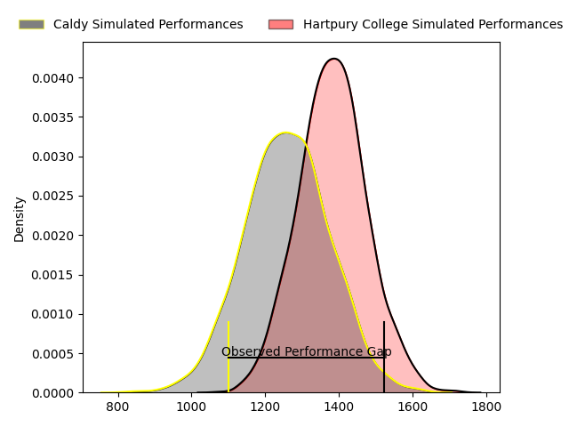
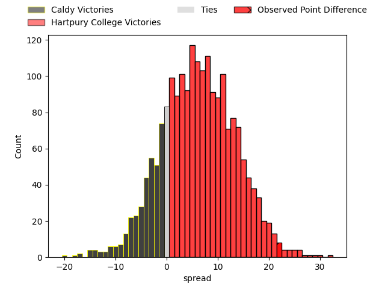

---  
layout: page  
title: Caldy at Hartpury College; 13-35  
date: 2023-04-29 16:00:00 18:00:00 -0500  
categories: match review  
---
# Caldy at Hartpury College; 13-35

# Club Level Predictions

The first set of predictions treats a club as the smallest object, as the club develops its members, organizes a gameplan, and deploys its players as needed for each match. This club model has a prediction of 0.661, which translates to predicting Hartpury College to win by 6.2.

Each club has a rating and a rating deviation (simiar to a Glicko system), and expected performances can be generated. This allows for simulated matches and spreads like the ones below.
## Projected Performances

## Projected Spreads

## Projected Results

# Player Level Predictions

Treating teams instead as an entity made up of the currently active players, I have ratings for each player in an altogether different system. These can be combined to form team ratings once teamsheets are announced, weighting starters a bit higher than the reserves. After the match is played, players can be weighted by their minutes on the field, allowing for an accurate measure of the team's composition. With these compiled team ratings, we can make predictions, measure inaccuracy, and update the individual player ratings.
## Prediction with Player Minutes: Hartpury College by 16.3

Hartpury College by 12.3 on a neutral field

There were 2 large changes in win probability in this match
## Prediction without Player Minutes: Hartpury College by 17.8

Hartpury College by 13.8 on a neutral pitch

|   Away Minutes | Away Player      |   Away elo |   Away Percentile |   Number |   Home Percentile |   Home elo | Home Player       |   Home Minutes |
|---------------:|:-----------------|-----------:|------------------:|---------:|------------------:|-----------:|:------------------|---------------:|
|             43 | Nathan Rushton   |      59.35 |                16 |        1 |                22 |      63.65 | Joe Wrafter       |             48 |
|             63 | Oliver Hearn     |      63.87 |                26 |        2 |               nan |      63.4  | Ethan Hunt        |             72 |
|             43 | Joe Jones        |      58.45 |                17 |        3 |                30 |      68.77 | Mikey Summerfield |             72 |
|             63 | Josiah Dickinson |      64.64 |                25 |        4 |                18 |      61.51 | Freddie Clarke    |             80 |
|             80 | Thomas Sanders   |      56.33 |                13 |        5 |                21 |      66.57 | Dale Lemon        |             80 |
|             80 | Harrison Crowe   |      56.42 |                18 |        6 |                15 |      57.98 | Sam Lewis         |             72 |
|             35 | Callum Ridgway   |      62.42 |                19 |        7 |                81 |      93.05 | Harry Short       |             48 |
|             80 | Sam Dickinson    |      58.1  |                15 |        8 |                12 |      54.38 | Jack Davies       |             80 |
|             46 | Joseph Murray    |      60.86 |                21 |        9 |                28 |      66.36 | Oscar Lennon      |             56 |
|             48 | Rhys Hayes       |      51.46 |                 9 |       10 |                27 |      66.05 | George Barton     |             80 |
|             80 | Dan Bibby        |      51.31 |                 9 |       11 |                62 |      84.83 | Alex Morgan       |             72 |
|             63 | Lewis Barker     |      58.23 |                16 |       12 |                50 |      77.84 | Harry Tarling     |             72 |
|             80 | Michael Cartmill |      65.13 |                30 |       13 |                22 |      61.67 | Jack Reeves       |             80 |
|             80 | Nick Royle       |      60.89 |                21 |       14 |                18 |      60.37 | Jack Bates        |             80 |
|             80 | Elliott Gourlay  |      54.68 |                14 |       15 |                76 |      93.41 | Noah Heward       |             80 |
|             45 | Thomas Parry     |      70.44 |               nan |       16 |                10 |      53.3  | Alex Gibson       |             32 |
|             37 | Adam Aigbokhae   |      63.46 |                22 |       17 |               nan |      64.5  | Harry Taylor      |             32 |
|             34 | Chris Pilgrim    |      56.92 |                14 |       18 |                30 |      66.93 | Matty Jones       |             24 |
|             32 | Ezra Hinchcliffe |      72.92 |                42 |       19 |                75 |      88.09 | Sam Rodman        |              8 |
|             17 | Thomas Clarke    |      57.48 |               nan |       20 |                29 |      68.28 | Jake Holcombe     |              8 |
|             17 | Michael Barlow   |      72.24 |                42 |       21 |                 4 |      42.26 | Matthew McNab     |              8 |
|             17 | Sam Olyott       |      58.28 |                18 |       22 |                32 |      69.04 | Tommy Mathews     |              8 |
|             37 | Ryan Higginson   |      66.11 |                31 |       23 |               nan |      65.85 | William Goffey    |              8 |

